## LoopBack3.0 中文增强版

**翻译者:** Yingshf
https://github.com/yingsf


**翻译官方文档中基础的7部分:**

* **Defining models**
* **Using built-in models**
* **Connecting models to data sources**
* **Working with data**
* **Adding application logic**
* **Managing users**
* **Authentication, authorization, and permissions**

增强版是指: 对官文中描述不清的地方(或者错误的地方)添加了自己的理解和试验代码.所有带___"译注"___的地方都是.

[官方文档在此处](http://loopback.io/doc/en/lb3/index.html),有需要的时候可以对比着看.

---

#### 目录:

* [1. 定义Models - 对应官方文档中Defining models一章](#1)
  * [1.1 创建Models](#1.1)
      * [1.1.1 使用model generator创建model](#1.1.1)
      * [1.1.2 从关系型数据库中发现model](#1.1.2)
      * [1.1.3 从非结构化数据中创建model](#1.1.3)
  * [1.2 定制Models](#1.2)
  * [1.3 将Model附加到数据源](#1.3)
  * [1.4 通过REST公开Model](#1.4)
  * [1.5 验证Model的数据](#1.5)
  * [1.6 创建Model关系](#1.6)
      * [1.6.1 开启Model关系之旅](#1.6.1)
      * [1.6.2 BelongsTo关系(多对一,一对一)](#1.6.2)
      * [1.6.3 HasOne关系(一对一)](#1.6.3)
      * [1.6.4 HasMany关系(一对多)](#1.6.4)
      * [1.6.5 HasManyThrough关系(多对多)](#1.6.5)
      * [1.6.6 HasAndBelongsToMany关系(多对多)](#1.6.6)
      * [1.6.7 Polymorphic关系(多态)](#1.6.7)
      * [1.6.8 查询相关model](#1.6.8)
      * [1.6.9 嵌入式model和关系](#1.6.9)
      * [1.6.10 嵌套查询](#1.6.10)
* [2. 使用内置Models - 对应官方文档Using built-in models一章](#2)
  * [2.1 扩展内置Models](#2.1)
  * [2.2 为内置Models添加remote methods](#2.2)
  * [2.3 为内置Models创建数据库表](#2.3)
  * [2.4 Model属性引用](#2.4)
  * [2.5 内置Model的REST API](#2.5)
      * [2.5.1 PersistedModel REST API](#2.5.1)
      * [2.5.2 Access token REST API](#2.5.2)
      * [2.5.3 ACL REST API](#2.5.3)
      * [2.5.4 Application REST API](#2.5.4)
      * [2.5.5 Relation REST API](#2.5.5)
      * [2.5.6 Role REST API](#2.5.6)
      * [2.5.7 User REST API](#2.5.7)
* [3. 将Model连接到数据源 - 对应官方文档Connecting models to data sources一章](#3)
  * [3.1 从Model创建数据库schema](#3.1)
  * [3.2 理解数据源](#3.2)
  * [3.3 使用数据库事务](#3.3)
  * [3.4 执行本地SQL](#3.4)
  * [3.5 构建连接器(暂未翻译)](#3.5)
* [4. 使用数据 - 对应官方文档Working with data一章](#4)
  * [4.1 创建,更新和删除数据](#4.1)
  * [4.2 查询数据](#4.2)
      * [4.2.1 Fields filter](#4.2.1)
      * [4.2.2 Include filter](#4.2.2)
      * [4.2.3 Limit filter](#4.2.3)
      * [4.2.4 Order filter](#4.2.4)
      * [4.2.5 Skip filter](#4.2.5)
      * [4.2.6 Where filter](#4.2.6)
  * [4.3 高级主题:数据](#4.3)
      * [4.3.1 Realtime server-sent events](#4.3.1)
* [5. 添加应用程序逻辑 - 对应官方文档Adding application logic一章](#5)
  * [5.1 使用LoopBack对象](#5.1)
  * [5.2 向model中添加业务逻辑](#5.2)
      * [5.2.1 Remote methods(远程方法)](#5.2.1)
      * [5.2.2 Remote hooks(远程钩子)](#5.2.2)
      * [5.2.3 Operation hooks(操作钩子)](#5.2.3)
      * [5.2.4 Connector hooks(连接器钩子)](#5.2.4)
  * [5.3 定义引导脚本](#5.3)
  * [5.4 定义中间件](#5.4)
  * [5.5 使用当前上下文](#5.5)
  * [5.6 事件](#5.6)
  * [5.7 使用promises](#5.7)
* [6. 管理用户 - 对应官方文档Managing users一章](#6)
  * [6.1 注册用户](#6.1)
  * [6.2 用户登录](#6.2)
  * [6.3 使用领域来分区用户](#6.3)
* [7. 身份验证,授权和权限 - 对应官方文档Authentication, authorization, and permissions一章](#7)
  * [7.1 用户模型认证简介](#7.1)
  * [7.2 控制数据访问](#7.2)
  * [7.3 进行身份验证请求](#7.3)
  * [7.4 定义和使用角色](#7.4)
  * [7.5 访问相关模型](#7.5)
  * [7.6 创建默认管理员账号](#7.6)

---

<h4 id="1"> 1. 定义Models </h4>

>  **概要:** Models是LoopBack的核心,它代表了后端的数据源,例如: 数据库、或其他各种后端服务(REST、SOAP等).

LoopBack的Model代表了后端系统(如数据库)中的数据,并且默认情况下具有Node API和REST API.此外，您还可以向Model添加验证规则和业务逻辑等功能。

每个LoopBack应用程序都有一组预定义的内置Model,例如User(用户),Role(角色)和Application(应用程序).您可以扩展这些内置Model以满足应用程序的需要。

此外,您还可以使用应用程序定义自己的Model：

使用`model generator`(模型生成器)创建自定义model.这将创建一个model的定义JSON文件(_译注:还有个同名的js文件_),在这个JSON文件中您可以定义model的具体细节.

使用`Datasource.buildModelFromInstance()`为数据源(如SOAP和REST服务)创建动态无模式的model.有关详细信息，请参阅Creating models from unstructured data.

对于由关系型数据库支持的数据源,model通常对应于数据库中的表,使用`model discovery`为基于数据库的数据源创建静态的、模式驱动的模型.有关详细信息，请参阅Discovering models from relational databases.

---

<h4 id="1.1"> 1.1 创建Models </h4>

>  **概要:** 您可以通过`model generator`这种方式来创建model,还可以通过从现有数据库模式进行`discovery`来创建model,还可以通过`实例内省(instance introspection)`的方式对非关系型数据源创建model.

##### 概述

您可以通过各种方式来创建model,这取决于model基于何种数据源(_译注:这并不意味着关系型数据库只能采用discovery的方式来创建model,使用model generator也可以,但表字段过多的话,这是种折磨_).

您可以通过以下3种方式来创建model:

* **使用model generator**.(_译注:_ 建议model name使用首字母大写的格式(非大驼峰格式,就是第一个字母大写).经测试,如果名字是小写,生成器会把你的model name转换成首字母大写格式的(但文件名还是小写),如果名字是大驼峰的,生成器会把你的名字加个"-"例如,我输入的名字是coffeeshop,但实际被转成了Coffeeshop(所以我建议直接命名的时候就首字母大写),如果你还在js文件中使用coffeeshop这个名字,StrongLoop会抛出coffeeshop未定义的错误.在例如我输入的名字是CoffeeShop,那么model name虽然还是CoffeeShop,但文件名则被转成coffee-shop.json,看着不美.大家可以自己尝试一下.)

* **使用model discovery创建现有关系型数据的model**: 使用_model discovery_,然后您可以使用LoopBack's schema/model synchronization API来使您的model和数据库保持同步.

* **使用instance introspection**为非关系型数据库或REST APIS创建model.

使用上述3个方法创建的model,都会创建一个`Model definition JSON`文件,这个JSON文件位于`common/models`目录(_译注: 其实还有别的目录_,如果你想让model只供server使用,它会在server/models/下,同理,还可以出现在client下.在common里,代表server和client都可以使用),名字是创建时您设置的名字,例如: `common/models/account.json`.

您还可以使用`LoopBack API`以编程的方式来创建和自定义model,您还可以人工编辑那个JSON文件来创建和自定义model,多数情况下,在创建model的时候,不建议采用人工编辑的方式,但是在修改和自定义的model的时候,可以采用人工编辑的形式.

##### 在JavaScript代码中获取对model的引用.

在JavaScript代码中获取对模型的引用(或"句柄")的方式取决于您JavaScript代码所在的位置.

##### 在model的js文件中,如何编写代码获取对model的引用?

>  **警告:** 例如有一个名为"foo"的model,它的js文件是`common/models/foo.js`,在这个js文件中,您不能访问model的关系(_译注: 访问别的model_),因为model还没有被加载,如果您想执行对关系的操作,请在boot scripts中实现它.

_译注:_ 上述警告是在告诉你,在某个model对应的js文件中(例如一个名为account的model,它的js文件是account.js),只能把自己的model name传进去.把其他的model name传进去是无效的,不信你可以多传入一个model,然后console.log它,你会发现是undefined.即使你把感觉上是全局对象的`app`传进来,仍然是undefined.

在model的js文件中,model的名字作为参数传入进顶层函数(top-level function),于是在代码里就可以直接使用这个model对象了,例如有一个model叫"customer",它的js文件里的代码如下:

```javascript
// Customer作为参数传进来,如果你使用生成器生成model的话,生成器自动把model名传进来了
// 你可以试试在Customer后面在多加一个别的已经存在的model,然后console.log它.一定是undefined
module.exports = function(Customer) {
  // Customer object is available 
  //...
}
```

LoopBack还支持Promises以及model和其相关model的CRUD方法的回调.

##### 当启动脚本中,如何以代码的形式获取对model的引用?

在启动脚本中使用`app.models`,你就能获得对所有model的引用.假设你的启动脚本名叫script.js,它位于`/server/boot/script.js`,代码如下:

```javascript
module.exports = function(app) { // 把app传进来
  var User = app.models.user;
  var Role = app.models.Role;
  var RoleMapping = app.models.RoleMapping;
  var Team = app.models.Team;
  // 现在可以对上面4个model为所欲为了
}
```

---

<h4 id="1.1.1"> 1.1.1 使用model generator创建model </h4>

##### 概述

使用`model generator`是创建新model最简单的方式,你可以使用IBM API Connect:

```bash
$ apic create --type model
```

或者使用:

```bash
$ slc loopback:model
```
当执行上述命令创建新model的时候,生成器会提示你若干问题(_译注: 7个_),这些问题用来确定model的相关**属性**,随后,您还可以使用`property generator`来增加新的**属性**.(_译注:这句话中出现了2遍属性这个词,但意义却不同,回答7个问题生成的属性是top-level属性,它是属于model的,这种属性有13个.最后一个属性你可以理解成表字段.现在先不用纠结这些,继续往下看就可以了.)

当您创建model的时候,(例如你创建了一个名为"myModel"的model),生成器会默默的为您:

* 创建/common/models/myModel.json,这是model的定义JSON文件.(_译注: 7个问题中有一个问题是model位置的,如果你选择的"公共",则放在common下_)

* 创建/common/models/myModel.js,在这个文件里,您可以用编程的方式来扩展model.例如添加个` remote methods`.

* 把你创建的这个model登记(注册)到`/server/model-config.json`中,登记内容包括名字,数据源等.

##### 基本的操作步骤(举例)

在你的application根目录下输入下面的命令,创建一个名为book的新model.

```bash
$ slc loopback:model book
```
或者使用:

```bash
$ apic create --type model book
```

回车后,生成器会提示您这么几个问题:

* 选择model要连接哪种数据源,默认情况下,只有一个名为db的内存数据源.如果你创建过别的数据源,这里就会以列表的形式列出来供你选择..

* 选择model的基类,生成器会列出一堆内置的model和你曾经定义过的自定义model.

**注意:**

通常情况下,如果您想将您的数据保存到数据库中的话(例如mysql,mongodb),基类请选择`PersistedModel `,如果您选择了`Model`作为您的基类的话,你这个model就没有CRUD方法

* 选择是否把你的model公开在REST上,默认值是yes.

* 输入自定义复数后缀,默认是英文的复数规则,例如books,cites等.这个复数是用于API的URL的.

* 为model增加一个属性.生成器会提示您(___译注: 这个属性你可以理解为数据库表的字段___):

  * 属性名.
  
  * 属性类型.
  
  * 是否为必须属性.

##### 在创建完model后又想添加新属性怎么办

使用`property generator`即可,如下:

```bash
$ [ slc | apic ] loopback:property
```

回答生成器提出的问题即可完成相关操作.

__译者注:注意标题是添加新属性,所以,修改旧属性是不能用这个的__

##### 给属性添加默认值

编辑model的JSON文件,给属性添加`default`关键字,更多内容后续会讲.

---

<h4 id="1.1.2"> 1.1.2 从关系型数据库中发现model </h4>

##### 译者概述

原文标题叫做*Discovering models from relational databases*.

你可以这样理解它的含义,假设关系型数据库mysql中有个表叫orders,它有200多个字段(可能是设计失误,或者必须要有这么多字段).如果用[1.1.1](#1.1.1)中的生成器来创建model并添加这200多个属性话,不仅特累,而且将来数据库中表结构变化的话,又要手工来维护这个model.

如果解决这个问题?本节介绍的内容就是解决这个问题的.

##### 原文概述

基于已经存在的关系型数据库,LoopBack创建起model来那是轻松加愉快.它支持以下几种连接器(数据库):

* **MySQL connector**

* **PostgreSQL connector**

* **Oracle connector**

* **SQL Server connector**

对于NoSQL数据库(如MongoDB),请改用instance introspection.

连接到关系型数据库的数据源自动获取异步` Database discovery API`(_译注: 这句话显得很突兀,不明白是啥意思.我的理解是一旦model的数据源是关系型数据库,那model就自动获取了一组discovery API_)

##### 基本的操作步骤(举例)

* **第一步:** 使用脚本(例如下面的代码)来发现模型(原文:discover the schema).

* **第二步:** 使用fs.writeFile()将输出保存为`common/models/你的名字.json`.

* **第三步:** 别忘了在`server/model-config.json`登记这个model.

* **第四步:** 启动app(执行: node .)

* **第五步:** 使用`LoopBack Explorer`来验证你的模型是否已经正确定义.

_译注:_ 上面的步骤不要严格效仿,它的核心理念是提醒你要保存json文件,要登记model.在后面的代码中,你会看到该怎么做.

##### discovery样例代码

例如,假设有一个Oracle数据库.首先,我们的代码要设置Oracle数据源.然后调用discoverAndBuildModels()从数据库表中把表结构搂回来并创建模型.别忘了使用`associations: true`选项来保证能把主/外键关系也搂回来.以下为代码,它位于`/server/bin/script.js`文件中:

```javascript
var loopback = require('loopback');
// 设置oracle数据源
var ds = loopback.createDataSource('oracle', {
  "host": "oracle-demo.strongloop.com",
  "port": 1521,
  "database": "XE",
  "username": "demo",
  "password": "L00pBack"
});

// 从INVENTORY这个表把表结构搂回来并创建models
// dataSource.discoverAndBuildModels有三个参数(modelName, [options], [cb])
ds.discoverAndBuildModels('INVENTORY', {visited: {}, associations: true},
function (err, models) {
  // Now we have a list of models keyed by the model name
  // Find the first record from the inventory
  models.Inventory.findOne({}, function (err, inv) {
    if(err) {
      console.error(err);
      return;
    }
    console.log("\nInventory: ", inv);
    // Navigate to the product model
    // Assumes inventory table has a foreign key relationship to product table
    inv.product(function (err, prod) {
      console.log("\nProduct: ", prod);
      console.log("\n ------------- ");
    });
  });
});
```

___译注:___ 如果按照上述的文字顺读下来,你就会以为上述代码可以直接把oracle数据库中的表INVENTORY的表结构给取回来然后在建立model,但实际是错误的,官文的这段代码有误导性.在查阅了API以后可以发现,上述代码中的discoverAndBuildModels()能根据表名创建一个如下的json,它确实是一个model,但与你的表没有关系(假设我的表叫coffeeshop).

```json
{ Coffeeshop: 
   { [Function: ModelConstructor]
     setMaxListeners: [Function: bound setMaxListeners],
     getMaxListeners: [Function: bound getMaxListeners],
     emit: [Function: bound emit],
     addListener: [Function: bound addListener],
     on: [Function: bound addListener],
     prependListener: [Function: bound prependListener],
     once: [Function: bound once],
     prependOnceListener: [Function: bound prependOnceListener],
     removeListener: [Function: bound removeListener],
     removeAllListeners: [Function: bound removeAllListeners],
     listeners: [Function: bound listeners],
     listenerCount: [Function: bound listenerCount],
     eventNames: [Function: bound eventNames],
     super_: 
      { [Function: ModelConstructor]
        setMaxListeners: [Function: bound setMaxListeners],
        getMaxListeners: [Function: bound getMaxListeners],
        emit: [Function: bound emit],
        addListener: [Function: bound addListener],
        on: [Function: bound addListener],
        prependListener: [Function: bound prependListener],
        once: [Function: bound once],
        prependOnceListener: [Function: bound prependOnceListener],
        removeListener: [Function: bound removeListener],
        removeAllListeners: [Function: bound removeAllListeners],
        listeners: [Function: bound listeners],
        listenerCount: [Function: bound listenerCount],
        eventNames: [Function: bound eventNames],
        super_: [Object],
        defineProperty: [Function],
        getPropertyType: [Function],
        isProtectedProperty: [Function],
        isHiddenProperty: [Function],
        mixin: [Function],
        getDataSource: [Function],
        observe: [Function],
        removeObserver: [Function],
        clearObservers: [Function],
        notifyObserversOf: [Function],
        _notifyBaseObservers: [Function],
        notifyObserversAround: [Function],
        afterInitialize: null,
        beforeValidate: null,
        afterValidate: null,
        beforeSave: null,
        afterSave: null,
        beforeCreate: null,
        afterCreate: null,
        beforeUpdate: null,
        afterUpdate: null,
        beforeDestroy: null,
        afterDestroy: null,
        validatesPresenceOf: [Function],
        validatesAbsenceOf: [Function],
        validatesLengthOf: [Function],
        validatesNumericalityOf: [Function],
        validatesInclusionOf: [Function],
        validatesExclusionOf: [Function],
        validatesFormatOf: [Function],
        validate: [Function],
        validateAsync: [Function],
        validatesUniquenessOf: [Function],
        getter: {},
        setter: {},
        definition: [Object],
        settings: [Object],
        forEachProperty: [Function],
        attachTo: [Function],
        extend: [Function],
        registerProperty: [Function],
        registry: [Object],
        setup: [Function: setupPersistedModel],
        _ACL: [Function: getACL],
        checkAccess: [Function],
        _getAccessTypeForMethod: [Function],
        getApp: [Function],
        remoteMethod: [Function],
        disableRemoteMethod: [Function],
        disableRemoteMethodByName: [Function],
        belongsToRemoting: [Function],
        hasOneRemoting: [Function],
        hasManyRemoting: [Function],
        scopeRemoting: [Function],
        nestRemoting: [Function],
        ValidationError: [Object],
        sharedClass: [Object],
        sharedCtor: [Object],
        beforeRemote: [Function],
        afterRemote: [Function],
        afterRemoteError: [Function],
        _runWhenAttachedToApp: [Function],
        create: [Object],
        patchOrCreate: [Object],
        updateOrCreate: [Object],
        upsert: [Object],
        patchOrCreateWithWhere: [Object],
        upsertWithWhere: [Object],
        replaceOrCreate: [Object],
        findOrCreate: [Object],
        exists: [Object],
        findById: [Object],
        find: [Object],
        findOne: [Object],
        destroyAll: [Object],
        remove: [Object],
        deleteAll: [Object],
        updateAll: [Object],
        update: [Object],
        destroyById: [Object],
        removeById: [Object],
        deleteById: [Object],
        count: [Object],
        replaceById: [Object],
        getIdName: [Function],
        setupRemoting: [Function],
        diff: [Function],
        changes: [Function],
        checkpoint: [Function],
        currentCheckpoint: [Function],
        replicate: [Function],
        createUpdates: [Function],
        bulkUpdate: [Function],
        getChangeModel: [Function],
        getSourceId: [Function],
        enableChangeTracking: [Function],
        _defineChangeModel: [Function],
        rectifyAllChanges: [Function],
        handleChangeError: [Function],
        rectifyChange: [Function],
        findLastChange: [Function],
        updateLastChange: [Function],
        createChangeStream: [Object] },
     defineProperty: [Function],
     getPropertyType: [Function],
     isProtectedProperty: [Function],
     isHiddenProperty: [Function],
     mixin: [Function],
     getDataSource: [Function],
     observe: [Function],
     removeObserver: [Function],
     clearObservers: [Function],
     notifyObserversOf: [Function],
     _notifyBaseObservers: [Function],
     notifyObserversAround: [Function],
     afterInitialize: null,
     beforeValidate: null,
     afterValidate: null,
     beforeSave: null,
     afterSave: null,
     beforeCreate: null,
     afterCreate: null,
     beforeUpdate: null,
     afterUpdate: null,
     beforeDestroy: null,
     afterDestroy: null,
     validatesPresenceOf: [Function],
     validatesAbsenceOf: [Function],
     validatesLengthOf: [Function],
     validatesNumericalityOf: [Function],
     validatesInclusionOf: [Function],
     validatesExclusionOf: [Function],
     validatesFormatOf: [Function],
     validate: [Function],
     validateAsync: [Function],
     validatesUniquenessOf: [Function],
     getter: {},
     setter: {},
     definition: 
      ModelDefinition {
        modelBuilder: [Object],
        name: 'Coffeeshop',
        rawProperties: [Object],
        settings: [Object],
        relations: [],
        properties: [Object],
        _ids: [Object] },
     settings: 
      { strict: false,
        base: [Object],
        replaceOnPUT: true,
        idInjection: false,
        mysql: [Object] },
     forEachProperty: [Function],
     attachTo: [Function],
     extend: [Function],
     registerProperty: [Function],
     registry: Registry { defaultDataSources: {}, modelBuilder: [Object] },
     setup: [Function: setupPersistedModel],
     _ACL: [Function: getACL],
     checkAccess: [Function],
     _getAccessTypeForMethod: [Function],
     getApp: [Function],
     remoteMethod: [Function],
     disableRemoteMethod: [Function],
     disableRemoteMethodByName: [Function],
     belongsToRemoting: [Function],
     hasOneRemoting: [Function],
     hasManyRemoting: [Function],
     scopeRemoting: [Function],
     nestRemoting: [Function],
     ValidationError: { [Function: ValidationError] super_: [Object], maxPropertyStringLength: 32 },
     sharedClass: 
      SharedClass {
        name: 'Coffeeshop',
        ctor: [Circular],
        _methods: [Object],
        _resolvers: [Object],
        _disabledMethods: {},
        http: [Object],
        sharedCtor: [Object] },
     sharedCtor: { [Function] accepts: [Object], http: [Object], returns: [Object] },
     beforeRemote: [Function],
     afterRemote: [Function],
     afterRemoteError: [Function],
     _runWhenAttachedToApp: [Function],
     create: [Function],
     patchOrCreate: [Function],
     updateOrCreate: [Function],
     upsert: [Function],
     patchOrCreateWithWhere: [Function],
     upsertWithWhere: [Function],
     replaceOrCreate: [Function: replaceOrCreate],
     findOrCreate: [Function: findOrCreate],
     exists: [Function: exists],
     findById: [Function: findById],
     find: [Function: find],
     findOne: [Function: findOne],
     destroyAll: [Function: destroyAll],
     remove: [Function: destroyAll],
     deleteAll: [Function: destroyAll],
     updateAll: [Function],
     update: [Function],
     destroyById: [Function: deleteById],
     removeById: [Function: deleteById],
     deleteById: [Function: deleteById],
     count: [Function],
     replaceById: [Function],
     getIdName: [Function],
     setupRemoting: [Function],
     diff: [Function],
     changes: [Function],
     checkpoint: [Function],
     currentCheckpoint: [Function],
     replicate: [Function],
     createUpdates: [Function],
     bulkUpdate: [Function],
     getChangeModel: [Function],
     getSourceId: [Function],
     enableChangeTracking: [Function],
     _defineChangeModel: [Function],
     rectifyAllChanges: [Function],
     handleChangeError: [Function],
     rectifyChange: [Function],
     findLastChange: [Function],
     updateLastChange: [Function],
     createChangeStream: { [Function] _delegate: true },
     _mixins: [ [Object], [Object], [Object], [Object] ],
     _forDB: [Function],
     defaultScope: [Function],
     applyScope: [Function],
     applyProperties: [Function],
     lookupModel: [Function],
     getConnector: [Function],
     findByIds: [Function],
     all: [Function],
     _getSetting: [Function],
     _normalize: [Function],
     _coerce: [Function],
     scope: [Function],
     normalizeInclude: [Function: normalizeInclude],
     include: [Function],
     hasMany: [Function: hasMany],
     belongsTo: [Function],
     hasAndBelongsToMany: [Function: hasAndBelongsToMany],
     hasOne: [Function: hasOne],
     referencesMany: [Function: referencesMany],
     embedsOne: [Function: embedsOne],
     embedsMany: [Function: embedsMany],
     beginTransaction: [Function],
     Transaction: 
      { [Function: Transaction]
        super_: [Object],
        SERIALIZABLE: 'SERIALIZABLE',
        REPEATABLE_READ: 'REPEATABLE READ',
        READ_COMMITTED: 'READ COMMITTED',
        READ_UNCOMMITTED: 'READ UNCOMMITTED',
        hookTypes: [Object],
        begin: [Function] } } }
```

另外一个坑就是mac下strongloop配置oracle连接器有点麻烦,我简单尝试了一下没有成功,于是就利用现成的mysql了.

下面是查阅API文档后写的一段代码([API链接](http://apidocs.strongloop.com/loopback-datasource-juggler/)),可以实现指定表的discovery,然后在创建model的json文件,并登记model.内容如下(已测试):

```javascript
'use strict';

/**
 * Discover And Build Model And Expose REST API From Mysql Database Table
 *
 * Create By: Yingshf
 * Put this file in the /server/bin/ directory for your application.
 * run: In Your root directory,Execute 'node ./server/bin/discoverAndBuildModel.js'
 */

var fs = require('fs');
var loopback = require('loopback');

// Change to the correct path for your folder
var commonFolder = '../../common';
var modelsFolder = commonFolder + '/models';
var modelConfig = require('../model-config.json');
var dataSources = require('../datasources.json');

// dataSourceName must be the name of your datasource in server/datasources.json
// 'mysqlTables' is a array of table name
var dataSourceName = 'mysqlDb';
var mysqlTables = ['coffeeshop'];
var lowerModelConfigName = null;
var ds = loopback.createDataSource('mysql', dataSources[dataSourceName]);

main();

// Below is function definitions
function main() {
  // Check if common/models exists
  // If not, create them and build models from database
  if (!fs.existsSync(commonFolder)) {
    fs.mkdirSync(commonFolder);
  }
  if (!fs.existsSync(modelsFolder)) {
    fs.mkdirSync(modelsFolder);
  }

  discoverAndCreate();
}

function discoverAndCreate(callback) {
  mysqlTables.forEach(function(tableName, index, array) {
    ds.discoverSchema(tableName, null, function(err, schema) {
      lowerModelConfigName = schema.name.toLowerCase();
      fs.writeFile('common/models/' + lowerModelConfigName + '.json', prettyJSON(schema), function(err) {
        if (err) throw err;
        console.log('It\'s saved!');
        //If last, then save
        if (index === array.length - 1) {
          saveAndExposeSchemas();
        }
      });
      addSchema(schema.name);
    });
  });
}

function addSchema(schema) {
  modelConfig[schema] = {
    dataSource: dataSourceName,
    public: true
  };
}

function saveAndExposeSchemas() {
  fs.writeFile('server/model-config.json', prettyJSON(modelConfig), function(err) {
    if (err) throw err;
    console.log('Schemas are exposed!');
    console.log('All thing is OK,Bye Bye!');
    process.exit(0);
  });
}

function prettyJSON(str) {
  // 2 means 'Indent with 2 spaces'
  return JSON.stringify(str, null, 2);
}
```
这段代码与官方文档中的差异在于使用的方法不同,这里使用的是discoverSchema().

更多的与discovery相关的方法如下:

```javascript
// List database tables and/or views,把数据库里的表名/视图名都取出来
ds.discoverModelDefinitions({views: true, limit: 20}, cb);

// List database columns for a given table/view,把表/视图字段取回来
ds.discoverModelProperties('PRODUCT', cb);
ds.discoverModelProperties('INVENTORY_VIEW', {owner: 'STRONGLOOP'}, cb);

// List primary keys for a given table
ds.discoverPrimaryKeys('INVENTORY',  cb);

// List foreign keys for a given table
ds.discoverForeignKeys('INVENTORY',  cb);

// List foreign keys that reference the primary key of the given table
ds.discoverExportedForeignKeys('PRODUCT',  cb);

// Create a model definition by discovering the given table
ds.discoverSchema(table, {owner: 'STRONGLOOP'}, cb);
```

---

<h4 id="1.1.3"> 1.1.3 从非结构化数据中创建model </h4>

___译注:___ 如果你是从1.1.2顺读下来的话,也许会以为这节内容跟上节差不多,只不过discovery的对象从关系型数据库变成了mongodb等nosql数据源.但事实不是这样的,LoopBack MongoDB connector不支持discovery.你只能从一个写好的json对象中创建model,所以不要误解了.

对于非结构化数据(如NoSQL数据库和REST服务中的数据),您可以使用实例内省创建模型.实例内省使用buildModelFromInstance()从单个模型**实例**创建模型(_译注:我理解的实例就是一个json,看下面的代码,user就是一个实例,所以, buildModelFromInstance只能从一个json对象去创建model_)。

以下数据源支持实例内省()：

* **MongoDB data sources**

* **REST data sources**

* **SOAP data sources**

举例如下(/server/boot/script.js):

```javascript
module.exports = function(app) {
  var db = app.dataSources.db;

  // Instance JSON document
  var user = {
    name: 'Joe',
    age: 30,
    birthday: new Date(),
    vip: true,
    address: {
      street: '1 Main St',
      city: 'San Jose',
      state: 'CA',
      zipcode: '95131',
      country: 'US'
    },
    friends: ['John', 'Mary'],
    emails: [
      {label: 'work', id: 'x@sample.com'},
      {label: 'home', id: 'x@home.com'}
    ],
    tags: []
  };

  // Create a model from the user instance
  var User = db.buildModelFromInstance('User', user, {idInjection: true});

  // Use the model for create, retrieve, update, and delete
  var obj = new User(user);

  console.log(obj.toObject());

  User.create(user, function (err, u1) {
    console.log('Created: ', u1.toObject());
    User.findById(u1.id, function (err, u2) {
      console.log('Found: ', u2.toObject());
    });
  });
});
```

_译注:_ 上述代码还是不能实现创建model的json文件,登记注册model,感兴趣的可以自己查查API来实现这一需求,这里就不写了.

---

<h4 id="1.2"> 1.2 定制Models </h4>

使用`model generator`创建一个model后,你就可以开始定制它了.定制的方式有多种,你可以使用`command-line tool`,或者直接编辑json文件,也可以编写JavaScript代码来实现定制.

##### 使用command-line tool定制model

>   注意: 你不能对一个已经存在的model使用model generator来进行修改和定制.但是,您可以使用命令行工具手动和在一定程度上自定义模型,详见下文.

能使用的命令行工具包括:

* **property generator**.

* **relation generator**.

* **ACL generator**.

##### 通过编辑JSON文件来定制model

下面是一个model的默认属性(用model generator创建model后自动添加的几个属性),例如这个model的json文件是common/models/model.json,它的内容如下:

```json
{
  "name": "myModel",
  "base": "PersistedModel",
  "properties": {
     // Properties listed here depend on your responses to the CLI
  },
  "validations": [],
  "relations": {},
  "acls": [],
  "methods": []
}
```

LoopBack为model添加了如上这些基本设置,对大多数model来说,这是比较直接的.但是对ACL设置来说,可能会有更复杂的交互,想了解更多关于acl的设置,请看**ACL rule precedence**

**从另一个model进行扩展**

你可以让一个model扩展或继承自一个已经存在的model.比如内置的User或者你自定义的model.在model generator中,选择“Select model’s base class”中的model name即可.或者,你可以编辑json文件中的“base”属性来指定你的model是扩展自哪个model.

>  注意:如果你的model需要保存数据到mysql或者mongodb等数据库,那么基类需要选择PersistedModel. 如果选择Model作为model的基类,那你的model就不具备CRUD方法.

例如,下面是customer.json的一段摘抄.它的基类是内置的User:

/common/models/model.json

```josn
{
  "name": "Customer",
  "base": "User",
  "idInjection": false,
...
}
```

> 强烈注意:千万不要修改内置model的属性,如果你确实想这么做.你需要创建有一个自定义的model,它继承自你想要修改的那个内置model,然后修改你自定义的这个model来代替直接修改内置model.

你可以创建一个自定义model,它扩展自一个单个的、自定义的model.例如,先定义一个model叫做"mMyBaseModel",然后你就可以定义一个名为"MyModel"的model,他的基类是"mMyBaseModel",他的json文件的内容如下:

common/models/MyModel.json

```json
{
  "name": "Example",
  "base": "MyBaseModel",
}
```
然后,你可以为这个model增加一些新的属性,例如:

```json
{
   "name": "Customer",
   "base": "User",
   "properties": {
      "favoriteMovie": {
        "type": "string"
      }
   }
}
```

了解更多的数据类型信息,请查看**LoopBack types**

**定制model的其他设置**

下面是4个你通常要定制的重要设置(_译注:_ 只翻译了原文内容最多的strict,其余自己理解):

* **plural** - 如果不指定,那默认就是英文规则的复数形式,比如book的复数是books,city的复数是cities.

* **strict** - 这个属性的默认值是false,如果你把它设置为true.那就代表该model仅仅保存具有预定义属性的实例,save或update操作中的任何其他属性都不会保留到数据源.(_译注:_ 我的理解是,假设你的model的json文件中,"properties"属性下面预定义了6个字段,这时你开启这个属性为true,那么在save或update操作时,loopback就只认这6个字段,多余的一概抛弃).

* **idInjection** - Whether to automatically add an id property to the model. True by default.

* **http.path** - customized HTTP path of REST endpoints.

访问**Model definition JSON file**可以了解更多信息.

##### 通过JavaScript代码定制model

以编程方式扩展model的基本方法是编辑model对应的js文件,例如，“customer”模型有一个common/ models/customer.js文件（如果使用模型生成器创建模型）.该js脚本在定义模型之后立即执行.**请将脚本视为模型定义的一部分**(使用它进行模型配置和注册).在js文件里,您可以为特定属性添加model关系,复杂验证或默认函数.基本上,您不能在JSON中执行的任何操作都可以在js文件中实现.**但是请注意,此时脚本无权访问app实例**(___译注:这点非常重要,切记,切记.要访问的话需要在boot目录下的脚本中实现___)

在这个js文件中,你还可以通过添加remote method或operation hook来扩展model.

如果不想通过REST公开你的方法,则只需要省略remoteMethod()的调用即可.

**更改内置model的实现**

**通过server boot script**

当将model附加到持久数据源时,它将成为扩展PersistedModel的持久化model.还记得前面介绍过的PersistedModel的特性么,那就是LoopBack会自动为你的model添加一组内置的CRUD操作方法.内置的CRUD不一定能完全符合你的要求,在某些情况下,您可能想要更改实现,这时候请使用/server/boot目录中的JavaScript文件执行此操作.例如,以下代码显示了如何重新实现Note.find()以覆盖内置的find()方法.

/server/boot/script.js

```javascript
module.exports = function(app) {
  var Note = app.models.Note;
  var find = Note.find;
  var cache = {};

  Note.find = function(filter, cb) {
    var key = '';
    if(filter) {
      key = JSON.stringify(filter);
    }
    var cachedResults = cache[key];
    if(cachedResults) {
      console.log('serving from cache');
      process.nextTick(function() {
        cb(null, cachedResults);
      });
    } else {
      console.log('serving from db');
      find.call(Note, function(err, results) {
        if(!err) {
          cache[key] = results;
        }
        cb(err, results);
      });;
    }
  }
}
```

**通过你的model’s script**

所谓你的model’s script.就是创建model时配套生成的那个js文件.

common/models/MyModel.js

```javascript
module.exports = function(MyModel) {
  MyModel.on('dataSourceAttached', function(obj){
    var find = MyModel.find;
    MyModel.find = function(filter, cb) {
      return find.apply(this, arguments);
    };
  });
};
```

---

<h4 id="1.3"> 1.3 将Model附加到数据源 </h4>

##### 概要:

数据源使model能够访问和修改后端系统(如关系数据库)中的数据.数据源封装业务逻辑,以在model和各种后端系统(如关系数据库、REST API、SOAP Web服务、存储服务等)之间交换数据.数据源通常提供创建、检索、更新和删除(CRUD)功能.

model通过可扩展和可定制的`connectors`访问数据源.一般来说,应用程序代码不直接使用连接器.相反,DataSource类提供了一个API来配置底层连接器,你可以使用这些API。

内置的内存connectors适合开发环境,要使用其他数据源：

* 使用data source generator生成器创建新的数据源，并将其添加到应用程序的datasources.json中.

* 编辑datasources.json以为数据源添加适当的凭据.

* 创建model以连接到数据源或修改现有model定义以使用你刚才添加的那个connectors.

##### 添加一个数据源

使用`data source generator`添加一个新的数据源:

```bash
$ slc loopback:datasource
```
或者

```bash
$ apic create --type datasource
```

你还可以使用`API Designer tool`添加数据源.

tool会提示你输入新数据源的名字以及要使用哪种connectors,例如:MySQL, Oracle, REST等等. 下面是一个datasources.json的例子:

/server/datasources.json

```json
  ...
  "corp1": {
    "name": "corp1",
    "connector": "mysql"
  }
  ...
```

这个例子创建了一个使用mysql连接器的,名字叫做corp1的数据源.

##### 添加数据源的访问凭证

编辑datasources.json来为数据源添加必要的访问权限信息.例如hostname, username,password, database name.

例如:

/server/datasources.json

```json
"corp1": {
    "name": "corp1",
    "connector": "mysql",
    "host": "your-mysql-server.foo.com",
    "user": "db-username",
    "password": "db-password",
    "database": "your-db-name"
  }
```

##### 配置model使用数据源

当你使用model generator创建了新的model时.你可以从列表中选择已经添加好的数据源.如果你没添加过数据源,那么列表中只有一个默认的db数据源,这是个内存数据源.

编辑应用程序的server/model-config.json文件来指定数据源.例如,让myModel使用corp1数据源.

server/model-config.json

```json
"myModel": {
    "dataSource": "corp1",
    "public": true
  }
```

默认情况下,model generator创建model时使用db数据源.

---

<h4 id="1.4"> 1.4 通过REST公开Model </h4>

##### 概要

LoopBack的model自动具有一组标准的`HTTP endpoints`,它们为model数据上的创建,读取,更新和删除(CRUD)操作提供REST API.要实现这个,只需要设置model-config.json中的public属性来指定是否公开model的REST API,例如:

/server/model-config.json

```json
...
"MyModel": {
  "public": true,
  "dataSource": "db"
},
...
```

不想公开REST API,把public属性改为false就妥之.

**REST paths**

默认情况下,你的model的REST API访问路径是你的model名字加复数:

_译注:这段我没看明白,因为官文的原文是By default, the REST APIs are mounted to the plural of the model name; specifically:,这个specifically不好翻译.我个人对这段的理解是,下面这3个是个优先级,REST API的访问路径会按照如下的优先级去查找,例如,我的model叫cust,我设置了Model.settings.http.path=/custone,那路径就会变成这个,如果我没设置,那就默认用复数的名字作为路径_

* Model.settings.http.path

* plural, 自定义的复数形式(在Model definition JSON文件中)

* 默认情况下,自动在model名字后面加复数.例如你有个model叫location,默认情况下它被加载为/locations(后面加个复数s).

**使用REST Router** 

如果你使用application generator创建你的应用程序, LoopBack会自动添加REST中间件并且把public属性设为true(公开REST).你不需要做任何其他事情.

人工公开model的REST方法请使用loopback.rest,例如下面的代码:

/server/server.js

```javascript
var app = loopback();
app.use(loopback.rest());

// Expose the `Product` model
app.model(Product);
```

添加完上述代码后,名为Product的model将会自动具备了从远程mobile访问的create, read, update, delete方法. 此时,model是无模式的并且数据是未被检查的.

你可以在http://localhost:3000/explorer查看生成的REST文档. 

LoopBack提供了一组具有REST API的内置model.有关详细信息,请查看**Built-in models REST API**.

**Request format**

对于POST和PUT请求,请求主体可以是JSON,XML或urlencoded格式,这取决于Content-Type头设置为application/json,application/xml或application/x-www-form-urlencoded.

>  提示:将请求的Accept头设置为application/vnd.api-json将导致响应的Content-Type头被自动设置为application/vnd.api-json.

**使用HTTP查询字符串传递JSON对象或数组**

某些REST API从查询字符串中获取json对象或数组.LoopBack支持2种风格来将json对象/数组编码为查询参数.

* Syntax from node-querystring (qs)

* Stringified JSON

例如:

```
http://localhost:3000/api/users?filter[where][username]=john&filter[where][email]=callback@strongloop.com

http://localhost:3000/api/users?filter={"where":{"username":"john","email":"callback@strongloop.com"}}
```

下面这个表格描述了2种风格的编码格式:

<table>
  <tbody>
    <tr>
      <th>JSON object/array for the filter object</th>
      <th>qs style</th>
      <th>Stringified JSON</th>
    </tr>
    <tr>
      <td>
        <pre><code>{
where: {
  username: 'john',
  email: 'callback@strongloop.com'
  }
}</code></pre>
      </td>
      <td>
        <pre><code>?filter[where][username]=john<br>&amp;</code>filter[where][email]=callback@strongloop.com</pre>
      </td>
      <td>
        <pre><code>?filter={"where":
{"username":"john",
 "email":"callback@strongloop.com"}
}</code></pre>
      </td>
    </tr>
    <tr>
      <td>
        <pre><code>{
where: {
    username: {inq: ['john', 'mary']}
  }
}</code></pre>
      </td>
      <td>
        <pre>?filter[where][username][inq][0]=john<br>&amp;filter[where][username][inq][1]=mary</pre>
      </td>
      <td>
        <pre><code>?filter={"where":
  {"username":{"inq":["john","mary"]}}
}</code></pre>
      </td>
    </tr>
    <tr>
      <td>
        <pre><code>{
  include: ['a', 'b']
}</code></pre>
      </td>
      <td>
        <pre><code>?filter[include]=a&amp;filter[include]=b</code></pre>
      </td>
      <td>
        <pre><code>?filter={"include":["a","b"]}</code></pre>
      </td>
    </tr>
  </tbody>
</table>

_译注:我个人比较喜欢第二种,即Stringified JSON这种filter格式,尤其在strongloop自带的API Explorer中测试API的时候特别方便,请看下图:_

在filter那里填`{"where":{"username":"john","email":"callback@strongloop.com"}}`,然后点击try it out,就可以根据指定的用户名和email查询数据了.

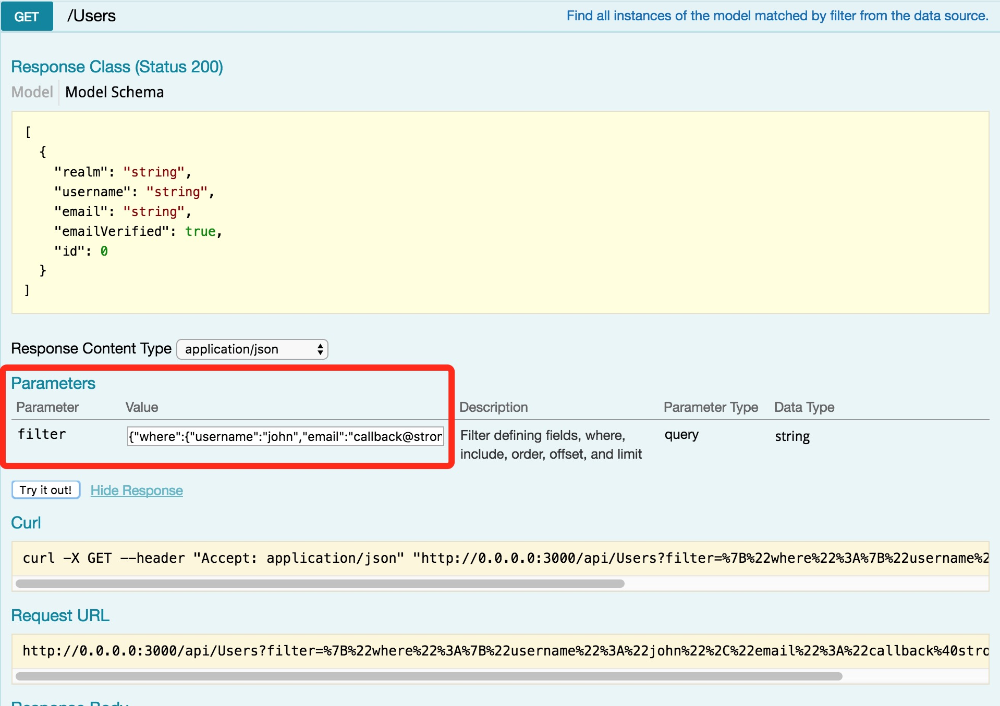


**Response format**

所有请求的响应格式通常是一个位于body或headers中的JSON对象/数组.有些响应的body是空的,例如:

```HTTP/1.1 200 OK
Access-Control-Allow-Origin: http://localhost:3000
Access-Control-Allow-Credentials: true
Content-Type: application/json; charset=utf-8
Content-Length: 59
Vary: Accept-Encoding
Date: Fri, 24 Oct 2014 18:02:34 GMT
Connection: keep-alive

{"title":"MyNote","content":"This is my first note","id":1}
```

HTTP status code表示一个请求是否成功:

* Status code 2xx indicates success
* Status code 4xx indicates request related issues.
* Status code 5xx indicates server-side problems

对错误的响应采用以下JSON格式:

* message: String error message.

* stack: String stack trace.

* statusCode: Integer HTTP status code.

例如:

```json
{
  "error": {
    "message": "could not find a model with id 1",
    "stack": "Error: could not find a model with id 1\n ...",
    "statusCode": 404
  }
}
```

**禁用API Explorer**

LoopBack API Explorer在开发应用程序时非常有用,但为了安全起见,您可能不想在生产环境中公开它.

对于使用loopback-component-explorer的应用程序，在生产环境中中禁它可以这么做：

* 将NODE_ENV环境变量设置为“production”.

* 然后在server/component-config.production.json中:

server/component-config.production.json

```json
{
  "loopback-component-explorer": null
}
```

##### 预定义remote methods

默认情况下,对于那种后面是数据源支持的model(_译注:有点莫名,有不是数据源支持的model么_),LoopBack为他们默认公开了创建,读取,更新和删除(CRUD)操作的REST API.

例如,有一个model名叫Location,LoopBack会自动创建多个具有相应REST端点的Node方法,如下表所示:

| Model (Node) API | HTTP Method | Example Path |
|---|---|---|
| [create()](https://apidocs.strongloop.com/loopback/#persistedmodel-create)                                        | POST   | /locations                 |
| [replaceOrCreate()](https://apidocs.strongloop.com/loopback/#persistedmodel-replaceorcreate)                      | PUT    | /locations                 |
| [patchOrCreate()](https://apidocs.strongloop.com/loopback/#persistedmodel-upsert)                                 | PATCH  | /locations                 |
| [exists()](https://apidocs.strongloop.com/loopback/#persistedmodel-exists)                                        | GET    | /locations/:id/exists      |
| [findById()](https://apidocs.strongloop.com/loopback/#persistedmodel-findbyid)                                    | GET    | /locations/:id             |
| [find()](https://apidocs.strongloop.com/loopback/#persistedmodel-find)                                            | GET    | /locations                 |
| [findOne()](https://apidocs.strongloop.com/loopback/#persistedmodel-findone)                                      | GET    | /locations/findOne         |
| [destroyById() or deleteById()](https://apidocs.strongloop.com/loopback/#persistedmodel-destroybyid)              | DELETE | /locations/:id             |
| [count()](https://apidocs.strongloop.com/loopback/#persistedmodel-count)                                          | GET    | /locations/count           |
| [replaceById()](https://apidocs.strongloop.com/loopback/#persistedmodel-replacebyid)                              | PUT    | /locations/:id             |
| [prototype.patchAttributes()](https://apidocs.strongloop.com/loopback/#persistedmodel-prototype-updateattributes) | PATCH  | /locations/:id             |
| [createChangeStream()](https://apidocs.strongloop.com/loopback/#persistedmodel-createchangestream)                | POST   | /locations/change-stream   |
| [updateAll()](https://apidocs.strongloop.com/loopback/#persistedmodel-updateall)                                  | POST   | /locations/update          |
| [replaceOrCreate()](https://apidocs.strongloop.com/loopback/#persistedmodel-replaceorcreate)                      | POST   | /locations/replaceOrCreate |
| [replaceById()](https://apidocs.strongloop.com/loopback/#persistedmodel-replacebyid)                              | POST   | /locations/:id/replace     |

LoopBack 2.0和3.0在默认公开的这些API中唯一不同的是HTTP PUT(both PUT /api/my-models and PUT /api/my-models/:id),在2.x中,默认情况下patch,部分更新.在3.0中,是完全替换更新.

___译注:官方文档中这一节就这些内容,如果仅看篇幅很容易忽略这节的重要性!请回想一下,截至目前,我们掌握了创建model,还知道了从REST API上查询数据(HTTP),但在js代码中怎么获取model的数据?这就是remote methods发挥作用的时候.现在可以不必深入了解,心中有数就可以了.___

**replaceOnPUT flag**

使用model.json中的replaceOnPUT属性来更改mapping replace和update methods的行为.如果replaceOnPUT为true,replaceOrCreate和replaceById使用HTTP PUT方法.如果为false,updateOrCreate和updateAttributes/patchAttributes使用HTTP PUT方法。

以下示例说明如何在location.json中设置replaceOnPUT：

```json
...
{
  name: "location",
  plural: "locations",
  relations: {…},
  acls: […],
  properties: { … },
  replaceOnPUT: true
}...
```

##### 公开和隐藏models, methods, and endpoints

公开model到REST上,只需设置public属性为true(/server/model-config.json):

```json
...
"Role": {
  "dataSource": "db",
  "public": false
},
...
```
**隐藏methods and REST endpoints**

如果不想公开某些创建,检索,更新和删除操作,可以通过在模型上调用disableRemoteMethod()来轻松隐藏它们.例如在model的js文件中,您将添加以下行以隐藏某个预定义的远程方法:

common/models/location.js

```javascript
var isStatic = true;
MyModel.disableRemoteMethod('deleteById', isStatic);
```

现在deleteById()操作以及它对应的REST endpoint就被隐藏了.

>  重要提醒:确定你是在你自己的model上调用disableRemoteMethod(),而不是在内置model进行调用.

下面这个例子隐藏除了login和logout的其余所有方法:

In server/model-config.json:

```json
"MyUser": {
  "dataSource": "db",
  "public": true,
  "options": {
    "remoting": {
      "sharedMethods": {
        "*": false,
        "login": true,
        "logout": true
      }
    }
  }
}
```

除了上面那种方法,还可以在`config.json`的remoting对象是隐藏他们:

```json
"remoting": {
  "context": false,
  ...
  "sharedMethods": {
    "*": false,
    "login": true,
    "logout": true
  }
}
```
或者你可以通过你的model的js文件来禁用remoteMethods:

```javascript
MyUser.disableRemoteMethod("create", true);
MyUser.disableRemoteMethod("upsert", true);
MyUser.disableRemoteMethod("updateAll", true);
MyUser.disableRemoteMethod("updateAttributes", false);

MyUser.disableRemoteMethod("find", true);
MyUser.disableRemoteMethod("findById", true);
MyUser.disableRemoteMethod("findOne", true);

MyUser.disableRemoteMethod("deleteById", true);

MyUser.disableRemoteMethod("confirm", true);
MyUser.disableRemoteMethod("count", true);
MyUser.disableRemoteMethod("exists", true);
MyUser.disableRemoteMethod("resetPassword", true);

MyUser.disableRemoteMethod('__count__accessTokens', false);
MyUser.disableRemoteMethod('__create__accessTokens', false);
MyUser.disableRemoteMethod('__delete__accessTokens', false);
MyUser.disableRemoteMethod('__destroyById__accessTokens', false);
MyUser.disableRemoteMethod('__findById__accessTokens', false);
MyUser.disableRemoteMethod('__get__accessTokens', false);
MyUser.disableRemoteMethod('__updateById__accessTokens', false);

```
**Read-Only endpoints的例子**

你可能想让你的model只公开read-only操作,隐藏其余所有的POST, PUT, DELETE.请看下面的例子:

common/models/model.js

```javascript
Product.disableRemoteMethod('create', true);				// Removes (POST) /products
Product.disableRemoteMethod('upsert', true);				// Removes (PUT) /products
Product.disableRemoteMethod('deleteById', true);			// Removes (DELETE) /products/:id
Product.disableRemoteMethod("updateAll", true);				// Removes (POST) /products/update
Product.disableRemoteMethod("updateAttributes", false);		// Removes (PUT) /products/:id
Product.disableRemoteMethod('createChangeStream', true);	// removes (GET|POST) /products/change-stream
```

**隐藏相关model的endpoints**

使用disableRemoteMethod()来禁用相关model的REST endpoints.

例如,有2个model,分别叫post和tag,他们的关系是post hasMany tags.添加如下代码到/common/models/post.js去禁用相关model(tag)的remote methods和对应的REST endpoints: 

common/models/post.js

```javascript
module.exports = function(Post) {
  Post.disableRemoteMethod('__get__tags', false);
  Post.disableRemoteMethod('__create__tags', false);
  Post.disableRemoteMethod('__destroyById__accessTokens', false); // DELETE
  Post.disableRemoteMethod('__updateById__accessTokens', false); // PUT
};
```

**隐藏属性**

上面说的都是隐藏REST或方法,如果想隐藏属性(可以理解为表字段)T,那就使用hidden属性就可以了.例如:

common/models/user.json

```json
...
  "properties": {
    ...
    "password": {
      "type": "string",
      "required": true
    },
...
   "hidden": ["password"],
...
```

更多细节参看 [Model definition JSON file (Hidden properties)](Model-definition-JSON-file.html#hidden-properties).

---

<h4 id="1.5"> 1.5 验证Model的数据 </h4>

模式(schema)对model施加了限制,以确保model将保存与对应的数据库表匹配的数据.

model可以在将数据传递到数据存储(例如数据库)之前验证数据,以确保其符合后端模式(schema).

##### 为model添加schema(模式)

验证数据的一种方法是创建model schema,LoopBack将确保数据符合该模式定义.

例如,假设您的应用程序有一个名为product的model.以下代码定义了一个模式并将其分配给model.模式定义了两个属性:name,必需的字符串属性和price,可选的数字属性.

common/models/product.js

```javascript
var productSchema = {
  "name": { "type": "string", "required": true },
  "price": "number"
};
// 实际上下面这行代码会报错,因为找不到Model,把Model换成Product就可以了.
var Product = Model.extend('product', productSchema);
```

如果客户端尝试使用额外属性(例如一个名为description的属性)保存产品,那么在应用将数据保存在模型中之前,会删除这些属性.此外,由于name是必需的值,因此只有在产品包含name属性的值时,才会保存模型.

___译注: 以下为实际测试,请仔细阅读___

**基础准备:**

首先,我在mysql数据库里建了一个表,名为city,有2个字段,分别是city_id(int类型),city_name(字符串类型),其中city_id为主键.

然后,我在strongloop中建立了一个model,名为City,注意下面的model定义json中的细节.

```json
{
  "name": "City",
  "base": "PersistedModel",
  "idInjection": true,  //  先看一下这个参数,记住它是true,后面会说.
  "options": {
    "validateUpsert": true
  },
  "properties": {
    "city_id": {
      "type": "number",
      "required": true,
      "id": true // 请思考为什么要有这个属性?
      // 答案:如果我不设置这个参数,并且上面的"idInjection"参数还是true
      // 那么strongloop这个傻x就会默认的认为你的表主键叫"id",而事实上是city_id.
      // 所以在post的时候会报错.
    },
    "city_name": {
      "type": "string",
      "required": true
    }
  },
  "validations": [],
  "relations": {},
  "acls": [],
  "methods": {}
}
```

接下来启动服务,到API Explorer中看一下city这个model,并进入到post一节,准备开始测试.如下图所示:

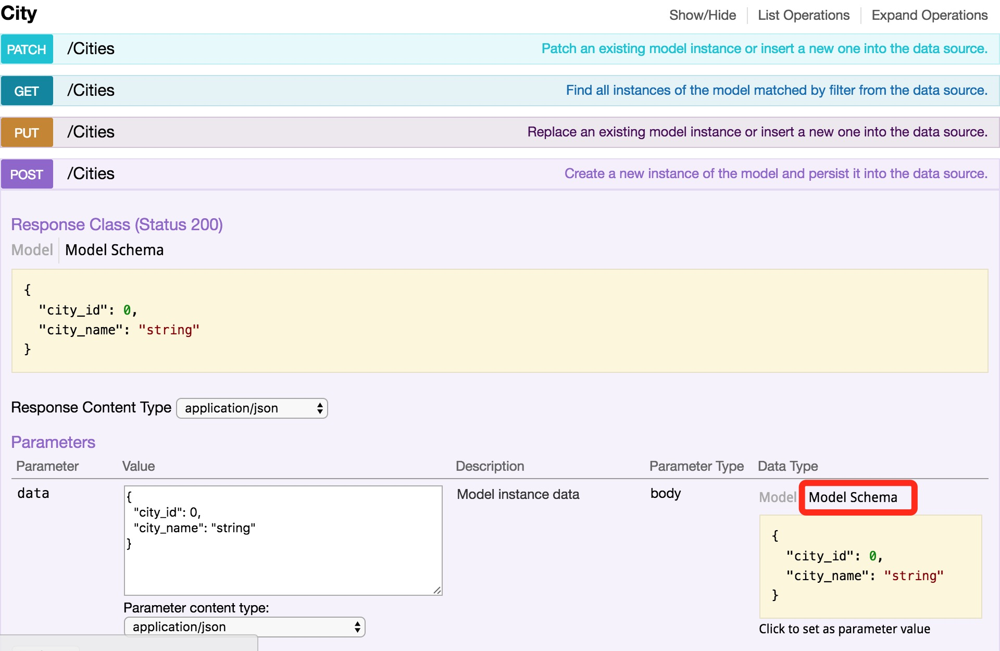

看一下上图我画红框地方,你会发现我并没有像上面文档要求的,在js文件里定义schema,但是model schema已经存在了,并且就是你json中定义的样子.

**测试一:多加个schema中没有的字段,然后post,看看是什么效果**

我在上图的data区域内输入如下内容:

```json
{
  "city_id": 3,
  "city_name": "Haerbin",
  "rem":"我是个多加的字段"
}
```

然后点击try it out!

奇迹出现了!!!请看下图,strongloop居然告诉我成功了:

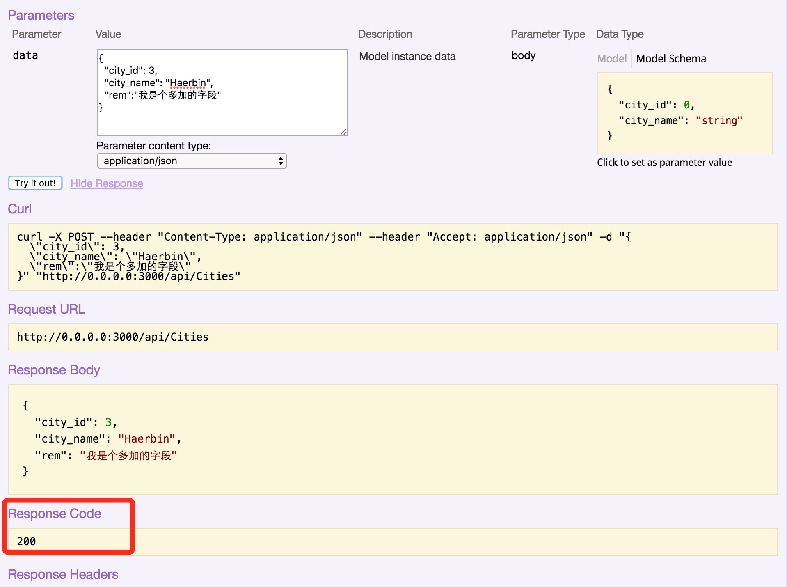

赶紧到数据库里查一眼,确实插入进去了,新增的字段被忽略了.如下图所示:

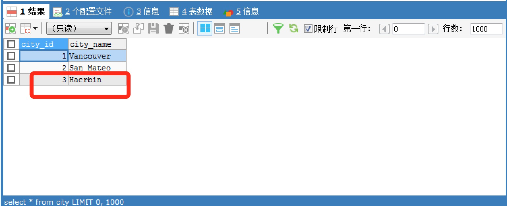

如此智能和灵活,也不知道是好是坏!并且和我想象中的schema会约束数据有点不符!

**测试二:在js中添加schema,然后多加个schema中没有的字段去post,看看是什么效果**

首先,我在city的js文件中添加如下代码:

```javascript
'use strict';

module.exports = function(City) {
  var citySchema = {
    "city_id": { "type": "number", "required": true, "id": true },
    "city_name": { "type": "string", "required": true },
    "rem": { "type": "string", "required": true }
  };
  var City = City.extend('City', citySchema);
};
```
请注意,上面代码中的"rem"在model的json定义中是不存在的.

然后我重复上面的操作,到API Explorer中进行测试,看下图所示:

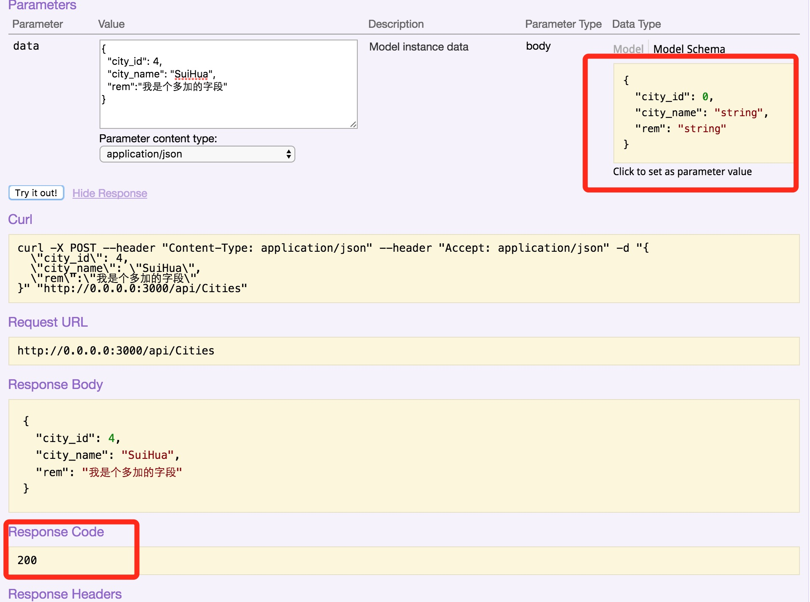

请注意:上图中model schema红框那里的内容变成了我在js中定义的内容.作为知识要点回顾,这说明js和json定义model都是一样的.

同样的,上面的操作又成功了,数据库里新增了一条记录.这和我想象的还不一样,我以为官方文档中的代码一旦添加到js文件中,就会约束数据,但实际还是没限制(不能说没限制,多余数据被抛弃了).

**测试三:增加strict参数**

如果我想实现"model定义了几个属性,post的时候如果有多余属性就让strongloop报错",应该怎么操作.

回想一下,上面其实提到过,在mode的json文件中,增加一条参数."strict": true,就可以了.

测试一下,添加完这个参数,在用多余的字段去post就会报错,如下图所示:

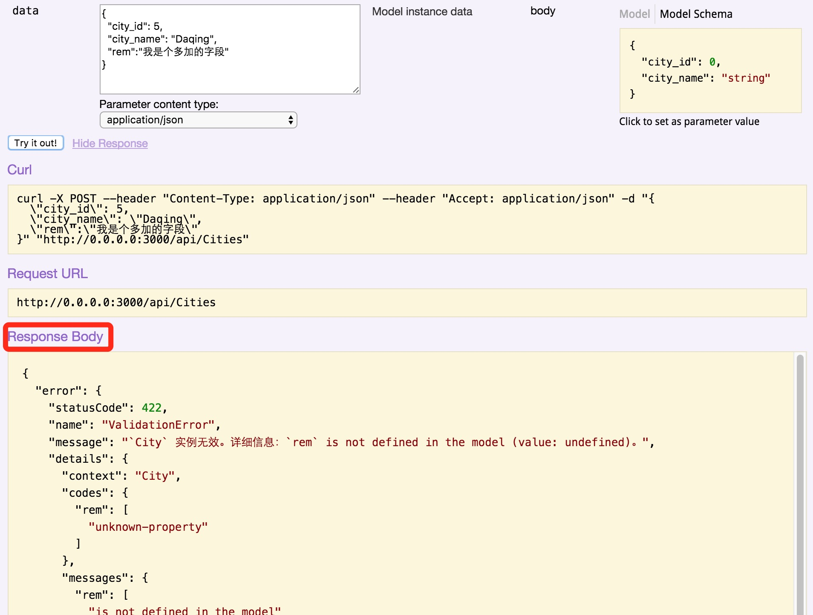

我还做了个测试,就不贴图了.我测了一下,把city_id输入个字符串(不是数字),然后去post,strongloop会报错(但是报错信息的内容比较恶心,居然提示我city_id不能为空,其实应该提示类型不符).这和下文中要讲的一点一致.那就是model会自动加载后面表格中所列的那些验证方法.

**测试结论:**

其实我主要是想吐槽一下strongloop的官方文档,可能是我智商低,我读到这里的时候,以为按照它要求的,在js文件中添加了schema就可以验证数据了.但实际测试真不是那么回事.所以,不要太相信官文,还是要自己多做测试.

___译注: 以上为实际测试,请仔细阅读___

##### 使用验证方法

附加到持久数据源的每个model都具有Validatable中混合的验证方法,如下表所示:

<table>
  <tbody>
    <tr>
      <th>Method</th>
      <th>Description</th>
    </tr>
    <tr>
      <td><a href="https://apidocs.strongloop.com/loopback-datasource-juggler/#validatable-validatesabsenceof" class="external-link" rel="nofollow">validatesAbsenceOf</a></td>
      <td>验证一个或多个指定属性是否缺失.model不应包括被视为有效的属性,验证字段不为空时失败.</td>
    </tr>
    <tr>
      <td><a href="https://apidocs.strongloop.com/loopback-datasource-juggler/#validatable-validatesexclusionof" class="external-link" rel="nofollow">validatesExclusionOf</a></td>
      <td>验证排除.要求属性值不在指定的数组中.</td>
    </tr>
    <tr>
      <td><a href="https://apidocs.strongloop.com/loopback-datasource-juggler/#validatable-validatesformatof" class="external-link" rel="nofollow">validatesFormatOf</a></td>
      <td>
        <p>验证格式.要求模型包含与给定格式匹配的属性.</p>
      </td>
    </tr>
    <tr>
      <td><a href="https://apidocs.strongloop.com/loopback-datasource-juggler/#validatable-validatesinclusionof" class="external-link" rel="nofollow">validatesInclusionOf</a></td>
      <td>验证是否包含在集合中.要求属性的值在指定的数组中.</td>
    </tr>
    <tr>
      <td><a href="https://apidocs.strongloop.com/loopback-datasource-juggler/#validatable-validateslengthof" class="external-link" rel="nofollow">validatesLengthOf</a></td>
      <td>
        <p>V验证长度.要求属性长度在指定范围内.三种验证：“min”，“max”和“is”.默认错误消息是：</p>
        <ul>
          <li>min: too short</li>
          <li>max: too long</li>
          <li>is: length is wrong</li>
        </ul>
      </td>
    </tr>
    <tr>
      <td><a href="https://apidocs.strongloop.com/loopback-datasource-juggler/#validatable-validatesnumericalityof" class="external-link" rel="nofollow">validatesNumericalityOf</a></td>
      <td>验证数字.需要属性的值为整数或数字.</td>
    </tr>
    <tr>
      <td><a href="https://apidocs.strongloop.com/loopback-datasource-juggler/#validatable-validatespresenceof" class="external-link" rel="nofollow">validatesPresenceOf</a></td>
      <td>验证一个或多个指定属性的存在.需要包含一个被认为有效的属性的模型,验证字段为空时失败.</td>
    </tr>
    <tr>
      <td><a href="https://apidocs.strongloop.com/loopback-datasource-juggler/#validatable-validatesuniquenessof" class="external-link" rel="nofollow">validatesUniquenessOf</a></td>
      <td>
        <p>验证唯一性.确保属性的值对模型是唯一的.不适用于所有连接器.目前支持这些连接器.:</p>
        <ul>
          <li>In Memory</li>
          <li>Oracle</li>
          <li>MongoDB</li>
        </ul>
      </td>
    </tr>
  </tbody>
</table>

下面是上述那些方法的使用实例:

**Options object**

大多数验证方法接受一个选项参数,其属性取决于所使用的特定方法.不过,有两个共同的适用于所有方法的属性：

* message - Error message to use instead of the default message, if validation fails.

* allowNull - Whether null values are allowed.

请看下面的例子:

common/models/user.js

```javascript
module.exports = function(user) {
  user.validatesPresenceOf('name', 'email');
  user.validatesLengthOf('password', {min: 5, message: {min: 'Password is too short'}});
  user.validatesInclusionOf('gender', {in: ['male', 'female']});
  user.validatesExclusionOf('domain', {in: ['www', 'billing', 'admin']});
  user.validatesNumericalityOf('age', {int: true});
  user.validatesUniquenessOf('email', {message: 'email is not unique'});
};
```
___译注:测试一下,不测不放心___

在model的js文件中加一个验证city_id是否为数字并且返回指定错误信息的代码,如下:

```javascript
'use strict';

module.exports = function(City) {
  // 自定义一个名为customValidator的验证方法
  City.validate('city_id', customValidator, { message: 'stop瞎整!' });
  // 判断city_id是否为数字
  function customValidator(err) {
    if (isNaN(this.city_id)) err();
  };
};
```

然后在API Explorer中测试一下,效果如下:

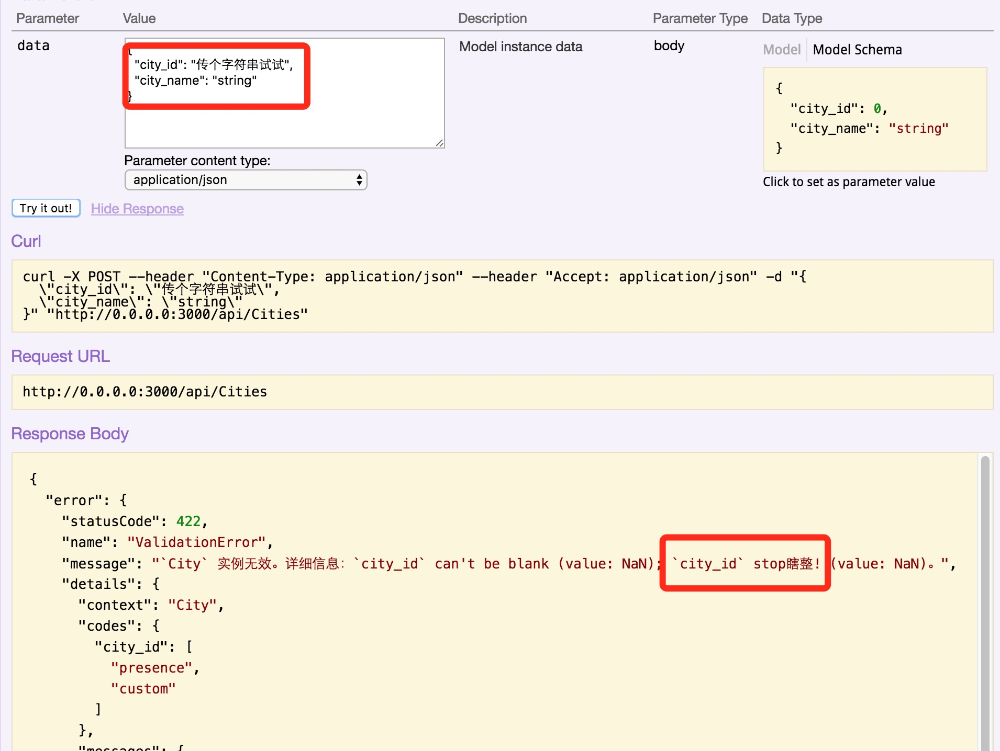

效果还可以,虽然错误信息那块有点多,将来在收拾它.

>  提示: 当您在模型实例上调用isValid()时,将调用验证方法,并在每次创建或更新模型实例时自动调用验证方法.您不必自己去调用isValid()来验证数据.要在调用upsert()时强制执行验证约束,请确保在模型定义JSON文件中将validateUpsert选项设置为true.默认情况下,模型生成器将此属性设置为true.

要显式调用验证约束,请调用isValid(),例如:

___译注:实际测试下面代码还是不好使,并且代码后面少了个")"___

```javascript
user.isValid(function (valid) {
  if (!valid) {
    user.errors // hash of errors {attr: [errmessage, errmessage, ...], attr: ...}
  }
```
另一个定义验证约束的示例,这次使用正则表达式:

```javascript
var re = /^(([^<>()[\]\\.,;:\s@\"]-(\.[^<>()[\]\\.,;:\s@\"]-)*)|(\".-\"))@((\[[0-9]{1,3}\.[0-9]{1,3}\.[0-9]{1,3}\.[0-9]{1,3}\])|(([a-zA-Z\-0-9]-\.)-[a-zA-Z]{2,}))$/;

UserModel.validatesFormatOf('email', {with: re, message: 'Must provide a valid email'});
if (!(UserModel.settings.realmRequired || UserModel.settings.realmDelimiter)) {
  UserModel.validatesUniquenessOf('email', {message: 'Email already exists'});
  UserModel.validatesUniquenessOf('username', {message: 'User already exists'});
}
```

要为创建新模型实例的模型添加验证,您不需要调用isValid().您可以通过添加验证器调用添加验证:

common/models/MyModel.js

```javascript
module.exports = function(MyModel) {
  MyModel.validatesLengthOf('name', { min: 5, message: { min: 'Name should be 5- characters' } });
  //...
};
```

##### 本地化验证信息

可以在客户端上本地化验证错误消息,而不是修改服务器返回的错误响应.验证错误响应会包含error.details.codes中的错误代码,使客户端能够将错误映射到本地化消息.这里是一个示例错误响应:

error.details.codes

___译注:这段说的比较空,在哪?怎么设置都没说?我在model的js中试了重定义error对象,res对象都不好使,可能是我的问题.___

```json
{
  "name": "ValidationError",
  "status": 422,
  "message": "The Model instance is not valid. See error object `details` property for more info.",
  "statusCode": 422,
  "details": {
    "context": "user",
    "codes": {
      "password": [
        "presence"
      ],
      "email": [
        "uniqueness"
      ]
   },
    "messages": {
      "password": [
       "can't be blank"
     ],
      "email": [
        "Email already exists"
      ]
    }
  }
}
```

---

<h4 id="1.6"> 1.6 创建Model关系 </h4>

##### 概述

单个模型虽然易于理解和使用.但在现实中,模型通常是有联系(connected)或相关的.当您使用多个模型构建真实的应用程序时,通常需要定义模型之间的关系。 例如：

* 客户有很多订单,每个订单都属于一个客户.

* 用户可以被分配一个或多个角色,角色可以有零个或多个用户.

* 医生伺候许多患者,患者也可以看许多医生.

对于有联系的模型,LoopBack为每个有联系的model公开了一组API以实现每个**模型实例**之间的交互,而且还可以根据客户端的需要在这些有联系的model上查询和过滤信息.

您可以在模型之间定义以下关系：

* BelongsTo relations

* HasOne relations

* HasMany relations

* HasManyThrough relations

* HasAndBelongsToMany relations

* Polymorphic relations(多态关系)

* Embedded relations(嵌入关系) (embedsOne and embedsMany)

您可以在模型定义JSON文件或JavaScript代码中定义模型关系,最终结果是一样的(_译注:但是后面不建议使用js代码_).

当为model定义关系时,LoopBack会向model中添加一组方法,详见每种关系类型的章节.

##### 使用关系生成器relation generator

对于已经存在的model创建新的关系是非常简单的.使用`slc loopback:relation`, 或者`apic loopback:relation`这2个命令即可.

生成器会提示你输入关系类型(belongsTo, hasMany等)和与之相关联的model name.

##### Relation options(关系选项)

大多数关系类型有3个选项:

* Scope (_译注:scope可以理解为查询条件或过滤器或者model的实例,可能不太准确_)

* Properties(属性)

* Custom scope methods(自定义scope方法)

**Scope**

scope可以是object或函数,它接受**所有关联scope**上的过滤器/查询条件.

当scope是object时,它有常见的过滤器选项,例如:where, order, include, limit, offset等

这些选项会被合并到默认过滤器中,这意味着where部分将进行AND运算(_译注:我理解,大概意思就是你定义的where会和原来默认过滤器的where进行AND,而其他的则会覆盖默认过滤器的选项_).其他选项通常会覆盖默认值(标准mergeQuery行为).

当scope是函数时,它将接收当前实例,以及默认过滤器对象(_译注:函数入参_).

例如:

```javascript
// only allow products of type: 'shoe', always include products
Category.hasMany(Product, {
    as: 'shoes', 
    // scope是object
    scope: { 
        where: { type: 'shoe' }, 
        include: 'products'
    }
});
Product.hasMany(Image, {
    // scope是函数,inst是当前实例,filter是默认过滤器对象.
    // 但inst到底是谁,官文的注释说这里的inst是category,不太理解.
    scope: function(inst, filter) { 
        return { type: inst.type }; 
    }
});  // inst is a category - match category type with product type.
```

**Properties**

与scope类似,Properties也可以是object或者函数.

___译注,下面两句我保留了原文,因为我翻译的不太好___

当Properties是object时,the keys refer to the instance, the value will be the attribute key on the related model (mapping).这个意思大概是说Properties对象的key是**当前实例**的属性引用,而Properties对象的value是它**相关model**的属性映射.

当Properties是函数时,the resulting object (key/values) are merged into the related model directly.意思大概是说生成的对象直接被合并进它的**关系model**中.

例如,以下关系将`type`转换到product这个model,并且在创建时将`category name`取消规范化为categoryName

```javascript
Category.hasMany(Product, {
    as: 'shoes', 
    properties: {
        type: 'type',
        category: 'categoryName'
    }
});
```

上述是Properties为object时的例子,如果要以函数的形式完成同样的操作,例子如下:

```javascript
Product.hasMany(Image, {
    properties: function(inst) { // inst is a category
        return {type: inst.type, categoryName: inst.name};
  }
});
```

___译注:截至到目前,"// inst is a category"这个注释已经出现了好几次,我没太看懂inst为什么会代表category这个model,按字面理解,它好像更应该代表Product这个model.先这样吧,以后再说.___

**invertProperties(反转属性)**

通常情况下,属性从父对象传递到子对象,但是有时可以做相反的操作.要启用此选项,请使用invertProperties选项.可以参见**Embedded models (embed with belongsTo)**里面的例子.

**Custom scope methods**

最后,您可以使用scopeMethods属性添加自定义scope method.同样,该选项可以是对象或函数.

>  重要提示: 默认情况下,自定义的scope method不会作为remote methods公开,你必须手工设置functionName.shared = true才可以.

例子:

```javascript
var reorderFn = function(ids, cb) {
  console.log(this.name); // `this` refers to the RelationDefinition  - `images` (relation name) 
  // Do some reordering here & save cb(null, [3, 2, 1]); }; 
  // Manually declare remoting params 
  reorderFn.shared = true; 
  reorderFn.accepts = { arg: 'ids', type: 'array', http: { source: 'body' } }; 
  reorderFn.returns = { arg: 'ids', type: 'array', root: true }; 
  reorderFn.http = { verb: 'put', path: '/images/reorder' }; 
  Product.hasMany(Image, { scopeMethods: { reorder: reorderFn } });
}
```

**Exposing REST APIs for related models**

以下示例演示如何通过REST API访问连接的模型:

/server/script.js

```javascript
var db = loopback.createDataSource({connector: 'memory'});
  Customer = db.createModel('customer', {
    name: String,
    age: Number
  });
  Review = db.createModel('review', {
    product: String,
    star: Number
  });
  Order = db.createModel('order', {
    description: String,
    total: Number
  });

  Customer.scope("youngFolks", {where: {age: {lte: 22}}});
  Review.belongsTo(Customer, {foreignKey: 'authorId', as: 'author'});
  Customer.hasMany(Review, {foreignKey: 'authorId', as: 'reviews'});
  Customer.hasMany(Order, {foreignKey: 'customerId', as: 'orders'});
  Order.belongsTo(Customer, {foreignKey: 'customerId'});
```

---

<h4 id="1.6.1"> 1.6.1 开启Model关系之旅 </h4>

>  一个简要的教程,说明如何设置model关系

```bash
$ git clone https://github.com/strongloop/loopback-example-relations.git
$ cd loopback-example-relations
$ npm install
$ node .
```

___译注:原文接下来一堆内容,都是介绍这个git的详细结构和内容的,我省略了大部分内容,只保留了model定义这几个与后续文档紧密相关的内容___ 

**创建models**

* Name: `Customer`
  * Data source: db (memory)
  * Base class: PersistedModel
  * Expose over REST: Yes
  * Custom plural form: Leave blank
  * Properties:
    * name
      * String
      * Not Required
    * age
      * number
      * Not Required

* Name: `Order`
  * Data source: db (memory)
  * Base class: PersistedModel
  * Expose over REST: Yes
  * Custom plural form: Leave blank
  * Properties:
    * 	description
      * String
      * Not Required
    * date
      * date
      * Not Required

* Name: `Account`
  * Data source: db (memory)
  * Base class: PersistedModel
  * Expose over REST: No
  * Custom plural form: Leave blank
  * Properties:
    * name
      * String
      * Not Required
    * date
      * date
      * Not Required

* Name: `Address`
  * Data source: transient
  * Base class: Model
  * Expose over REST: No
  * Custom plural form: Leave blank
  * Properties:
    * street
      * String
      * Not Required
    * city
      * String
      * Not Required
    * state
      * String
      * Not Required
    * zipCode
      * String
      * Not Required

* Name: `Author`
  * Data source: db (memory)
  * Base class: PersistedModel
  * Expose over REST: No
  * Custom plural form: Leave blank
  * Properties:
    * name
      * String
      * Not Required

* Name: `Book`
  * Data source: db (memory)
  * Base class: PersistedModel
  * Expose over REST: Yes
  * Custom plural form: Leave blank
  * Properties:
    * name
      * String
      * Not Required

* Name: `EmailAddress`
  * Data source: transient
  * Base class: PersistedModel
  * Expose over REST: No
  * Custom plural form: Leave blank
  * Properties:
    * label
      * String
      * Not Required
    * address
      * String
      * Not Required

* Name: `Link`
  * Data source: transient
  * Base class: Model
  * Expose over REST: No
  * Custom plural form: Leave blank
  * Properties:
    * id
      * number
      * Required > Please set "id": true manually for this property, like link.json
    * name
      * String
      * Not Required
    * notes
      * String
      * Not Required

* Name: `Reader`
  * Data source: db (memory)
  * Base class: PersistedModel
  * Expose over REST: No
  * Custom plural form: Leave blank
  * Properties:
    * name
      * String
      * Not Required

**定义model关系**

* `Customer`
  * has many
    * `Order`
      * Property name for the relation: `orders`
      * Custom foreign key: `customerId`
      * Require a through model: No
    * `Other Relations:` (please add them manually)

```json
"address": {
  "type": "embedsOne",
  "model": "Address",
  "property": "billingAddress",
  "options": {
    "validate": true,
    "forceId": false
  }
},
"emails": {
  "type": "embedsMany",
  "model": "EmailAddress",
  "property": "emailList",
  "options": {
    "validate": true,
    "forceId": false
  }
},
"accounts": {
  "type": "referencesMany",
  "model": "Account",
  "property": "accountIds",
  "options": {
    "validate": true,
    "forceId": false
  }
},
```
* `Book`(please add them manually)

```json
"people": {
    "type": "embedsMany",
    "model": "Link",
    "scope": {
      "include": "linked"
    }
}
```
	
* `Link`(please add them manually)

```json
"linked": {
  "type": "belongsTo",
  "polymorphic": {
    "idType": "number"
  },
  "properties": {
    "name": "name"
  },
  "options": {
    "invertProperties": true
  }
}
```

* `Order`
  * belongs to
    * `Customer`
      * Property name for the relation: Leave blank - defaults to customer
      * Custom foreign key: Leave blank

---

<h4 id="1.6.2"> 1.6.2 BelongsTo关系(多对一,或一对一) </h4>

##### 概述

belongsTo关系是指一个model与另一个model建立多对一(many-to-one)或一对一(one-to-one)的连接.在多对一关系中,声明model的每个实例"属于"另一个model的至多一个实例,而目标model可以具有许多声明model.

例如,假设应用程序有customers和orders两个model:

* 每个订单只能由一个客户设置: ”Order belongsTo (one) Customer”.

* 一个客户可以有多个订单: ”Customer hasMany Orders”.

这种belongsTo关系是hasMany关系的逻辑反射.

声明模型(Order)具有引用目标模型(Customer)的主键属性的外键属性.如果主键不存在,LoopBack将自动添加一个(_译注:这句话是说order有个外键,内容是customer的主键_).

另一种belongsTo关系是一对一的关系,它类似于many-to-one,但不同的是,一对一关系要求拥有模型的每个实例只能有一个声明模型的实例.

例如,假设应用程序有customers和adress两个model：

* 每个地址只能与一个客户相关联：“地址belongsTo一个客户”。

* 客户只能有一个地址：“客户hasOne一个地址”。

这种belongsTo关系是hasOne关系的逻辑反射.

##### 定义belongsTo关系

使用关系生成器`relation generator`创建两个model之间的关系.该工具将提示您输入model的名称,相关model的名称和其他必需的信息.该工具将相应地修改model定义JSON文件(例如,common/models/customer.json).

例如，下面是loopback-example-relation中的订单模型的JSON文件：

**common/models/order.json**

```json
{
  "name": "Order",          // 这个就是前面说的"声明模型(model)"
  "base": "PersistedModel",
  ...
  "relations": {
    "customer": {           // 关系名
      "type": "belongsTo",  // 关系类型
      "model": "Customer",  // 关联的model,也就是前面说的"目标模型(model)"
      "foreignKey": ""      // 为空,所以loopback自动指定customer的customerId为外键
    }
  },
  ...
```

或者,你还可以通过js代码来定义“belongsTo”关系, **虽然一般不推荐这么做**:

**common/models/order.js**

```javascript
Order.belongsTo(Customer, {foreignKey: 'customerId'});
```

如果声明model没有外键属性,LoopBack将添加一个具有相同名称的属性.属性的类型将与目标模型的`id`属性的类型相同(_译注:id属性是永远存在的,如果你没指定,loopback默认也指定_).

如果不指定它们,那么LoopBack指定关系名称和外键如下：

* 关系名称：驼峰式的模型名称,例如,对于“Customer”模型,关系是“customer”.
* 外键：附加了`Id`的关系名称,例如,对于关系名称“customer”,默认外键是“customerId”.

##### 添加method到model

一旦定义belongsTo关系,LoopBack会自动添加一个带有关系名称的方法到声明模型类的原型,例如:`Order.prototype.customer(...)`

根据参数,该方法可用于get或set所属模型实例.方法调用的结果在内部缓存,并通过对方法的后续同步调用提供.

<table>
  <tbody>
    <tr>
      <th style="width: 400px;">Example method</th>
      <th>Description</th>
    </tr>
    <tr>
      <td>
        <pre>order.customer(function(err, customer) {<br>  ...<br>});</pre>
      </td>
      <td>Get the customer for the order asynchronously(异步获取定单的客户)</td>
    </tr>
    <tr>
      <td>
        <pre>var customer = order.customer();</pre>
      </td>
      <td>
        <p>Synchronously get the results of a previous get call to <span>customer(...)(同步获取之前的get调用结果给客户)</span></p>
      </td>
    </tr>
    <tr>
      <td>
        <pre>order.customer(customer);</pre>
      </td>
      <td>Set the customer for the order(设置定单的客户)</td>
    </tr>
  </tbody>
</table>

---

<h4 id="1.6.3"> 1.6.3 HasOne关系(一对一) </h4>

##### 概述

hasOne关系与另一个model建立了一对一的连接,这使得声明模型的每个实例具有另一个模型的"has one"实例.hasOne关系是hasMany关系的退化.

##### 定义hasOne关系

使用关系生成器`relation generator`创建两个模型之间的关系.该工具将提示您输入模型的名称,相关模型的名称和其他必需的信息.该工具将相应地修改模型定义JSON文件(例如,common/models/customer.json).

例如,假设有两个model:supplier和account

**common/models/supplier.json**

```json
{
  "name": "supplier",
  "base": "PersistedModel",
  "idInjection": true,
  "properties": {
    "name": {
      "type": "string"
    }
  },
  "validations": [],
  "relations": {
    "supplier_acct": {
      "type": "hasOne",
      "model": "account",
      "foreignKey": "supplierId"
    }
  },
  "acls": [],
  "methods": []
}
```

supplier(供应商)有一个account(帐号), 在声明模型上有个外键:account.supplierId -> supplier.id.

_译注: 观察上面supplier的json,你会发现,它自身的model定义中只有一个名为name的字段.这时,在它的关系中定义的foreignKey会不会合并到supplier的model中,大家可以试一下._

**common/models/account.json**

```json
{
  "name": "account",
  "base": "PersistedModel",
  "idInjection": true,
  "properties": {
    "id": {
      "type": "number",
      "required": true
    },
    "acctmgr": {
      "type": "string"
    },
    "supplierId": {
      "type": "number",
      "required": true
    }
  },
  "validations": [],
  "relations": {},
  "acls": [],
  "methods": []
}
```

或者,你可以通过模型的js代码来定义“hasOne”关系, **虽然通常情况下不建议在和么做**:

**common/models/supplier.js**

```javascript
Supplier.hasOne(Account, {foreignKey: 'supplierId', as: 'account'});
```

如果目标模型没有外键属性,LoopBack将添加一个具有相同名称的属性.属性的类型将与目标模型的id属性的类型相同.**请注意,外键属性是在目标模型上定义的(例如,Account)**.

如果不指定它们,那么LoopBack生成关系名称和外键如下:

* 关系名称:驼峰式模型名称,例如,对于"supplier"模型，关系是"supplier".(_译注:你看出驼峰了么,我是没看出来_)
* 外键:附有Id的关系名称,例如,对于关系名称"supplier",默认外键是"supplierId".

##### 添加method到model

一旦定义了hasOne关系,LoopBack会自动添加一个带有关系名称的方法到声明模型类的原型.例如:supplier.prototype.account(...).

<table>
  <tbody>
    <tr>
      <th style="width: 400px;">Example method</th>
      <th>Description</th>
    </tr>
    <tr>
      <td>
        <pre>supplier.account(function(err, account) {<br>  ...<br>});</pre>
      </td>
      <td>
        <p>Find the supplier's account model.</p>
        <div class="sl-hidden"><strong>REVIEW COMMENT from Rand</strong><br>You cannot supply a filter, as you can for hasMany right?</div>
        <p></p>
      </td>
    </tr>
    <tr>
      <td>
        <pre>var supplier = supplier.account.build(data);</pre>
        <p>Or equivalently:</p>
        <pre>var account = new account({supplierId: supplier.id, ...});</pre>
      </td>
      <td>Build a new account for the supplier with the supplierId to be set to the id of the supplier. No persistence is involved.</td>
    </tr>
    <tr>
      <td>
        <pre>supplier.account.create(data, function(err, account) {<br>  ...<br>});</pre>
        <p>Or, equivalently:</p>
        <pre>account.create({supplierId: supplier.id, ...}, function(err, account) {<br>  ...<br>});</pre>
      </td>
      <td>Create a new account for the supplier. If there is already an account, an error will be reported.</td>
    </tr>
    <tr>
      <td>
        <pre>supplier.account.destroy(function(err) {<br>  ...<br>});</pre>
      </td>
      <td>Remove the account for the supplier.</td>
    </tr>
    <tr>
      <td>
        <pre>supplier.account.update({balance: 100}, function(err, account) {<br>  ...<br>});</pre>
      </td>
      <td>Update the associated account.</td>
    </tr>
  </tbody>
</table>

---

<h4 id="1.6.4"> 1.6.4 HasMany关系(一对多) </h4>

##### 概述

hasMany关系与另一个模型建立一对多连接.你经常在belongsTo关系的“另一边”找到这个关系.此关系指示模型的每个实例具有另一个模型的零个或多个实例.例如,在具有客户和订单两个模型的应用程序中,客户可以有许多订单.

##### 定义hasMany关系

使用关系生成器`relation generator`创建两个模型之间的关系.该工具将提示您输入模型的名称,相关模型的名称和其他必需的信息.该工具将相应地修改模型定义JSON文件(例如,common/models/customer.json).

例如,下面是一个model的json定义文件:

**common/models/customer.json**

```json
{
  "name": "Customer",
  "base": "PersistedModel",
  ...
  "relations": {
    "reviews": {
      "type": "hasMany",
      "model": "Review",
      "foreignKey": "authorId"
    },
  ...
```

或者,你可以通过模型的js代码来定义“hasOne”关系, **虽然通常情况下不建议在和么做**:

**common/models/customer.js**

```javascript
Customer.hasMany(Review, {as: 'reviews', foreignKey: 'authorId'});
```

如果不指定它们,那么LoopBack生成关系名称和外键如下:

* 关系名称:驼峰式的模型复数名称,例如,对于"Order"模型，关系是"orders".
* 外键:附有Id的关系名称,例如,对于关系名称"Customer",默认外键是"customerId".

##### 添加method到model

一旦你定义了一个“hasMany”关系,LoopBack会自动将一个带有关系名称的方法添加到声明模型类的原型.例如:Customer.prototype.orders(...).

<table>
  <tbody>
    <tr>
      <th style="width: 400px;">Example method</th>
      <th>Description</th>
    </tr>
    <tr>
      <td>
        <pre>customer.orders([filter],
  function(err, orders) {<br>  ...<br>});</pre>
      </td>
      <td>Find orders for the customer, optionally using provided [filter](Querying-data.html)</td>
    </tr>
    <tr>
      <td>
        <pre>var order = customer.orders.build(data);</pre>
        <p>Or equivalently:</p>
        <pre>var order = new Order({customerId: customer.id, ...});</pre>
      </td>
      <td>Build a new order for the customer with the customerId to be set to the id of the customer. No persistence is involved.</td>
    </tr>
    <tr>
      <td>
        <pre>customer.orders.create(data,
  function(err, order) {<br>  ...<br>});</pre>
        <p>Or, equivalently:</p>
        <pre>Order.create({customerId: customer.id, ...},
  function(err, order) {<br>  ...<br>});</pre>
      </td>
      <td>Create a new order for the customer.</td>
    </tr>
    <tr>
      <td>
        <pre>customer.orders.destroyAll(function(err) {<br>  ...<br>});</pre>
      </td>
      <td>Remove all orders for the customer.</td>
    </tr>
    <tr>
      <td>
        <pre>customer.orders.findById(orderId,
  function(err, order) {<br>   ...<br>});</pre>
      </td>
      <td>Find an order by ID.</td>
    </tr>
    <tr>
      <td>
        <pre>customer.orders.destroy(orderId,
  function(err) {<br>  ...<br>});</pre>
      </td>
      <td>Delete an order by ID.</td>
    </tr>
  </tbody>
</table>

---

<h4 id="1.6.5"> 1.6.5 HasManyThrough关系(多对多) </h4>

##### 概述

hasManyThrough关系设置了与另一个模型的多对多连接.此关系表示`通过第三(中介)模型，声明模型可以与另一模型的零个或多个实例匹配`(_译注:这句不太好理解,但是看下面的图就能理解了).例如,在医生的申请中,如果病人预约见医生,有关的关系声明可能是:

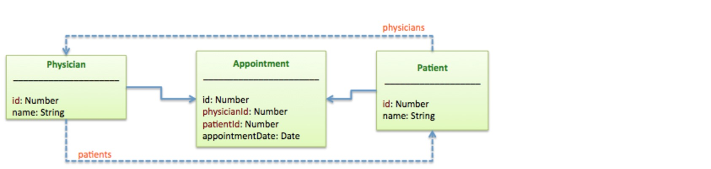

第三(中介)模型(Appointment),有2个外键属性(physicianId和patientId),这2个外键分别引用声明模型(Physician)的主键,以及目标模型(Patient)的主键.

##### 定义hasManyThrough关系

使用关系生成器`relation generator`创建两个模型之间的关系.该工具将提示您输入模型的名称,相关模型的名称和其他必需的信息.该工具将相应地修改模型定义JSON文件(例如,common/models/customer.json).

创建hasManyThrough关系时,对"Require a through model"这个问题回答**Yes**,然后指定model即可,如下所示:

```bash
[?] Require a through model? Yes
[?] Choose a through model: Appointment
```

例如:

**common/models/physician.json**

```json
{  
  "name": "Physician",
  "base": "PersistedModel",
  "properties": {
    "name": {
      "type": "string"
    }
  },
  "validations": [],
  "relations": {
    "patients": {
      "type": "hasMany",
      "model": "Patient",
      "foreignKey": "physicianId",
      "through": "Appointment"
    },
  ...
```

**common/models/patient.json**

```json
{  
  "name": "Patient",
  "base": "PersistedModel",
  "properties": {
    "name": {
      "type": "string"
    }
  },
  "validations": [],
  "relations": {
    "physicans": {
      "type": "hasMany",
      "model": "Physician",
      "foreignKey": "patientId",
      "through": "Appointment"
    },
  ...
```

**common/models/appointment.json**

```json
{  
  "name": "Appointment",
  "base": "PersistedModel",
  "properties": {
    "appointmentDate": {
      "type": "date"
    }
  },
  "validations": [],
  "relations": {
    "physician": {
      "type": "belongsTo",
      "model": "Physician",
      "foreignKey": "physicianId"
    },
    "patient": {
      "type": "belongsTo",
      "model": "Patient",
      "foreignKey": "patientId"
    },
  ...
```

你还可以通过js代码来设置hasManyThrough关系,**虽然通常情况下不建议在和么做**:

**common/models/physician.js**

```javascript
//...
Appointment.belongsTo(Patient);
Appointment.belongsTo(Physician);

Physician.hasMany(Patient, {through: Appointment});
Patient.hasMany(Physician, {through: Appointment});
                                                   // Now the Physician model has a virtual property called patients:
Physician.patients(filter, callback);              // Find patients for the physician
Physician.patients.build(data);                    // Build a new patient
Physician.patients.create(data, callback);         // Create a new patient for the physician
Physician.patients.destroyAll(callback);           // Remove all patients for the physician
Physician.patients.add(patient, callback);         // Add an patient to the physician
Physician.patients.remove(patient, callback);      // Remove an patient from the physician
Physician.patients.findById(patientId, callback);  // Find an patient by id
```

**定义外键属性**

hasManyThrough关系具有指示外键属性(字段)名称的keyThrough属性.如果未指定,它将默认为带有附加ID的toModelName.例如:

* Physician.hasMany(Patient, {through: Appointment}) - keyThrough defaults to patientId.
* Patient.hasMany(Physician, {through: Appointment})- keyThrough defaults to physicianId.

上面的keyThrough属性将用于匹配这些foreignKeys：

```javascript
Appointment.belongsTo(Physician, {as: 'foo', foreignKey: 'physicianId'});
Appointment.belongsTo(Patient, {as: 'bar', foreignKey: 'patientId'});
```

你可以显式指定keyThrough属性:

```javascript
Physician.hasMany(Patient, {through: Appointment, foreignKey: 'fooId', keyThrough: 'barId'});
Patient.hasMany(Physician, {through: Appointment, foreignKey: 'barId', keyThrough: 'fooId'});
// keyThroughs above will be used to match foreignKeys below
Appointment.belongsTo(Physician, {as: 'foo'}); // foreignKey defaults to 'fooId'
Appointment.belongsTo(Patient, {as: 'bar'});   // foreignKey defaults to 'barId'
```

**在JSON中定义keyThrough**

下面是使用外键定义hasManyThrough关系的示例.考虑下面的表:

* STUDENTS(ID,STUNAME): student information
* COURSES(ID,COURNAME): course information
* COURSTU(COURID,STUID): table with foreign keys that handle the many-to-many mapping

你可以按照如下所示在JSON文件中定义关系:

**common/models/courses.json**

```json
...
  "relations": {
    "students": {
      "type": "hasMany",
      "model": "Students",
      "foreignKey": "courid",
      "through": "Courstu",
      "keyThrough": "stuid"
    }
...
```

**common/models/students.json**

```json
"relations": {
    "courses": {
      "type": "hasMany",
      "model": "Courses",
      "foreignKey": "stuid",
      "through": "Courstu",
      "keyThrough": "courid"
    }
```

**Self throug)**

在某些情况下,您可能想要定义从模型到其自身的关系.例如,考虑一个社交媒体应用程序,用户可以follow其他用户.在这种情况下,用户可以follow许多其他用户并且可以被其他用户follow.下面的代码显示了如何定义,以及相应的keyThrough属性:

**common/models/user.js**

```javascript
User.hasMany(User, {as: 'followers', foreignKey: 'followeeId', keyThrough: 'followerId', through: Follow});
User.hasMany(User, {as: 'following', foreignKey: 'followerId', keyThrough: 'followeeId', through: Follow});
Follow.belongsTo(User, {as: 'follower'});
Follow.belongsTo(User, {as: 'followee'});
```

##### 添加method到model

一旦你定义了一个“hasManyThrough”关系,LoopBack会自动将一个带有关系名称的方法添加到声明模型类的原型.例如:physician.patients.create(...).

<table>
  <tbody>
    <tr>
      <th style="width: 400px;">Example method</th>
      <th>Description</th>
    </tr>
    <tr>
      <td>
        <pre>physician.patients(filter,
  function(err, patients) {<br>  ...<br>});</pre>
      </td>
      <td>Find patients for the physician.</td>
    </tr>
    <tr>
      <td>
        <pre>var patient = physician.patients.build(data);</pre>
      </td>
      <td>Create a new patient.</td>
    </tr>
    <tr>
      <td>
        <pre>physician.patients.create(data,
  function(err, patient) {<br>  ...<br>});</pre>
      </td>
      <td>Create a new patient for the physician.</td>
    </tr>
    <tr>
      <td>
        <pre>physician.patients.destroyAll(function(err) {<br>  ...<br>});</pre>
      </td>
      <td>Remove all patients for the physician</td>
    </tr>
    <tr>
      <td>
        <pre>physician.patients.add(patient,
  function(err, patient) {<br>  ...<br>});</pre>
      </td>
      <td>Add a patient to the physician.</td>
    </tr>
    <tr>
      <td>
        <pre>physician.patients.remove(patient,
  function(err) {<br>  ...<br>});</pre>
      </td>
      <td>Remove a patient from the physician.</td>
    </tr>
    <tr>
      <td>
        <pre>physician.patients.findById(patientId,
  function(err, patient) {<br>  ...<br>});</pre>
      </td>
      <td>Find an patient by ID.</td>
    </tr>
  </tbody>
</table>

这些关系方法提供了用于与相关对象(上述示例中的患者)一起工作的API.但是,它们不允许您在单个调用中访问相关对象(Patient)和“through”记录(Appointment).

例如,如果要添加新患者并在特定日期创建预约,则必须进行两次调用(REST请求):

1.通过Patient.create创建

`POST /patients`

```json
{
  "name": "Jane Smith"
}
```

2.通过Appointment.create创建appointment,将patientId属性设置为Patient.create返回的id.

`POST /appointments`

```json
{
  "patientId": 1,
  "physicianId": 1,
  "appointmentDate": "2014-06-01"
}
```

以下查询可用于列出给定医生的所有患者,包括其约会日期:

```
GET /appointments?filter={"include":["patient"],"where":{"physicianId":2}}
```

响应返回:

```json
[
  {
    "appointmentDate": "2014-06-01",
    "id": 1,
    "patientId": 1,
    "physicianId": 1,
    "patient": {
      "name": "Jane Smith",
      "id": 1
    }
  }
]
```

---

<h4 id="1.6.6"> 1.6.6 HasAndBelongsToMany关系(多对多) </h4>

##### 概述

hasAndBelongsToMany关系创建了与另一个模型的**直接**多对多连接,没有中间模型.例如,某个应用程序具有名为组件(assembly)和部件(part)的2个model,其中每个组件具有许多部件,并且每个部件出现在许多组件中,您可以这样声明模型:

##### 定义hasAndBelongsToMany关系

使用关系生成器`relation generator`创建两个模型之间的关系.该工具将提示您输入模型的名称,相关模型的名称和其他必需的信息.该工具将相应地修改模型定义JSON文件(例如,common/models/customer.json).

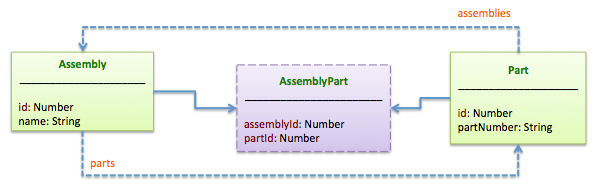

例如,下面是assembly模型的JSON文件的摘录,表示了assembly(组件)和part(部件)模型之间的hasAndBelongsToMany关系:

**/common/models/assembly.json**

```json
{
  "name": "Assembly",
  "plural": "Assemblies",
  "relations": {
    "parts": {
      "type": "hasAndBelongsToMany",
      "model": "Part"
    },
...
```

你还可以通过js代码定义hasAndBelongsToMany关系,虽然通常情况下不建议这么做:

**/common/models/assembly.js**

```javascript
Part.hasAndBelongsToMany(Assembly);
Assembly.hasAndBelongsToMany(Part);
```

**通过REST API添加关系**

通过REST API添加关系时,连接模型必须存在才能添加关系.例如,在上面的“Assembly”和“Part”模型示例中,要通过REST API接口将“Part”的实例添加到“Assembly”中,必须存在一个“AssemblyPart”模型才能工作.

**大多数时候,你应该使用method(方法)添加“hasAndBelongToMany”关系**到服务器端的模型:

**Example method**

```javascript
assembly.parts.add(part, function(err) {
  //...
});
```

如果您需要使用REST添加关系,首先检查是否首先存在“AssemblyPart”模型.然后使用此代码添加关系:

**Rest Example Method**

```javascript
Assembly.Parts.link({id:assemblyId, fk: partId}, partInstance,  function(value, header) {
  //success
});
```

##### 为model添加method

一旦你定义了一个“hasAndBelongsToMany”关系,LoopBack会自动将一个带有关系名称的方法添加到声明模型类的原型.例如:assembly.parts.create(...).

<table>
  <tbody>
    <tr>
      <th style="width: 400px;">Example method</th>
      <th>Description</th>
    </tr>
    <tr>
      <td>
        <pre>assembly.parts(filter,
  function(err, parts) {<br>  ...<br>});</pre>
      </td>
      <td>Find parts for the assembly.</td>
    </tr>
    <tr>
      <td>
        <pre>var part = assembly.parts.build(data);</pre>
      </td>
      <td>Build a new part.</td>
    </tr>
    <tr>
      <td>
        <pre>assembly.parts.create(data,
  function(err, part) {<br>  ...<br>});</pre>
      </td>
      <td>Create a new part for the assembly.</td>
    </tr>
    <tr>
      <td>
        <pre>assembly.parts.add(part,
  function(err) {<br>  ...<br>});</pre>
      </td>
      <td>Add a part to the assembly.</td>
    </tr>
    <tr>
      <td>
        <pre>assembly.parts.remove(part,
  function(err) {<br>  ...<br>});</pre>
      </td>
      <td>Remove a part from the assembly.</td>
    </tr>
    <tr>
      <td>
        <pre>assembly.parts.findById(partId,
  function(err, part) {<br>  ...<br>});</pre>
      </td>
      <td>Find a part by ID.</td>
    </tr>
    <tr>
      <td>
        <pre>assembly.parts.destroy(partId,
function(err) {<br>  ...<br>});</pre>
      </td>
      <td>Delete a part by ID.</td>
    </tr>
  </tbody>
</table>

---

<h4 id="1.6.7"> 1.6.7 Polymorphic关系(多态) </h4>

##### 概述

LoopBack支持多态关系(polymorphic relations),其中模型可以属于多个其他模型,在单个关联上。 例如,您可能具有属于作者模型或读者模型的图片模型.

_译注: 上面翻译的不好,原文在这里,自己理解LoopBack supports polymorphic relations in which a model can belong to more than one other model, on a single association. For example, you might have a Picture model that belongs to either an Author model or a Reader model_

下面的示例使用三个示例模型:Picture,Author,和Reader,其中Picture可以属于Author或Reader.

##### HasMany的polymorphic关系实现

常用的选项都被支持,例如:'photos'指定一个不同的relation name/accessor(关系名称/访问器).

**common/models/author.json**

```json
{
  "name": "Author",
  "base": "PersistedModel",
  ...
  "relations": {
    "pictures": {
      "type": "hasMany",
      "model": "Picture",
      { "polymorphic": "imageable" }
    }
  }
...
```

和:

**common/models/reader.json**

```json
{
  "name": "Reader",
  "base": "PersistedModel",
  ...
  "relations": {
    "pictures": {
      "type": "hasMany",
      "model": "Picture",
      "polymorphic": {
        "as": "imageable",
        "foreignKey": "imageableId",
        "discriminator": "imageableType"
       } 
    }
  }
...
```

或者,你可以在js代码中定义关系:

**common/models/author.js**

```javascript
Author.hasMany(Picture, { polymorphic: 'imageable' });
```

和:

**common/models/reader.js**

```javascript
Reader.hasMany(Picture, { polymorphic: { // alternative syntax  
  as: 'imageable', // if not set, default to: reference
  foreignKey: 'imageableId', // defaults to 'as - Id'
  discriminator: 'imageableType' // defaults to 'as - Type'
  } 
});
```

##### HasManyThrough的polymorphic关系实现

要定义hasMany多态关系,必须有一个“through”模型,类似于标准的HasManyThrough关系.

例如,"ImageLink":

**/common/models/ImageLink.json**

```json
{
  "name": "ImageLink",
  "base": "PersistedModel",
  ...
  "relations": {
    "author": {
      "type": "belongsTo",
      "model": "Author",
      "foreignKey": "authorId"
    },
    "pictures": {
      "type": "hasMany",
      "model": "Picture",
      "polymorphic": {
        "foreignKey": "imageableId",
        "discriminator": "imageableType"
      }
    }
  },
...
}
```

下面这个例子就是polymorphic hasManyThrough关系:

**/common/models/Author.json**

```json
{
  "name": "Author",
  "base": "PersistedModel",
  ...
  "relations": {
    "pictures": {
      "type": "hasMany",
      "model": "Picture",
      "polymorphic": {
        "foreignKey": "imageableId",
        "discriminator": "imageableType"
      },
      "through": "ImageLink",
      "keyThrough": "authorId"
    }
  },
...
}
```

同样的,用js实现也可以,例子是下面这个:

**/common/models/Author.js**

```javascript
Author.hasMany(Picture, {
  as: 'pictures',
  polymorphic: {
    foreignKey: 'imageableId',
    discriminator: 'imageableType'
  },
  through: ImageLink,
  keyThrough: 'authorId'
});
```

##### BelongsTo的polymorphic关系实现

因为你动态地定义了相关的模型,所以你不能在前面声明它(_译注:原文是you cannot declare it up front,我翻译的好像不准_). 因此,不是传入相关模型(名称),而是指定多态关系的名称.

**common/models/picture.json**

```json
{
  "name": "Picture",
  "base": "PersistedModel",
  ...
  "relations": {
    "author": {
      "type": "belongsTo",
      "model": "Author",
      "polymorphic": {
        "foreignKey": "imageableId",
        "discriminator": "imageableType"
      }
    }
  },
...
```

或者,使用js代码:

**common/models/picture.js**

```javascript
Picture.belongsTo('imageable', {
  polymorphic: true
}); 
// Alternatively, use an object for setup
Picture.belongsTo('imageable', {
  polymorphic: {
    foreignKey: 'imageableId',
    discriminator: 'imageableType'
  }
});
```

##### HasAndBelongsToMany的polymorphic关系实现

这需要一个明确的“through”模型,例如:PictureLink.

关系`Picture.belongsTo(PictureLink)`和`Picture.belongsTo('imageable',{polymorphic：true})`将自动设置.

对于PictureLink所需的属性也是如此(true).

**/common/models/model.js**

```javascript
Author.hasAndBelongsToMany(Picture, {
  through: PictureLink,
  polymorphic: 'imageable'
});
Reader.hasAndBelongsToMany(Picture, {
  through: PictureLink,
  polymorphic: 'imageable'
});
// Optionally, define inverse hasMany relations with '(invert: true)'
Picture.hasMany(Author, {
  through: PictureLink,
  polymorphic: 'imageable',
  invert: true
});
Picture.hasMany(Reader, {
  through: PictureLink,
  polymorphic: 'imageable',
  invert: true
});
```

##### HasOne的polymorphic关系实现

如下所示,您可以指定'avatar'来显式设置关系的名称.如果未设置,它将默认为多态名称.

**/common/models/model.js**

```javascript
Picture.belongsTo('imageable', {polymorphic: true});
Author.hasOne(Picture, {as: 'avatar', polymorphic: 'imageable'});
Reader.hasOne(Picture, {polymorphic: {as: 'imageable'}});
```

##### 处理polymorphic.idType

因为modelTo在前面是未知的(它是多态的),你不能依靠`modelTo`来获得`foreignKey`类型.您可以显式声明`idType`,如下所示.

```json
[{
  url: 'john.jpg',
  imageableType: 'Author',
  imageableId: '1',
  id: 1
}, {
  url: 'joe.jpg',
  imageableType: 'Reader',
  imageableId: '1',
  id: 2
}]

Authors: [{
  username: 'John',
  id: 1
}]

Readers: [{
  name: 'Joe',
  id: 1
}]
```

```javascript
var Author = app.models.Author;
var Reader = app.models.Reader;
var Picture = app.models.Picture;

Author.hasOne(Picture, {
  as: 'avatar',
  polymorphic: {
    foreignKey: 'imageableId',
    discriminator: 'imageableType'
  }
});

Reader.hasOne(Picture, {
  as: 'imageable',
  polymorphic: {
    foreignKey: 'imageableId',
    discriminator: 'imageableType'
  }
});

Picture.belongsTo('owner', {
  idName: 'username',
  polymorphic: {
    idType: Author.definition.properties.username.type,
    foreignKey: 'imageableId',
    discriminator: 'imageableType'
  }
});

//Creating demo author, reader pictures then listing them
function createAuthor(cb) {
  Author.create({
    username: "John"
  }).then(function(author) {
    author.avatar.create({
      url: "john.jpg"
    }, function() {
      cb();
    });
  });
}

function createReader(cb) {
  Reader.create({
    name: "Joe"
  }).then(function(reader) {
    reader.imageable.create({
      url: "joe.jpg"
    }, function() {
      cb();
    });
  });
}

function listPictures() {
  Picture.find(function(err, res) {
    console.log("\nPictures:\n", res);
  })
}

function listReaders() {
  Reader.find(function(err, res) {
    console.log("\nReaders:\n", res);
  })
}

function listAuthors() {
  Author.find(function(err, res) {
    console.log("\nAuthors:\n", res);
  })
}

//executing the demo
createAuthor(function() {
  createReader(function() {
    listPictures();
    listAuthors();
    listReaders();
  });
});
```

---

<h4 id="1.6.8"> 1.6.8 查询相关model </h4>

##### 概述

关系通过将外键属性连接到主键属性来定义两个模型之间的连接.对于每种关系类型,LoopBack自动将辅助方法混合到模型类中,以帮助导航和关联模型实例以加载或构建数据图.

通常,客户端应用程序想要从图中选择相关数据,例如获得用户信息和最近放置的订单.LoopBack提供了几种方法来在查询中表达这些要求.

##### Inclusion

要在查询的响应中包括相关模型,请使用查询对象的`include`属性或在模型类上使用include()方法. `include`可以是字符串,数组或对象.有关详细信息,请参阅`Include filter`.

以下示例说明有效的格式.

Load all user posts with only one additional request:

**/server/script.js**

```javascript
User.find({include: 'posts'}, function() {
  //...
});
```

或者用js代码:

**/server/script.js**

```javascript
User.find({include: ['posts']}, function() {
  //...
});
```

Load all user posts and orders with two additional requests:

**/server/script.js**

```javascript
User.find({include: ['posts', 'orders']}, function() {
  //...
});
```

Load all post owners (users), and all orders of each owner:

**/server/script.js**

```javascript
Post.find({include: {owner: 'orders'}}, function() {
  //...
});
```

Load all post owners (users), and all friends and orders of each owner:

**/server/script.js**

```javascript
Post.find({include: {owner: ['friends', 'orders']}}, function() {
  //...
});
```

Load all post owners (users), all posts (including images), and orders of each owner:

**/server/script.js**

```javascript
Post.find({include: {owner: [{posts: 'images'} , 'orders']}}, function() {
  //...
});
```

The model class also has an include() method. For example, the code snippet below will populate the list of user instances with posts:

**/server/script.js**

```javascript
User.include(users, 'posts', function() {
  //...
});
```

##### Scope

使用Scoping可以将查询定义为目标模型类或原型的方法.例如:

**/server/boot/script.js**

```javascript
User.scope('top10Vips', {where: {vip: true}, limit: 10});

User.top10Vips(function(err, vips) {
});
```

You can create the same function using a custom method too:

**/server/boot/script.js**

```javascript
User.top10Vips = function(cb) {
  User.find({where: {vip: true}, limit: 10}, cb);
};
```

##### 使用包含关系的过滤器参数

在查询相关模型以从相关模型返回数据时,可以在过滤器(例如,where,order,fields,include过滤器)上使用参数.

例如:考虑Student,Class和Teacher模型，其中Student有多个Class,并且Teacher有多个Class.

查找所有学生,并返回所有他们的课程与教这些课的教师,以及所有的学生注册的这些课,诸如此类,等等.

```javascript
Student.find({
  "filter": {
    "include": {
      "relation": "classes",
      "scope": {
        "include": ["teachers", "students"]
      }
    }
  }
});
```

另一个例子:找到一个特定的老师,也返回所有他们的课程,以及所有学生注册的这些课.

```javascript
Teacher.find({
  "filter": {
    "where": {
      "id": $state.params.id
    },
    "include": {
      "relation": "classes",
      "scope": {
        "include": ["students"]
      }
    }
  }
});
```

---

<h4 id="1.6.9"> 1.6.9 嵌入式model和关系 </h4>

>  LoopBack支持如下这几种(5种)嵌入关系：embedsOne，embedsMany，embedsMany with belongsTo和referencesMany。

##### 概述

LoopBack的relations使您能够在模型之间创建连接,并提供导航/聚合API来处理模型实例的图形(graph).除了传统的以外,LoopBack还支持以下嵌入关系:

* **EmbedsOne** - 一个model嵌入了另一个model.例如:Customer里面迁入了billingAddress.

* **EmbedsMany** - 一个model嵌入许多其他model的实例.例如:Customer可以有很多个email地址,并且每一个email都是一个复合对象,它包括标签和地址等.

* **EmbedsMany** with belongsTo - a model that embeds many links to related people, such as an author or a reader. 

* **ReferencesMany**

> Important: 您可以使用关系数据库的嵌入关系,但数据将始终以字符化JSON格式存储.

##### EmbedsOne

EmbedsOne用于表示嵌入其他模型的模型,例如,Customer嵌入一个billingAddress.

**Sample embedded model**

```json
{
  id: 1,
  name: 'John Smith',
  billingAddress: {
    street: '123 Main St',
    city: 'San Jose',
    state: 'CA',
    zipCode: '95124'
  }
}
```

在js代码中定义关系

**common/models/customer.js**

```javascript
Customer.embedsOne(Address, {
  as: 'address', // default to the relation name - address
  property: 'billingAddress' // default to addressItem
});
```

Parameters for the definition

* **methods** - Scoped methods for the given relation
* **properties** - Properties taken from the parent object
* **scope** - Default scope
* **options** - Options
* **default** - Default value
* **property** - Name of the property for the embedded item
* **as** - Name of the relation

Options

* **forceId** - force generation of ida for embedded items, default to false(强制生成嵌入项的ida,默认为false)
* **validate** - denote if the embedded items should be validated, default to true(表示是否应该验证嵌入的项目,默认为true)
* **persistent** - denote if the embedded items should be persisted, default to false(表示嵌入的项目是否应该持久化,默认为false)

在json中定义关系

**common/models/customer.json**

```json
{
  "name": "Customer",
  "base": "PersistedModel",
  "idInjection": true,
  "properties": {
    "name": {
      "type": "string"
    }
  },
  "relations": {
    "address": {
      "type": "embedsOne",
      "model": "Address",
      "property": "billingAddress",
      "options": {
        "validate": true,
        "forceId": false
      }
    }
    ...
  }
```

Helper methods(辅助方法)

* customer.address()
* customer.address.build()
* customer.address.create()
* customer.address.update()
* customer.address.destroy()
* customer.address.value()

Operation hooks

您可以在embedsOne关系中,为嵌入模型定义`before save`和`after save`的`operation hooks`. 然后,更新或创建容器模型的实例将触发嵌入式模型上的operation hook.发生这种情况时,ctx.isNewInstance为false,因为只创建容器模型的新实例.

例如,如果`Customer embedsOne Address`,并且您在地址模型上定义了一个'before save'hook,则创建新的Customer实例将触发操作挂钩.

##### EmbedsMany

使用embedsMany关系来指示模型可以嵌入另一个模型的许多实例.例如,客户可以有多个电子邮件地址,每个电子邮件地址是一个包含标签和地址的复合对象.

**Sample model instance with many embedded models**

```json
{
  id: 1,
  name: 'John Smith',
  emails: [{
    label: 'work',
    address: 'john@xyz.com'
  }, {
    label: 'home',
    address: 'john@gmail.com'
  }]
}
```

>  Important:把embedsMany作为一个实际的关系,和hasMany关系相比,没有任何不同.例如:这意味着,您不能只是通过嵌入/嵌套数据来POST完整对象,从而一次创建所有内容.因此,使用上面的示例添加一个客户和多个电子邮件地址将需要两个POST操作,一个用于客户记录,一个用于多个电子邮件地址数据.

在js代码中定义关系

**common/models/customer.js**

```javascript
Customer.embedsOne(EmailAddress, {
  as: 'emails', // default to the relation name - emailAddresses
  property: 'emailList' // default to emailAddressItems
});
```

Parameters for the definition

* methods
* properties
* scope
* options
* default
* property
* as

Options

* forceId
* validate
* persistent

在json中定义关系

**common/models/customer.json**

```json
{
  "name": "Customer",
  "base": "PersistedModel",
  "idInjection": true,
  "properties": {
    "name": {
      "type": "string"
    }
  },
  "relations": {
    "emails": {
      "type": "embedsMany",
      "model": "EmailAddress",
      "property": "emailList",
      "options": {
        "validate": true,
        "forceId": false
      }
    }
    ...
  }
```

Helper methods(辅助方法)

* customer.emails()
* customer.emails.create()
* customer.emails.build()
* customer.emails.findById()
* customer.emails.destroyById()
* customer.emails.updateById()
* customer.emails.exists()
* customer.emails.add()
* customer.emails.remove()
* customer.emails.get() - alias to findById
* customer.emails.set() - alias to updateById
* customer.emails.unset() - alias to destroyById
* customer.emails.at()
* customer.emails.value()

Operation hooks

您可以在embedsMany关系中为嵌入模型定义`before save`和`after save`的operation hooks.然后m更新或创建容器模型的实例将触发嵌入式模型上的operation hook.发生这种情况时,ctx.isNewInstance为false,因为只创建容器模型的新实例.

例如,如果`Customer embedsOne Address`,并且您在地址模型上定义了一个`before save`hook,则创建一个新的Customer实例将触发operation hook.

##### EmbedsMany with belongsTo

使用embedsMany with belongsTo关系来表示可以嵌入许多链接到其他模型的模型.例如一个book模型嵌入许多相关人物的链接(例如作者或读者).每个链接属于一个人,它是多态的,因为一个人可以是一个作者或一个读者.

**Exampel embedsMany with belongsTo model instance**

```json
{ 
  id: 1
  name: 'Book 1',
  links: [{
    notes: 'Note 1',
    id: 1,
    linkedId: 1,
    linkedType: 'Author',
    name: 'Author 1'
  }, {
  notes: 'Note 2',
    id: 2,
    linkedId: 1,
    linkedType: 'Reader',
    name: 'Reader 1'
  }]
}
```

Define the embedsMany relation for Book

**common/models/book.json**

```json
{
  "name": "Book",
  "base": "PersistedModel",
  "idInjection": true,
  "properties": {
    "name": {
      "type": "string"
    }
  },
  "validations": [],
  "relations": {
    "people": {
      "type": "embedsMany",
      "model": "Link",
      "scope": {
        "include": "linked"
      }
    }
  },
  "acls": [],
  "methods": []
}
```

Define the polymorphic belongsTo relation for Link

**common/models/link.json**

```json
{
  "name": "Link",
  "base": "Model",
  "idInjection": true,
  "properties": {
    "id": {
      "type": "number",
      "id": true
    },
    "name": {
      "type": "string"
    },
    "notes": {
      "type": "string"
    }
  },
  "validations": [],
  "relations": {
    "linked": {
      "type": "belongsTo",
      "polymorphic": {
        "idType": "number"
      },
      "properties": {
        "name": "name"
      },
      "options": {
        "invertProperties": true
      }
    }
  },
  "acls": [],
  "methods": []
}
```

##### ReferencesMany

Sample referencesMany model instance

```json
{
  id: 1,
  name: 'John Smith',
  accounts: [
    "saving-01", "checking-01",
  ]
}
```

Parameters for the definition

* methods
* properties
* foreignKey
* scope
* options
* default
* as

Options

* forceId
* validate
* persistent

Define the relation in code

**common/models/customer.json**

```json
{
  "name": "Customer",
  "base": "PersistedModel",
  "idInjection": true,
  "properties": {
    "name": {
      "type": "string"
    }
  },
  "relations": {
    "accounts": {
      "type": "referencesMany",
      "model": "Account",
      "foreignKey": "accountIds",
      "options": {
        "validate": true,
        "forceId": false
      }
    }
...
}
```

Helper methods

* customer.accounts()
* customer.accounts.create()
* customer.accounts.build()
* customer.accounts.findById()
* customer.accounts.destroy()
* customer.accounts.updateById()
* customer.accounts.exists()
* customer.accounts.add()
* customer.accounts.remove()
* customer.accounts.at()

##### Transient versus persistent for the embedded model(嵌入模型的瞬态与永久)

Define a transient data source

**server/datasources.json**

```json
{
  ...
  "transient": {
    "name": "transient",
    "connector": "transient"
  }
}
```

Use the transient data source for embedded models

**server/model-config.json**

```json
{
  ...
  "Customer": {
    "dataSource": "db",
    "public": true
  },
  "Address": {
    "dataSource": "transient",
    "public": false
  },
  "EmailAddress": {
    "dataSource": "transient",
    "public": false
  },
  "Account": {
    "dataSource": "db",
    "public": false
  }
}
```

---

<h4 id="1.6.10"> 1.6.10 嵌套查询 </h4>

除了使用LoopBack API直接查询数据,嵌套模型可以是API endpoints(端点).为此,必须使用nestRemoting函数.

>  Important:通常,最好在引导脚本(boot script)中执行嵌套查询,以确保所有模型都已加载.虽然可以在模型定义JSON文件中执行嵌套查询,但必须使用事件来确保已加载相关模型.

了解嵌套查询的最简单的方法是通过一个例子.

假设应用程序有 book, chapter, page, and image models模型,和:

* Each book can have many pages and chapters.
* Each chapter and page can have many notes.
* Each book has an image.

以下JSON块显示了和page和chapter模型有关系的的Book模型.

**common/models/book.json**

```json
{
  "name": "Book",
  "base": "PersistedModel",
  "idInjection": true,
  "options": {
    "validateUpsert": true
  },
  "properties": {
    "name": {
      "type": "string"
    }
  },
  "validations": [],
  "relations": {
    "pages": {
      "type": "hasMany",
      "model": "Page",
      "foreignKey": "",
      "through": ""
    },
    "chapters": {
      "type": "hasMany",
      "model": "Chapter",
      "foreignKey": "",
      "through": ""
    }
  },
  "acls": [],
  "methods": {}
}
```

**common/models/chapter.json**

```json
{
  "name": "Chapter",
  ...
  "relations": {
    "notes": {
      "type": "hasMany",
      "model": "Note",
      "foreignKey": "",
      "through": ""
    }
  },
  ...
}
```

**common/models/page.json**

```json
{
  "name": "Page",
  ...
  "relations": {
    "notes": {
      "type": "hasMany",
      "model": "Note",
      "foreignKey": "",
      "through": ""
    }
  },
  ...
}
```

**common/models/image.json**

```json
{
  "name": "Image",
  ...
  "relations": {
    "book": {
      "type": "belongsTo",
      "model": "Book",
      "foreignKey": "",
      "required": true
    }
  },
  ...
}
```

您可以通过常规关系查询特定图书的页面,如以下API端点所示:

<table>
  <tbody>
    <tr>
      <th>Endpoint</th>
      <th>Output</th>
      <th>Description</th>
    </tr>
    <tr>
      <td>/api/books/123/pages</td>
      <td>An array of pages data</td>
      <td>Queries pages of a specific book</td>
    </tr>
    <tr>
      <td>/api/books/123/pages/456</td>
      <td>An object of a page data</td>
      <td>Queries a page data of a specific page under a specific book</td>
    </tr>
  </tbody>
</table>

但是,要更深入地查询嵌套模型并将它们作为API端点,您需要使用模型nestRemoting()函数:

```javascript
Book.nestRemoting('pages');
Book.nestRemoting('chapters');
Image.nestRemoting('book');
```

上述代码启用以下嵌套查询:

<table>
  <tbody>
    <tr>
      <th>Endpoint</th>
      <th>Output</th>
      <th>Description</th>
    </tr>
    <tr>
      <td>/api/books/123/pages/456/notes</td>
      <td>An array of notes objects</td>
      <td>Queries all of the notes associated with a specific page under a specific book</td>
    </tr>
    <tr>
      <td>/api/books/123/pages/456/notes/567</td>
      <td>An object of a note data</td>
      <td>Queries a specific note associated with a specific page under a specific book</td>
    </tr>
  </tbody>
</table>

或者,由于图像属于书实例,所以,您可以通过他们的图像查询他们的网页:

<table>
  <tbody>
    <tr>
      <th>Endpoint</th>
      <th>Output</th>
      <th>Description</th>
    </tr>
    <tr>
      <td>/api/images/345/book/pages</td>
      <td>An array of pages of a book</td>
      <td>Queries all of the pages of the book, whose associated image id is 345</td>
    </tr>
    <tr>
      <td>/api/images/345/book/pages/456</td>
      <td>An object of a page data</td>
      <td>Queries page with the id of 456 under the book, whose associated image id is 345</td>
    </tr>
  </tbody>
</table>

---

<h4 id="2"> 2. 使用内置Models </h4>

##### 概述

LoopBack为常见使用场景提供了有用的内置models:

* **Application model** - 包含具有自己的标识和与LoopBack服务关联配置的客户端应用程序的元数据.

* **User model** - 注册和验证本地或第三方服务的用户.

* **Access control models** - 包括ACL,AccessToken,Scope,Role和RoleMapping模型,用于控制对应用程序,资源和方法的访问.

* **Email model** - 使用SMTP或第三方服务向您的应用用户发送电子邮件.

内置模型（电子邮件除外）扩展自PersistedModel,因此它们自动具有完整的创建,更新和删除(CRUD)操作.

>  注意:默认情况下,只有User model通过REST公开.要暴露其他内置模型,请在server/model-config.json中将模型的public属性更改为true.使用警告:将某些模型暴露于公共API可能是一种安全风险.

##### Access control models

使用访问控制模型来控制对应用程序,资源和方法的访问.这些模型包括:

* ACL
* AccessToken
* Scope
* Role
* RoleMapping

___ACL model___

ACL模型将主体连接到受保护的资源.系统向主体(用户或应用程序,以及那些可以被分组为角色的主体)授予权限.

* 保护资源：模型数据和操作(模型/属性/方法/关系)
* 是否允许给定的客户端应用程序或用户访问(读取,写入或执行)受保护的资源.

创建新的ACL实例.

**server/boot/script.js**

```javascript
ACL.create({
    principalType: ACL.USER, 
    principalId: 'u001', 
    model: 'User', 
    property: ACL.ALL,
    accessType: ACL.ALL, 
    permission: ACL.ALLOW}, function (err, acl) {
        ACL.create({
            principalType: ACL.USER, 
            principalId: 'u001', 
            model: 'User', 
            property: ACL.ALL,
            accessType: ACL.READ, 
            permission: ACL.DENY}, function (err, acl) {
            }
        );
    }
);
```

---

<h4 id="2.1"> 2.1 扩展内置Models </h4>

##### 使用JSON来扩展内置model

当使用模型生成器创建模型时,选择基本模型,即模型将“扩展”的模型,并从中继承方法和属性.该工具将相应地在模型定义JSON文件中设置基本属性.例如,对于扩展PersistedModel的模型:

**/common/models/model.json**

```json
{
  "name": "Order",
  "base": "PersistedModel",
  ...
```

要更改基本模型,只需编辑JSON文件并更改基本属性.

一般来说,当您想要使用连接器(如MySQL或MongoDB)将数据存储在数据库中时,请使用`PersistedModel`作为基本模型.使用`Model`作为不具有CRUD语义的模型的基础,例如,使用诸如SOAP和REST之类的连接器.

>  提示:扩展内置的User模型以创建表示用户或客户的自己的模型.此模型提供注册,登录和恢复密码的功能.扩展内置User模型时,请使用除"User"以外的模型名称,例如"customer"或"client".不要将其命名为"User",因为这将与内置User模型冲突.为了避免混淆,最好避免使用小写字母"u"的"user".

##### 使用js代码来扩展内置model

您还可以使用模型JavaScript文件/common/models/_modelName_.js中的JavaScript文件扩展模型(其中,modelName是模型的名称),例如:

**/common/models/user.js**

```javascript
var properties = {
  firstName: {
    type: String,
    required: true
  }
};

var options = {
  relations: {
    accessTokens: {
      model: accessToken,
      type: hasMany,
      foreignKey: userId
    },
    account: {
      model: account,
      type: belongsTo
    },
    transactions: {
      model: transaction,
      type: hasMany
    }
  },
  acls: [{
    permission: ALLOW,
    principalType: ROLE,
    principalId: $everyone,
    property: myMethod
  }]
};

var user = loopback.Model.extend('user', properties, options);
```

___Mixing in model definitions___

您可能需要创建共享一组公共属性和逻辑的模型.LoopBack使您能够将一个或多个其他模型“混合(mix-in)”到单个模型中.例如:

**common/models/myModel.js**

```javascript
var TimeStamp = modelBuilder.define('TimeStamp', {
  created: Date,
  modified: Date
});
var Group = modelBuilder.define('Group', {
  groups: [String]
});
User.mixin(Group, TimeStamp);
```

_设置自定义model_

您可能需要为自定义模型执行其他设置,例如添加另一个模型的远程方法.要实现这些,请在新模型上实施setup()方法.loopback.Model.extend()函数调用setup(),因此在setup()中输入的代码将在创建模型时自动执行.

例如:

**common/models/myModel.js**

```javascript
MyModel = Model.extend('MyModel');

MyModel.on('myEvent', function() {
  console.log('meep meep!');
});

MyExtendedModel = MyModel.extend('MyExtendedModel');

MyModel.emit('myEvent'); // nothing happens (no event listener)

// this is where `setup()` becomes handy

MyModel.setup = function() {
  var MyModel = this;
  // since setup is called for every extended model
  // the extended model will also have the event listener
  MyModel.on('myEvent', function() {
    MyModel.printModelName();
  });
}
```

---

<h4 id="2.2"> 2.2 为内置Models添加remote methods </h4>

要向内置模型添加远程方法.您可以扩展模型,然后将远程方法添加到新模型,或将其添加到引导脚本中.如此处示例所述:

此示例将为内置的User模型添加"greet"方法.

##### Boot script

通常,要向User模型添加远程方法,您需要将其添加到/common/models/user.js中.然而,对于内置模型,这个文件将覆盖内置的模型定义,所以你必须在启动脚本中创建和附加我们的远程方法,例如:

**server/boot/userRemoteMethods.js**

```javascript
module.exports = function(app) {
  const User = app.models.User;

  User.greet = function(msg, cb) {
    cb(null, 'Greetings... ' - msg);
  };

  User.remoteMethod(
    'greet', {
      accepts: {
        arg: 'msg',
        type: 'string'
      },
      returns: {
        arg: 'greeting',
        type: 'string'
      }
    }
  );
};
```

##### ACLs

默认情况下,User模型的ACL拒绝除了明确列入白名单的所有请求,因此您必须为远程方法添加ACL记录. 最常见的做法是编辑/common/models/user.json这样的文件,但是这个文件会覆盖内置的版本,所以这是不可能的.相反,您可以在model-config.json中定义ACL.

例如:

**server/model-config.json**

```json
{
  "User": {
    "dataSource": "db",
    "acls": [{
      "principalType": "ROLE",
      "principalId": "$everyone",
      "permission": "ALLOW",
      "property": "greet"
    }]
  },
  ...
}
```

现在,所有用户都可以向/Users/greet发送POST请求,并访问此内置模型上的新自定义方法.

##### 其他注意事项

* 以这种方式添加远程方法**不会将它们添加到Swagger JSON**.这意味着您不会在API Explorer中看到“Users/greet”方法.
* 通过设计,您可以通过`environment specific configurations`覆盖model-config.json中的设置.记住在定义ACL时,如上所示.

---

<h4 id="2.3"> 2.3 为内置Models创建数据库表 </h4>

LoopBack应用程序附带一小组内置模型.要为这些内置模型创建数据库表,请使用`auto-migration`.

>  重要:如果数据库具有现有表,则运行automigrate()将删除并重新创建表,从而可能导致数据丢失.要避免此问题,请使用autoupdate().

为LoopBack内置model创建数据库表情遵循以下步骤:

1. 按照[1.3 将Model附加到数据源](#1.3)的操作来指定数据源.
2. 创建`server/create-lb-tables.js`,代码如下:

```javascript
var server = require('./server');
var ds = server.dataSources.db;
var lbTables = ['User', 'AccessToken', 'ACL', 'RoleMapping', 'Role'];
ds.automigrate(lbTables, function(er) {
  if (er) throw er;
  console.log('Loopback tables [' - lbTables - '] created in ', ds.adapter.name);
  ds.disconnect();
});
```

最后,人工执行这个脚本:

```bash
$ cd server
$ node create-lb-tables.js
```

---

<h4 id="2.4"> 2.4 Model属性引用 </h4>

>  重要:此参考信息正在移至API文档.直到完成才在这里提供.


原文比较少,所以就不翻译了.可以自己去看一下.[链接在这](#http://loopback.io/doc/en/lb3/Model-property-reference.html)

---

<h4 id="2.5"> 2.5 内置Model的REST API </h4>

LoopBack提供了一些具有REST API的内置模型.其中许多都从通用PersistedModel REST API继承端点.

默认情况下,LoopBack使用`/api`作为应用程序REST API的URI根.要更改它,请在应用程序app.js文件中设置`apiPath`变量.

内置model有:

* PersistedModel REST API
* Access token REST API
* ACL REST API
* Application REST API
* Email (See the email connector page)
* Relation REST API
* Role REST API
* User REST API

---

<h4 id="2.5.1"> 2.5.1 PersistedModel REST API </h4>

>  概要:PersistedModel是连接到持久数据源(如数据库)的模型的基类,也是所有内置模型(电子邮件除外)的基类.

##### 概述

PersistedModel是连接到持久数据源(如数据库)的模型的基类,也是所有内置模型(电子邮件除外)的基类.它提供所有标准的创建,读取,更新和删除(CRUD)操作,并为它们公开REST端点.

默认情况下,LoopBack使用`/api`作为REST API的URI根.您可以通过更改应用程序`/server/config.json`文件中的restApiRoot属性来更改此属性.有关详细信息,请参阅config.json.

Model REST API的端点通常是模型名称的复数形式.默认情况下,这只是带有"s"的名称.例如,如果模型是"car",则"cars"是复数形式.您可以在模型定义JSON文件中自定义复数形式.

>  注意:您不能自定义到PersistedModel REST API端点的路由.但是,您可以使用server/ config.json中的rest.normalizeHttpPath属性来控制如何从自定义模型构造REST API端点.有关更多信息,请参阅config.json (Remoting properties).

##### 创建model实例

创建模型的新实例并将其持久保存到数据源.

`POST /_modelName_`

参数:

* 表单数据 - 模型实例数据.可以是表示单个模型实例或模型实例数组的JSON.

例子:

**Request URL**: POST  http://localhost:3000/api/locations

**Request body**: {"name": "L1", "street": "107 S B St", "city": "San Mateo", "zipcode": "94401"}

**Response status code**: 200

**Response body**:

```json
{
  "id": "96",
  "street": "107 S B St",
  "city": "San Mateo",
  "zipcode": 94401,
  "name": "L1"
}
```

##### Update / insert实例

更新现有模型实例或将新实例插入数据源.更新将覆盖请求数据对象中的任何指定的属性.它不会删除现有的,除非该值设置为null.

执行upsertto检测是否有匹配的实例.如果没有,则插入(创建)一个新实例.如果有匹配的实例,则更新它.

`PUT /_modelName_`

参数:

* 表单数据 - JSON格式的model实例数据

例子:

_Insert_

**Request URL**: PUT  http://localhost:3000/api/locations

**Request body**: {"name": "L1", "street": "107 S B St", "city": "San Mateo", "zipcode": "94401"}

**Response status code**: 200

**Response body**:

```json
{
  "id": 98,
  "street": "107 S B St",
  "city": "San Mateo",
  "zipcode": 94401,
  "name": "L1"
}
```

_Update_

**Request URL**: PUT  http://localhost:3000/api/locations

**Request body**: 

```json
{
  "id": "98",
  "name": "L4",
  "street": "107 S B St",
  "city": "San Mateo",
  "zipcode": "94401"
}
```

**Response status code**: 200

**Response body**: 

```json
{ 
  "id": 98,
  "street": "107 S B St",
  "city": "San Mateo",
  "zipcode": 94401,
  "name": "L4"
}
```

##### 检查实例存在

在数据源中根据ID检查实例是否存在

`GET /_modelName_/_modelID_/exists`

参数:

* modelID - model instance ID

例子:

**Request URL**: GET http://localhost:3000/api/locations/88/exists

**Response status code**: 200

**Response body**: javascript {"exists": true}

##### 根据ID查找实例

从数据源中根据ID查找一个model实例

`GET /modelName/modelID?filter=[filterType1]=<val1>&filter[filterType2]=<val2>...`

参数:

* **modelID** - Model instance ID

* _filterType1, filterType2_, and so on, are the filter types. This operation supports only include and fields filters. See Include filter and Fields filter for more information.

* _val1, val2_ are the corresponding values.

例子:

**Request URL**: GET  http://localhost:3000/api/locations/88

**Response status code**: 200

**Response body**:

```json
{
    "id": 88,
    "street": "390 Lang Road",
    "city": "Burlingame",
    "zipcode": 94010,
    "name": "Bay Area Firearms"
}
```

##### 查找匹配实例

从数据源中,根据过滤器,查找所有匹配的实例.

`GET /modelName?filter=[filterType1]=<val1>&filter[filterType2]=<val2>...`

参数:

将参数作为过滤器的HTTP查询参数的值传递,其中:

* _filterType1, filterType2_, and so on, are the filter types.

* _val1, val2_ are the corresponding values.

例子:

Request without filter:

**Request URL**: GET  http://localhost:3000/api/locations

Request with a filter to limit response to two records:

**Request URL**: GET  http://localhost:3000/api/locations?filter[limit]=2

**Response status code**: 200

**Response body**:

```json
[
  { 
  "id": "87",
  "street": "7153 East Thomas Road",
  "city": "Scottsdale",
  "zipcode": 85251,
  "name": "Phoenix Equipment Rentals"
  },
  { 
    "id": "88",
    "street": "390 Lang Road",
    "city": "Burlingame",
    "zipcode": 94010,
    "name": "Bay Area Firearms"
  }
]
```

##### 查找第一个实例

从数据源中,根据过滤器,查找第一个匹配的实例.

`GET /modelName/findOne?filter=[filterType1]=<val1>&filter[filterType2]=<val2>...`

参数:

查询参数:

* filter - 定义位置,顺序,字段,跳过和限制的过滤器.它和find的filter参数一样.

例子:

**Request URL**: GET  http://localhost:3000/api/locations/findOne?filter[where][city]=Scottsdale

**Response status code**: 200

**Response body**:

```json
{
  "id": "87",
  "street": "7153 East Thomas Road",
  "city": "Scottsdale",
  "zipcode": 85251,
  "name": "Phoenix Equipment Rentals"
}
```

##### 删除model实例

从数据源根据ID删除model实例.

`DELETE /modelName/modelID`

参数:

* modelID  - model instance ID

例子:

**Request URL**: DELETE  http://localhost:3000/api/locations/88

**Response status code**: 204

##### 删除所有匹配的实例

>  警告:默认情况下,此操作不会通过REST公开,以防止无意中删除数据.

从与指定的where子句匹配的数据源中删除model的实例.

`DELETE /modelName?filter=[filterType1]=<val1>&filter[filterType2]=<val2>...`

参数:

* filter - 用于定义位置,顺序,字段,跳过和限制的过滤器.它和find的filter参数一样.

例子:

**Request URL**: DELETE  http://localhost:3000/api/locations?[where][city]=Dallas

**Response status code**: 200

##### 获取匹配的实例数量(_译注:可以理解为count(*)_)

从与指定的where子句匹配的数据源中count model的实例.

`GET /modelName/count?where[property]=value`

参数:

* where - 匹配模型实例的条件.

例子:

Count without “where” filter

**Request URL**: GET  http://localhost:3000/api/locations/count

Count with a “where” filter

**Request URL**: GET  http://localhost:3000/api/locations/count?where[city]=Burlingame

**Response status code**: 200

**Response body**:

{count: 6}

##### 更新model实例属性

更新model实例属性并持久化进数据源.

`PUT /model/modelID`

参数:

* data - An object containing property name/value pairs
* modelID - The model instance ID

例子:

**Request URL**: PUT  http://localhost:3000/api/locations/88

**Request body**:

```json
{"name": "L2"}
```

**Response status code**: 200

**Response body**:

```json
{
  "id": "88",
  "street": "390 Lang Road",
  "city": "Burlingame",
  "zipcode": 94010,
  "name": "L2"
}
```

##### 更新匹配的model实例

更新匹配model实例的属性,并持久化到数据源.

`POST /modelName/update?where[property]=value`

参数:

* data - An object containing property name/value pairs.
* where - The where object to select matching instances. See Where filter for more information.

例子:

**Request URL**: POST  http://localhost:3000/api/locations/update?where[city]=Burlingame

**Request body**: {"city": "San Jose"}

**Response status code**: 200

##### 创建更改流(Create Change Stream)

创建一个新的更改流:

`POST /modelName/change-stream?format=event-stream`

参数:

* 表单数据 - 模型实例数据.表示单个模型实例的JSON或模型实例的数组.

例子:

**Request URL**: POST  http://localhost:3000/api/locations/

**Request body**: {"city": "San Jose"}

##### 获取更改流

`GET /modelName/change-stream?format=event-stream`

---

<h4 id="2.5.2"> 2.5.2 Access token REST API </h4>

访问令牌REST API中的所有端点都是从通用PersistedModel REST API继承.为方便起见,此处提供了参考.

**Quick reference**

<table>
  <tbody>
    <tr>
      <th>URI Pattern</th>
      <th>HTTP Verb</th>
      <th>Default Permission</th>
      <th width="200">Description</th>
      <th width="300">Arguments</th>
    </tr>
    <tr>
      <td><code>/accessTokens</code></td>
      <td>POST</td>
      <td>Allow</td>
      <td>
        <a href="PersistedModel-REST-API.html#create-model-instance">Add access token instance</a> and persist to data source.
      </td>
      <td>JSON object (in request body)</td>
    </tr>
    <tr>
      <td><code>/accessTokens</code></td>
      <td>GET</td>
      <td>Deny</td>
      <td><a href="PersistedModel-REST-API.html#find-matching-instances">Find instances</a> of accessTokens that match specified filter.</td>
      <td>
        One or more filters in query parameters:
        <ul>
          <li>where</li>
          <li>include</li>
          <li>order</li>
          <li>limit</li>
          <li>skip / offset</li>
          <li>fields</li>
        </ul>
      </td>
    </tr>
    <tr>
      <td><code>/accessTokens</code></td>
      <td>PUT</td>
      <td>Deny</td>
      <td><a href="PersistedModel-REST-API.html#update--insert-instance">Update / insert access token instance</a> and persist to data source.</td>
      <td>JSON object (in request body)</td>
    </tr>
    <tr>
      <td><code>/accessTokens/<em>id</em></code></td>
      <td>GET</td>
      <td>Deny</td>
      <td><a href="PersistedModel-REST-API.html#find-instance-by-id">Find access token by ID</a>: Return data for the specified access token instance ID.</td>
      <td><em>id</em>, the access token instance ID (in URI path)</td>
    </tr>
    <tr>
      <td><code>/accessTokens/<em>id</em></code></td>
      <td>PUT</td>
      <td>Deny</td>
      <td><a href="PersistedModel-REST-API.html#update-model-instance-attributes">Update attributes</a> for specified access token ID and persist.</td>
      <td>
        Query parameters:
        <ul>
          <li>data&nbsp;- An object containing property name/value pairs</li>
          <li><em>id</em>&nbsp;- The model id</li>
        </ul>
      </td>
    </tr>
    <tr>
      <td><code>/accessTokens/<em>id</em></code></td>
      <td>DELETE</td>
      <td>Deny</td>
      <td><a href="PersistedModel-REST-API.html#delete-model-instance">Delete access token</a> with specified instance ID.</td>
      <td><em>id</em>, access token ID<em> </em>(in URI path)</td>
    </tr>
    <tr>
      <td><code>/accessTokens/<em>id</em>/exists</code></td>
      <td>GET</td>
      <td>Deny</td>
      <td>
        <a href="PersistedModel-REST-API.html#check-instance-existence">Check instance existence</a>: Return true if specified access token ID exists.
      </td>
      <td>
        URI path:
        <ul>
          <li><em>id</em> - Model instance ID</li>
        </ul>
      </td>
    </tr>
    <tr>
      <td><code>/accessTokens/count</code></td>
      <td>GET</td>
      <td>Deny</td>
      <td>
        <a href="PersistedModel-REST-API.html#get-instance-count">Return the number of access token instances</a>&nbsp;that matches specified where clause.
      </td>
      <td>Where filter specified in query parameter</td>
    </tr>
    <tr>
      <td><code>/accessTokens/findOne</code></td>
      <td>GET</td>
      <td>Deny</td>
      <td>
        <a href="PersistedModel-REST-API.html#find-first-instance">Find first access token instance</a> that matches specified filter.
      </td>
      <td>Same as <a href="PersistedModel-REST-API.html#find-matching-instances">Find matching instances</a>.</td>
    </tr>
  </tbody>
</table>

---

<h4 id="2.5.3"> 2.5.3 ACL REST API </h4>

ACL REST API中的所有端点都继承自PersistedModel REST API.为方便起见,此处提供了参考.

默认情况下,不显示ACL REST API.要公开它,请将以下内容添加到models.json中:

```json
"acl": {
  "public": true,
  "options": {
    "base": "ACL"
  },
  "dataSource": "db"
}
```

**Quick reference**

<table>
  <tbody>
    <tr>
      <th>
        <p>URI Pattern</p>
      </th>
      <th>HTTP Verb</th>
      <th>Default Permission</th>
      <th>Description</th>
      <th>Arguments</th>
    </tr>
    <tr>
      <td>
        <p><code>/acls</code></p>
        <div style="width:120px;">
          <p>&nbsp;</p>
        </div>
      </td>
      <td>POST</td>
      <td>Allow</td>
      <td>
        <p><a href="PersistedModel-REST-API.html#create-model-instance">Add ACL instance</a><span> and persist to data source.</span></p>
      </td>
      <td>JSON object (in request body)</td>
    </tr>
    <tr>
      <td><code>/acls</code></td>
      <td>GET</td>
      <td>Deny</td>
      <td><a href="PersistedModel-REST-API.html#find-matching-instances">Find instances</a><span> of ACLs that match specified filter.</span></td>
      <td>
        <p>One or more filters in query parameters:</p>
        <ul>
          <li>where</li>
          <li>include</li>
          <li>order</li>
          <li>limit</li>
          <li>skip / offset</li>
          <li>fields</li>
        </ul>
      </td>
    </tr>
    <tr>
      <td><code>/acls</code></td>
      <td>PUT</td>
      <td>Deny</td>
      <td><a href="PersistedModel-REST-API.html#update--insert-instance">Update / insert ACL instance</a><span> and persist to data source.</span></td>
      <td>JSON object (in request body)</td>
    </tr>
    <tr>
      <td><code>/acls/<em>id</em></code></td>
      <td>GET</td>
      <td>Deny</td>
      <td><a href="PersistedModel-REST-API.html#find-instance-by-id">Find ACL by ID</a><span>: Return data for the specified ACL instance ID.</span></td>
      <td><em>id</em>, the ACL instance ID (in URI path)</td>
    </tr>
    <tr>
      <td><code>/acls/<em>id</em></code></td>
      <td>PUT</td>
      <td>Deny</td>
      <td><a href="PersistedModel-REST-API.html#update-model-instance-attributes">Update attributes</a><span> for specified ACL ID and persist.</span></td>
      <td>
        <p>Query parameters:</p>
        <ul>
          <li>data&nbsp;- An object containing property name/value pairs</li>
          <li><em>id</em>&nbsp;- The model id</li>
        </ul>
      </td>
    </tr>
    <tr>
      <td><code>/acls/<em>id</em></code></td>
      <td>DELETE</td>
      <td>Deny</td>
      <td><a href="PersistedModel-REST-API.html#delete-model-instance">Delete ACL</a><span> with specified instance ID.</span></td>
      <td><em>id</em>, acls ID<em> </em>(in URI path)</td>
    </tr>
    <tr>
      <td><code>/acls/<em>id</em>/exists</code></td>
      <td>GET</td>
      <td>Deny</td>
      <td>
        <p><a href="PersistedModel-REST-API.html#check-instance-existence">Check instance existence</a><span>: Return true if specified ACL ID exists.</span></p>
      </td>
      <td>
        <p>URI path:</p>
        <ul>
          <li><em>id</em> - Model instance ID</li>
        </ul>
      </td>
    </tr>
    <tr>
      <td><code>/acls/count</code></td>
      <td>GET</td>
      <td>Deny</td>
      <td>
        <p><a href="PersistedModel-REST-API.html#get-instance-count">Return the number of ACL instances</a><span>&nbsp;that matches specified where clause.</span></p>
      </td>
      <td>Where filter specified in query parameter</td>
    </tr>
    <tr>
      <td><code>/acls/findOne</code></td>
      <td>GET</td>
      <td>Deny</td>
      <td>
        <p><a href="PersistedModel-REST-API.html#find-first-instance">Find first ACL instance</a><span> that matches specified filter.</span></p>
      </td>
      <td>Same as <a href="PersistedModel-REST-API.html#find-matching-instances">Find matching instances</a>.</td>
    </tr>
  </tbody>
</table>

---

<h4 id="2.5.4"> 2.5.4 Application REST API </h4>

Application  REST API中的所有端点都继承自PersistedModel REST API.为方便起见.此处提供了参考.

**Quick reference**

<table>
  <tbody>
    <tr>
      <th>
        <p>URI Pattern</p>
      </th>
      <th>HTTP Verb</th>
      <th>Default Permission</th>
      <th>Description</th>
      <th>Arguments</th>
    </tr>
    <tr>
      <td>
        <p><code>/applications</code></p>
        <div style="width:120px;">
          <p>&nbsp;</p>
        </div>
      </td>
      <td>POST</td>
      <td>Allow</td>
      <td>
        <p><a href="PersistedModel-REST-API.html#create-model-instance">Add application instance</a> and persist to data source.</p>
      </td>
      <td>JSON object (in request body)</td>
    </tr>
    <tr>
      <td><code>/applications</code></td>
      <td>GET</td>
      <td>Deny</td>
      <td><a href="PersistedModel-REST-API.html#find-matching-instances">Find instances</a> of applications that match specified filter.</td>
      <td>
        <p>One or more filters in query parameters:</p>
        <ul>
          <li>where</li>
          <li>include</li>
          <li>order</li>
          <li>limit</li>
          <li>skip / offset</li>
          <li>fields</li>
        </ul>
      </td>
    </tr>
    <tr>
      <td><code>/applications</code></td>
      <td>PUT</td>
      <td>Deny</td>
      <td><a href="PersistedModel-REST-API.html#update--insert-instance">Update / insert application instance</a> and persist to data source.</td>
      <td>JSON object (in request body)</td>
    </tr>
    <tr>
      <td><code>/applications/<em>id</em></code></td>
      <td>GET</td>
      <td>Deny</td>
      <td><a href="PersistedModel-REST-API.html#find-instance-by-id">Find application by ID</a>: Return data for the specified application instance ID.</td>
      <td><em>id</em>, the application instance ID (in URI path)</td>
    </tr>
    <tr>
      <td><code>/applications/<em>id</em></code></td>
      <td>PUT</td>
      <td>Deny</td>
      <td><a href="PersistedModel-REST-API.html#update-model-instance-attributes">Update attributes</a> for specified application ID and persist.</td>
      <td>
        <p>Query parameters:</p>
        <ul>
          <li>data&nbsp;- An object containing property name/value pairs</li>
          <li><em>id</em>&nbsp;- The model id</li>
        </ul>
      </td>
    </tr>
    <tr>
      <td><code>/applications/<em>id</em></code></td>
      <td>DELETE</td>
      <td>Deny</td>
      <td><a href="PersistedModel-REST-API.html#delete-model-instance">Delete application</a> with specified instance ID.</td>
      <td><em>id</em>, application ID<em> </em>(in URI path)</td>
    </tr>
    <tr>
      <td><code>/applications/<em>id</em>/exists</code></td>
      <td>GET</td>
      <td>Deny</td>
      <td>
        <p><a href="PersistedModel-REST-API.html#check-instance-existence">Check instance existence</a>: Return true if specified application ID exists.</p>
      </td>
      <td>
        <p>URI path:</p>
        <ul>
          <li><em>id</em> - Model instance ID</li>
        </ul>
      </td>
    </tr>
    <tr>
      <td><code>/applications/count</code></td>
      <td>GET</td>
      <td>Deny</td>
      <td>
        <p><a href="PersistedModel-REST-API.html#get-instance-count">Return the number of application instances</a>&nbsp;that matches specified where clause.</p>
      </td>
      <td>Where filter specified in query parameter</td>
    </tr>
    <tr>
      <td><code>/applications/findOne</code></td>
      <td>GET</td>
      <td>Deny</td>
      <td>
        <p><a href="PersistedModel-REST-API.html#find-first-instance">Find first application instance</a> that matches specified filter.</p>
      </td>
      <td>Same as&nbsp;<a href="PersistedModel-REST-API.html#find-matching-instances">Find matching instances</a>.</td>
    </tr>
  </tbody>
</table>

---

<h4 id="2.5.5"> 2.5.5 Relation REST API </h4>

这些端点是PersistedModel REST API的一部分,但是为了方便参考,这里提供.

##### 获取相关model实例

`GET /<model1-name>/<instanceID>/<model2-name>`

参数:

* `<instanceID>` - ID of instance in model1.
* `<model1-name>` - name of first model. 
* `<model2-name>` - name of second related model.

例子:

Request:

`GET http://localhost:3000/locations/88/inventory`

Response:

```json
[
  {
    "productId": "2",
    "locationId": "88",
    "available": 10,
    "total": 10
  },
  {
    "productId": "3",
    "locationId": "88",
    "available": 1,
    "total": 1
  }
]
```

##### Get hasMany related model instances

列出由instance-ID标识指定的`<model-name>`的hasMany关系的相关模型实例.

`GET /<model-name>/<instance-ID>/<hasManyRelationName>`

##### Create hasMany related model instance

为hasMany关系的`<instance-ID>`标识的指定`<model-name>`创建相关模型实例.(_译注:原文在这里,以下不翻译了,容易造成误解,Create a related model instance for specified <model-name> identified by <instance-ID>, for hasMany relationship._)

`POST /<model1-name>/<instance-ID>/<hasMany-Relation-Name>`

##### Delete hasMany related model instances

Delete related model instances for specified `<model-name>` identified by `<instance-ID>`, for hasMany relationship.

`DELETE /<model1-name>/<instance-ID>/<hasMany-relation-name>`

##### List belongsTo related model instances

List the related model instances for the given model identified by `<instance-ID>`, for hasMany relationship.

`GET /model-name/<instance-ID>/<belongsTo-relation-name>`

##### Aggregate models following relations

通常期望在对查询的响应中包含相关模型的实例,以使得客户端不必进行多个调用.

`GET /<model1-name>?filter[include]=...`

参数:

* include - The object that describes a hierarchy of relations to be included(描述要包含的关系的层次结构的对象)

例子:

`GET /api/members?filter[include]=posts`

The API returns the following JSON:

```json
[
  {
    "name": "Member A",
    "age": 21,
    "id": 1,
    "posts": [
      {
        "title": "Post A",
        "id": 1,
        "memberId": 1
      },
      {
        "title": "Post B",
        "id": 2,
        "memberId": 1
      },
      {
        "title": "Post C",
        "id": 3,
        "memberId": 1
      }
    ]
  },
  {
    "name": "Member B",
    "age": 22,
    "id": 2,
    "posts": [
      {
        "title": "Post D",
        "id": 4,
        "memberId": 2
      }
    ]
  },
...
]
```

The following request retrieves all members, including the posts, which further includes the author:

`GET /api/members?filter[include][posts]=author`

The API returns the following JSON:

```json
[
  {
    "name": "Member A",
    "age": 21,
    "id": 1,
    "posts": [
      {
        "title": "Post A",
        "id": 1,
        "memberId": 1,
        "author": {
          "name": "Member A",
          "age": 21,
          "id": 1
        }
      },
      {
        "title": "Post B",
        "id": 2,
        "memberId": 1,
        "author": {
          "name": "Member A",
          "age": 21,
          "id": 1
        }
      },
      {
        "title": "Post C",
        "id": 3,
        "memberId": 1,
        "author": {
          "name": "Member A",
          "age": 21,
          "id": 1
        }
      }
    ]
  },
  {
    "name": "Member B",
    "age": 22,
    "id": 2,
    "posts": [
      {
        "title": "Post D",
        "id": 4,
        "memberId": 2,
        "author": {
          "name": "Member B",
          "age": 22,
          "id": 2
        }
      }
    ]
  },
  ...
]
```

The following request retrieves all members who are 21 years old, including the posts, which further includes the author:

`GET /api/members?filter[include][posts]=author&filter[where][age]=21`

The API returns the following JSON:

```json
[
  {
    "name": "Member A",
    "age": 21,
    "id": 1,
    "posts": [
      {
        "title": "Post A",
        "id": 1,
        "memberId": 1,
        "author": {
          "name": "Member A",
          "age": 21,
          "id": 1
        }
      },
      {
        "title": "Post B",
        "id": 2,
        "memberId": 1,
        "author": {
          "name": "Member A",
          "age": 21,
          "id": 1
        }
      },
      {
        "title": "Post C",
        "id": 3,
        "memberId": 1,
        "author": {
          "name": "Member A",
          "age": 21,
          "id": 1
        }
      }
    ]
  }
]
```

The following request retrieves two members, including the posts, which further includes the author: 

`GET /api/members?filter[include][posts]=author&filter[limit]=2`

The API returns the following JSON:

```json
[
  {
    "name": "Member A",
    "age": 21,
    "id": 1,
    "posts": [
      {
        "title": "Post A",
        "id": 1,
        "memberId": 1,
        "author": {
          "name": "Member A",
          "age": 21,
          "id": 1
        }
      },
      {
        "title": "Post B",
        "id": 2,
        "memberId": 1,
        "author": {
          "name": "Member A",
          "age": 21,
          "id": 1
        }
      },
      {
        "title": "Post C",
        "id": 3,
        "memberId": 1,
        "author": {
          "name": "Member A",
          "age": 21,
          "id": 1
        }
      }
    ]
  },
  {
    "name": "Member B",
    "age": 22,
    "id": 2,
    "posts": [
      {
        "title": "Post D",
        "id": 4,
        "memberId": 2,
        "author": {
          "name": "Member B",
          "age": 22,
          "id": 2
        }
      }
    ]
  }
]
```

The following request retrieves all members, including the posts and passports.

`GET /api/members?filter[include]=posts&filter[include]=passports`

The API returns the following JSON:

```json
[
  {
    "name": "Member A",
    "age": 21,
    "id": 1,
    "posts": [
      {
        "title": "Post A",
        "id": 1,
        "memberId": 1
      },
      {
        "title": "Post B",
        "id": 2,
        "memberId": 1
      },
      {
        "title": "Post C",
        "id": 3,
        "memberId": 1
      }
    ],
    "passports": [
      {
        "number": "1",
        "id": 1,
        "ownerId": 1
      }
    ]
  },
  {
    "name": "Member B",
    "age": 22,
    "id": 2,
    "posts": [
      {
        "title": "Post D",
        "id": 4,
        "memberId": 2
      }
    ],
    "passports": [
      {
        "number": "2",
        "id": 2,
        "ownerId": 2
      }
    ]
  }, ... ]
```

---

<h4 id="2.5.6"> 2.5.6 Role REST API </h4>

Role REST API中的所有端点都从通用PersistedModel REST API继承.为方便起见,此处提供了参考.

**Quick reference**

<table>
  <tbody>
    <tr>
      <th>
        <p>URI Pattern</p>
      </th>
      <th>HTTP Verb</th>
      <th>Default Permission</th>
      <th>Description</th>
      <th>Arguments</th>
    </tr>
    <tr>
      <td>
        <p><code>/roles</code></p>
        <div style="width:120px;">
          <p>&nbsp;</p>
        </div>
      </td>
      <td>POST</td>
      <td>Allow</td>
      <td>
        <p><a href="PersistedModel-REST-API.html#create-model-instance">Add role instance</a> and persist to data source.</p>
      </td>
      <td>JSON object (in request body)</td>
    </tr>
    <tr>
      <td><code>/roles</code></td>
      <td>GET</td>
      <td>Deny</td>
      <td><a href="PersistedModel-REST-API.html#find-matching-instances">Find instances</a> of roles that match specified filter.</td>
      <td>
        <p>One or more filters in query parameters:</p>
        <ul>
          <li>where</li>
          <li>include</li>
          <li>order</li>
          <li>limit</li>
          <li>skip / offset</li>
          <li>fields</li>
        </ul>
      </td>
    </tr>
    <tr>
      <td><code>/roles</code></td>
      <td>PUT</td>
      <td>Deny</td>
      <td><a href="PersistedModel-REST-API.html#update--insert-instance">Update / insert role instance</a> and persist to data source.</td>
      <td>JSON object (in request body)</td>
    </tr>
    <tr>
      <td><code>/roles/<em>id</em></code></td>
      <td>GET</td>
      <td>Deny</td>
      <td><a href="PersistedModel-REST-API.html#find-instance-by-id">Find role by ID</a>: Return data for the specified role instance ID.</td>
      <td><em>id</em>, the role instance ID (in URI path)</td>
    </tr>
    <tr>
      <td><code>/roles/<em>id</em></code></td>
      <td>PUT</td>
      <td>Deny</td>
      <td><a href="PersistedModel-REST-API.html#update-model-instance-attributes">Update attributes</a> for specified role ID and persist.</td>
      <td>
        <p>Query parameters:</p>
        <ul>
          <li>data&nbsp;- An object containing property name/value pairs</li>
          <li><em>id</em>&nbsp;- The model id</li>
        </ul>
      </td>
    </tr>
    <tr>
      <td><code>/roles/<em>id</em></code></td>
      <td>DELETE</td>
      <td>Deny</td>
      <td><a href="PersistedModel-REST-API.html#delete-model-instance">Delete role</a> with specified instance ID.</td>
      <td><em>id</em>, role ID<em> </em>(in URI path)</td>
    </tr>
    <tr>
      <td><code>/roles/<em>id</em>/exists</code></td>
      <td>GET</td>
      <td>Deny</td>
      <td>
        <p><a href="PersistedModel-REST-API.html#check-instance-existence">Check instance existence</a>: Return true if specified role ID exists.</p>
      </td>
      <td>
        <p>URI path:</p>
        <ul>
          <li><em>id</em> - Model instance ID</li>
        </ul>
      </td>
    </tr>
    <tr>
      <td><code>/roles/count</code></td>
      <td>GET</td>
      <td>Deny</td>
      <td>
        <p><a href="PersistedModel-REST-API.html#get-instance-count">Return the number of role instances</a>&nbsp;that matches specified where clause.</p>
      </td>
      <td>Where filter specified in query parameter</td>
    </tr>
    <tr>
      <td><code>/roles/findOne</code></td>
      <td>GET</td>
      <td>Deny</td>
      <td>
        <p><a href="PersistedModel-REST-API.html#find-first-instance">Find first role instance</a> that matches specified filter.</p>
      </td>
      <td>Same as&nbsp;<a href="PersistedModel-REST-API.html#find-matching-instances">Find matching instances</a>.</td>
    </tr>
  </tbody>
</table>

---

<h4 id="2.5.7"> 2.5.7 User REST API </h4>

下面表格中的所有端点都继承自PersistedModel REST API,但以下情况除外：

* Log in user - `POST /users/login`
* Log out user - `POST /users/logout`
* Confirm email address - `GET /users/confirm`
* Reset password - `POST /users/reset`

**Quick reference**

<table>
  <tbody>
    <tr>
      <th>URI Pattern</th>
      <th>HTTP Verb</th>
      <th>Default Permission</th>
      <th>Description</th>
      <th style="width:300px;">Arguments</th>
    </tr>
    <tr>
      <td><code>/users</code></td>
      <td>POST</td>
      <td>Allow</td>
      <td>
        <p><a href="PersistedModel-REST-API.html#create-model-instance">Add user instance</a> and persist to data source. Inherited from <a href="PersistedModel-REST-API.html">PersistedModel API</a>.</p>
      </td>
      <td>
        <p>JSON object (in request body) providing <a href="http://apidocs.strongloop.com/loopback/#user" class="external-link" rel="nofollow">User object properties</a>: <code>username</code>, <code>password</code>, <code>email</code>. LoopBack sets values for <code>emailVerified</code> and <code>verificationToken</code>.</p>
        <p>NOTE: A value for <code>username</code> is not required, but a value for <code>email</code> is. LoopBack validates a unique value for <code>password</code> is provided. LoopBack does not automatically maintain values of the <code>created</code> and <code>lastUpdated</code> properties; you can set them manually if you wish.</p>
      </td>
    </tr>
    <tr>
      <td><code>/users</code></td>
      <td>GET</td>
      <td>Deny</td>
      <td><a href="PersistedModel-REST-API.html#find-matching-instances">Find matching instances</a> of users that match specified filter. Inherited from <a href="PersistedModel-REST-API.html">PersistedModel API</a>.
      </td>
      <td>
        <p>One or more filters in query parameters:</p>
        <ul>
          <li>where</li>
          <li>include</li>
          <li>order</li>
          <li>limit</li>
          <li>skip / offset</li>
          <li>fields</li>
        </ul>
      </td>
    </tr>
    <tr>
      <td><code>/users</code></td>
      <td>PUT</td>
      <td>Deny</td>
      <td><a href="PersistedModel-REST-API.html#update--insert-instance">Update / insert user instance</a> and persist to data source. Inherited from <a href="PersistedModel-REST-API.html">PersistedModel API</a>.
      </td>
      <td>
        <p>JSON object (in request body)</p>
        <p>Same as for <code>POST /users</code></p>
      </td>
    </tr>
    <tr>
      <td><code>/users/<em>id</em></code></td>
      <td>GET</td>
      <td>Deny</td>
      <td><a href="PersistedModel-REST-API.html#find-instance-by-id">Find user by ID</a>: Return data for the specified user ID. Inherited from <a href="PersistedModel-REST-API.html">PersistedModel API</a>.
      </td>
      <td><em>id</em>, the user ID (in URI path)</td>
    </tr>
    <tr>
      <td><code>/users/<em>id</em></code></td>
      <td>PUT</td>
      <td>Deny</td>
      <td><a href="PersistedModel-REST-API.html#update-model-instance-attributes">Update user attributes</a> for specified user ID and persist. Inherited from <a href="PersistedModel-REST-API.html">PersistedModel API</a>.
      </td>
      <td>
        <p>Query parameters:</p>
        <ul>
          <li>data&nbsp;An object containing property name/value pairs</li>
          <li><em>id</em>&nbsp;The model id</li>
        </ul>
      </td>
    </tr>
    <tr>
      <td><code>/users/<em>id</em></code></td>
      <td>DELETE</td>
      <td>Deny</td>
      <td><a href="PersistedModel-REST-API.html#delete-model-instance">Delete user</a> with specified instance ID. Inherited from <a href="PersistedModel-REST-API.html">PersistedModel API</a>.
      </td>
      <td><em>id</em>, user ID<em> </em>(in URI path)</td>
    </tr>
    <tr>
      <td><code>/users/<em>id</em>/accessTokens</code></td>
      <td>GET</td>
      <td>Deny</td>
      <td>Returns access token for specified user ID.</td>
      <td>
        <ul>
          <li><em>id</em>, user ID, in URI path</li>
          <li>where in query parameters</li>
        </ul>
      </td>
    </tr>
    <tr>
      <td><code>/users/<em>id</em>/accessTokens</code></td>
      <td>POST</td>
      <td>Deny</td>
      <td>Create access token for specified user ID.</td>
      <td>
        <p><em>id</em>, user ID, in URI path</p>
      </td>
    </tr>
    <tr>
      <td><code>/users/<em>id</em>/accessTokens</code></td>
      <td>DELETE</td>
      <td>Deny</td>
      <td>Delete access token for specified user ID.</td>
      <td>
        <p><em>id</em>, user ID, in URI path</p>
      </td>
    </tr>
    <tr>
      <td><code>/users/confirm</code></td>
      <td>GET</td>
      <td>Deny</td>
      <td><a href="#confirm-email-address">Confirm email address</a> for specified user.</td>
      <td>
        <p>Query parameters:</p>
        <ul>
          <li>uid</li>
          <li>token</li>
          <li>redirect</li>
        </ul>
      </td>
    </tr>
    <tr>
      <td><code>/users/count</code></td>
      <td>GET</td>
      <td>Deny</td>
      <td>
        <p><a href="http://apidocs.strongloop.com/loopback/#persistedmodel-count" class="external-link" rel="nofollow">Return number of user instances</a>&nbsp;that match specified where clause. Inherited from <a href="http://apidocs.strongloop.com/loopback/#persistedmodel">PersistedModel API</a>.
        </p>
      </td>
      <td>"Where" filter specified in query parameter</td>
    </tr>
    <tr>
      <td><code>/users/<em>id</em>/exists</code></td>
      <td>GET</td>
      <td>Deny</td>
      <td>
        <p>Check instance existence: Return true if specified user ID exists. Inherited from <a href="PersistedModel-REST-API.html">PersistedModel API</a>.
        </p>
      </td>
      <td>
        <p>URI path:</p>
        <ul>
          <li><em>users</em> - Model name</li>
          <li><em>id</em> - Model instance ID</li>
        </ul>
      </td>
    </tr>
    <tr>
      <td><code>/users/findOne</code></td>
      <td>GET</td>
      <td>Deny</td>
      <td>
        <p>Find first user instance that matches specified filter. Inherited from <a href="PersistedModel-REST-API.html">PersistedModel API</a>.
        </p>
      </td>
      <td>
      <p>One or more filters in query parameters:</p>
      <ul>
        <li>where</li>
        <li>include</li>
        <li>order</li>
        <li>limit</li>
        <li>skip / offset</li>
        <li>fields</li>
      </ul>
      </td>
    </tr>
    <tr>
      <td><code>/users/login[?include=user]</code></td>
      <td>
        <p>POST</p>
      </td>
      <td>Allow</td>
      <td>
        <p><a href="#log-in-user">Log in</a> the specified user.</p>
      </td>
      <td>
        <p>Username and password in POST body.</p>
        <p>If query parameter is <code>include=user</code>, then returns the user object.</p>
      </td>
    </tr>
    <tr>
      <td>
        <code>/users/logout</code>
      </td>
      <td>POST</td>
      <td>Allow</td>
      <td><a href="#log-out-user">Log out</a> the specified user.</td>
      <td>Access token in POST body.</td>
    </tr>
    <tr>
      <td><code>/users/reset</code></td>
      <td>POST</td>
      <td>&nbsp;</td>
      <td><a href="#reset-password">Reset password</a> for the specified user.</td>
      <td>In POST body</td>
    </tr>
  </tbody>
</table>

##### Log in user

`POST /users/login`

您必须在请求正文中提供用户名或电子邮件以及密码.为了确保这些值被加密,请将它们作为正文的一部分,并确保通过HTTPS提供应用程序.

您还可以通过提供具有秒值的ttl(存活时间)属性来指定访问令牌有效的有效期.

例子:

**Request URL**: POST  http://localhost:3000/users/login

**Request body**: 

```json
{ "email": "foo@bar.com", "password": "bar", "ttl": 86400 }
```

**Response status code**: 200

**Response body**: 

```json
{ 
  "id": "PqosmmPCdQgwerDYwQcVCxMakGQV0BSUwG4iGVLvD3XUYZRQky1cmG8ocmzsVpEE", 
  "ttl": 86400,
  "created": "2014-12-23T08:31:33.464Z",
  "userId": 1
}
```

用户会话的访问令牌存储在在响应的id键中.它必须在查询参数`access_token`中为需要用户登录的所有API指定,例如:

`http://localhost:3000/api/Users/logout?access_token=PqosmmPCdQgwerDYwQcVCxMakGQV0BSUwG4iGVLvD3XUYZRQky1cmG8ocmzsVpEE`

##### Log out user

`POST /users/logout`

例子:

**Request URL**: `POST  http://localhost:3000/api/Users/logout?access_token=PqosmmPCdQgwerDYwQcVCxMakGQV0BSUwG4iGVLvD3XUYZRQky1cmG8ocmzsVpEE`

**Response status code**: 204

##### 确认邮件地址

要求用户在登录前验证其电子邮件地址,这将向用户发送一封电子邮件,其中包含用于验证其地址的链接.一旦用户点击链接,他们将被重定向到web根("/"),并将能够正常登录.

`GET /users/confirm`

参数:

Query parameters:

* uid
* token
* redirect

返回值:

If token invalid: HTTP 400

If user not found: HTTP 404

If successful: HTTP 204

##### 重置密码

`POST /users/reset`

参数:

POST payload:

```json
{
  "email": "foo@bar.com"
  ...
}
```

Return value

`200 OK`

您必须处理"resetPasswordRequest"事件才能向正确的用户发送包含访问令牌的重置电子邮件.

下面的示例显示了如何获取用户可以用来重置密码的访问令牌:

**common/models/user.js**

```javascript
User.on('resetPasswordRequest', function (info) {
  console.log(info.email); // the email of the requested user
  console.log(info.accessToken.id); // the temp access token to allow password reset

  // requires AccessToken.belongsTo(User)
  info.accessToken.user(function (err, user) {
    console.log(user); // the actual user
  });
});
```

---

<h4 id="3"> 3. 将Model连接到数据源 </h4>

##### 概要

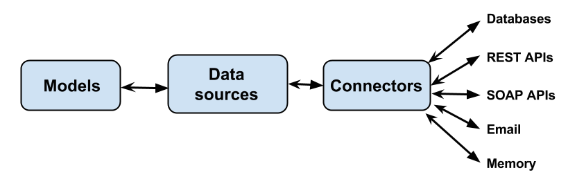

LoopBack模型通过提供创建,检索,更新和删除(CRUD)功能的数据源连接到后端系统,如数据库.LoopBack还将其他后端服务(例如REST API,SOAP Web服务和存储服务等)概括为数据源.

数据源由使用数据库驱动程序或其他客户端API实现数据交换逻辑的连接器支持.一般来说,应用程序不直接使用连接器,而是使用DataSource和PersistedModel API访问数据源.

##### 基础步骤

1. 使用`data source generator`创建新数据源.
   
   例如:
   
   ```bash
   $ slc loopback:datasource
   ? Enter the data-source name: mysql-corp
   ? Select the connector for mysql: MySQL (supported by StrongLoop)
   ```
   按照提示命名数据源并选择要使用的连接器.这将新数据源添加到datasources.json中.
2. 编辑`server/datasources.json`以添加必要的身份验证凭据:通常为主机名,用户名,密码和数据库名称.

   例如:
   
   **server/datasources.json**
   
   ```json
   "mysql-corp": {
   "name": "mysql-corp",
   "connector": "mysql",
   "host": "your-mysql-server.foo.com",
   "user": "db-username",
   "password": "db-password",
   "database": "your-db-name"
  }
  ```
3. 使用npm安装连接器
  
  例如:
  
  ```bash
  $ cd <your-app>
  $ npm install --save loopback-connector-mysql
  ```
4. 使用model generator创建model
  
   ```bash
   $ slc loopback:model
   ? Enter the model name: myModel
   ? Select the data-source to attach myModel to: mysql (mysql)
   ? Select model's base class: PersistedModel
   ? Expose myModel via the REST API? Yes
   ? Custom plural form (used to build REST URL):
   Let's add some test2 properties now.
   ```

##### 连接器

下表列出了商业支持的LoopBack连接器.

<table>
  <thead>
    <tr>
      <td colspan="3" data-highlight-colour="red" style="text-align: center;"><strong>Database connectors</strong></td>
    </tr>
    <tr>
      <th style="text-align: center;">Connector</th>
      <th>Module</th>
      <th>Installation</th>
    </tr>
    <tr>
      <td><a href="https://cloudant.com/" class="external-link" rel="nofollow">IBM Cloudant</a></td>
      <td><a href="https://www.npmjs.com/package/loopback-connector-cloudant" class="external-link" rel="nofollow">loopback-connector-cloudant</a></td>
      <td><code>npm install --save loopback-connector-cloudant</code></td>
    </tr>
    <tr>
      <td><a href="http://www.ibm.com/analytics/us/en/technology/cloud-data-services/dashdb/" class="external-link" rel="nofollow">IBM DashDB</a></td>
      <td><a href="https://www.npmjs.com/package/loopback-connector-dashdb" class="external-link" rel="nofollow">loopback-connector-dashdb</a></td>
      <td><code>npm install --save loopback-connector-dashdb</code></td>
    </tr>
    <tr>
      <td><a href="http://www.ibm.com/analytics/us/en/technology/db2/" class="external-link" rel="nofollow">IBM DB2</a></td>
      <td><a href="https://www.npmjs.com/package/loopback-connector-db2z" class="external-link" rel="nofollow">loopback-connector-db2</a></td>
      <td><code>npm install --save loopback-connector-db2</code></td>
    </tr>
    <tr>
      <td><a href="https://www-01.ibm.com/software/data/db2/zos/family/" class="external-link" rel="nofollow">IBM DB2 for z/OS</a></td>
      <td><a href="https://www.npmjs.com/package/loopback-connector-db2z" class="external-link" rel="nofollow">loopback-connector-db2z</a></td>
      <td><code>npm install --save loopback-connector-db2z</code></td>
    </tr>
    <tr>
      <td><a href="https://www-01.ibm.com/software/data/informix/" class="external-link" rel="nofollow">IBM Informix</a></td>
      <td><a href="https://www.npmjs.com/package/loopback-connector-informix" class="external-link" rel="nofollow">loopback-connector-informix</a></td>
      <td><code>npm&nbsp;install&nbsp;loopback-connector-informix&nbsp;--save</code></td>
    </tr>
  </thead>
  <tbody>
    <tr>
      <td><a href="Memory-connector.html">Memory connector</a></td>
      <td>Built in to LoopBack</td>
      <td>Not required; suitable for development and debugging only.</td>
    </tr>
    <tr>
      <td><a href="MongoDB-connector.html">MongoDB</a></td>
      <td><a href="https://www.npmjs.com/package/loopback-connector-mongodb" class="external-link" rel="nofollow">loopback-connector-mongodb</a></td>
      <td><code>npm install --save loopback-connector-mongodb</code></td>
    </tr>
    <tr>
      <td><a href="MySQL-connector.html">MySQL</a></td>
      <td><a href="https://www.npmjs.com/package/loopback-connector-mysql" class="external-link" rel="nofollow">loopback-connector-mysql</a></td>
      <td><code>npm install --save loopback-connector-mysql</code></td>
    </tr>
    <tr>
      <td><a href="Oracle-connector.html">Oracle</a></td>
      <td><a href="https://www.npmjs.com/package/loopback-connector-oracle" class="external-link" rel="nofollow">loopback-connector-oracle</a></td>
      <td><code>npm install --save loopback-connector-oracle</code></td>
    </tr>
    <tr>
      <td><a href="PostgreSQL-connector.html">PostgreSQL</a></td>
      <td><a href="https://www.npmjs.com/package/loopback-connector-mysql" class="external-link" rel="nofollow">loopback-connector-postgresql</a></td>
      <td><code>npm install --save loopback-connector-postgresql</code></td>
    </tr>
    <tr>
      <td><a href="SQL-Server-connector.html">SQL Server</a></td>
      <td><a href="https://www.npmjs.com/package/loopback-connector-mssql" class="external-link" rel="nofollow">loopback-connector-mssql</a></td>
      <td><code>npm install --save loopback-connector-mssql</code></td>
    </tr>
    <tr>
      <td><a href="https://www.sqlite.org/" class="external-link" rel="nofollow">SQLite 3.x</a></td>
      <td><a href="https://www.npmjs.com/package/loopback-connector-sqlite3" class="external-link" rel="nofollow">loopback-connector-sqlite3</a></td>
      <td><code>npm install --save loopback-connector-sqlite3</code></td>
    </tr>
    <tr>
      <td colspan="3"><strong>Other connectors</strong></td>
    </tr>
    <tr>
      <td><a href="Email-connector.html">Email connector</a></td>
      <td>Built in to LoopBack</td>
      <td>
        <p>Not required</p>
      </td>
    </tr>
    <tr>
      <td><a href="Push-connector.html">Push connector</a>  </td>
      <td><a href="https://github.com/strongloop/loopback-component-push" class="external-link" rel="nofollow">loopback-component-push</a></td>
      <td><code>npm install --save loopback-component-push</code></td>
    </tr>
    <tr>
      <td><a href="Remote-connector.html">Remote connector</a></td>
      <td><a href="https://github.com/strongloop/loopback-connector-remote" class="external-link" rel="nofollow">loopback-connector-remote</a></td>
      <td><code>npm install --save loopback-connector-remote</code></td>
    </tr>
    <tr>
      <td><a href="REST-connector.html">REST</a></td>
      <td><a href="http://github.com/strongloop/loopback-connector-rest" class="external-link" rel="nofollow">loopback-connector-rest</a></td>
      <td><code>npm install --save loopback-connector-rest</code></td>
    </tr>
    <tr>
      <td><a href="SOAP-connector.html">SOAP</a></td>
      <td><a href="http://github.com/strongloop/loopback-connector-soap" class="external-link" rel="nofollow">loopback-connector-soap</a></td>
      <td><code>npm install --save loopback-connector-soap</code></td>
    </tr>
    <tr>
      <td><a href="Storage-connector.html">Storage connector</a></td>
      <td><a href="https://github.com/strongloop/loopback-component-storage" class="external-link" rel="nofollow">loopback-component-storage</a>    </td>
      <td><code>npm install --save loopback-component-storage</code></td>
    </tr>
  </tbody>
</table>

##### 安装连接器

在你的应用程序根目录运行`npm install --save <_connector-module_>` ,然后它会把相关依赖保存到`package.json`文件中,例如安装Oracle database connector:

```bash
$ cd <your-app>
$ npm install --save loopback-connector-oracle
```

**package.json**

```json
...
"dependencies": {
  "loopback-connector-oracle": "latest"
}
...
```

##### 创建数据源

使用`data source generator`创建数据源.

数据源属性:

数据源属性取决于所使用的特定数据源.但是,数据库连接器(Oracle,MySQL,PostgreSQL,MongoDB等)的数据源共享一组公用属性,如下表所述:

<table>
  <tbody>
    <tr>
      <th>Property</th>
      <th>Type</th>
      <th>Description</th>
    </tr>
    <tr>
      <td>connector</td>
      <td>String</td>
      <td>
        <p>Connector name; for example:</p>
        <ul>
          <li>"memory"</li>
          <li>"loopback-connector-mongodb" or "mongodb"</li>
          <li>"loopback-connector-mysql" or "mysql"</li>
          <li>"loopback-connector-oracle" or "oracle"</li>
          <li>"loopback-connector-postgresql" or "postgresql"</li>
          <li>"loopback-connector-rest" or "rest"</li>
          <li>"loopback-connector-mssql" or "mssql"</li>
        </ul>
      </td>
    </tr>
    <tr>
      <td>database</td>
      <td>String</td>
      <td>Database name</td>
    </tr>
    <tr>
      <td>debug</td>
      <td>Boolean</td>
      <td>If true, turn on verbose mode to debug database queries and lifecycle.</td>
    </tr>
    <tr>
      <td>host</td>
      <td>String</td>
      <td>Database host name</td>
    </tr>
    <tr>
      <td>password</td>
      <td>String</td>
      <td>Password to connect to database</td>
    </tr>
    <tr>
      <td>port</td>
      <td>Number</td>
      <td>Database TCP port</td>
    </tr>
    <tr>
      <td>url</td>
      <td>String</td>
      <td>
        <p>Combines and overrides <code>host</code>,&nbsp;<code>port</code>,&nbsp;<code>user</code>,&nbsp;<code>password</code>, and&nbsp;<code>database</code>&nbsp;properties.</p>
        <p>Only valid with <a href="MongoDB-connector.html">MongoDB connector</a>, <a href="PostgreSQL-connector.html">PostgreSQL connector</a>, and <a href="SQL-Server-connector.html">SQL Server connector</a>.</p>
      </td>
    </tr>
    <tr>
      <td>username</td>
      <td>String</td>
      <td>Username to connect to database</td>
    </tr>
  </tbody>
</table>

---

<h4 id="3.1"> 3.1 从Model创建数据库schema </h4>

LoopBack _auto-migration_根据应用程序的模型创建数据库模式.在关系数据库中,auto-migration为每个模型创建一个表,并为模型中的每个属性在表中创建一个列.auto-migration为附加到数据源的所有模型创建表,包括内置模型.

一旦定义了模型,如果需要调整数据库以匹配模型,LoopBack可以相应地创建或更新(同步0数据库模式. LoopBack提供了两种方法来将模型定义与表模式同步:

* **Auto-migrate**: 基于模型定义自动创建或重新创建表模式. 

* **Auto-update**: 根据模型定义自动更改表模式.

>  警告:如果现有表的名称与模型名称匹配,Auto-migration将删除现有表.当表里有数据时,请使用自动更新以避免数据丢失.

##### Auto-migrate

下面的数据源支持auto-migration:

* Oracle
* PostgreSQL
* MySQL
* SQL Server
* MongoDB

下面是个auto-migration的例子.

**/common/models/model.js**

```javascript
var schema_v1 = {
  "name": "CustomerTest",
  "options": {
    "idInjection": false,
    "oracle": {
      "schema": "LOOPBACK",
      "table": "CUSTOMER_TEST"
    }
  },
  "properties": {
    "id": {
      "type": "String",
      "length": 20,
      "id": 1
    },
    "name": {
      "type": "String",
      "required": false,
      "length": 40
    },
    "email": {
      "type": "String",
      "required": false,
      "length": 40
    },
    "age": {
      "type": "Number",
      "required": false
    }
  }
};
```

假设模型在Oracle数据库中没有相应的表,您可以使用autoMigrate()创建相应的模式对象以反映模型定义.

**/common/models/model.js**

```javascript
var ds = Model.app.dataSources.oracle;

ds.createModel(schema_v1.name, schema_v1.properties, schema_v1.options);

ds.automigrate(function () {
  ds.discoverModelProperties('CUSTOMER_TEST', function (err, props) {
    console.log(props);
  });
});
```

上面的代码将在oracle数据库中创建如下对象:

* A table CUSTOMER_TEST.
* A sequence CUSTOMER_TEST_ID_SEQUENCE for keeping sequential IDs.
* A trigger CUSTOMER_ID_TRIGGER that sets values for the primary key.

现在假设你打算对你的model做一些改变.下面是它的代码:

**/common/models/model.js**

```javascript
var schema_v2 = {
  "name": "CustomerTest",
  "options": {
    "idInjection": false,
    "oracle": {
      "schema": "LOOPBACK",
      "table": "CUSTOMER_TEST"
    }
  },
  "properties": {
    "id": {
      "type": "String",
      "length": 20,
      "id": 1
    },
    "email": {
      "type": "String",
      "required": false,
      "length": 60,
      "oracle": {
        "columnName": "EMAIL",
        "dataType": "VARCHAR",
        "dataLength": 60,
        "nullable": "Y"
      }
    },
    "firstName": {
      "type": "String",
      "required": false,
      "length": 40
    },
    "lastName": {
      "type": "String",
      "required": false,
      "length": 40
    }
  }
}
```

##### MongoDB indexes

运行autoMigrate()创建缺少的索引,但是如果它们的定义更改,则autoMigrate()不会修改它们.如果模型的索引定义更改,您必须通过MongoDB shell修改它们,或删除它们并重新创建它们.有关详细信息请参阅MongoDB文档.

##### Auto-update

如果数据库中存在现有表,则运行autoMigrate()将删除并重新创建表.这意味着数据将丢失.要避免此问题,请使用auto-update(). autoupdate()计算LoopBack模型和数据库表定义之间的差异,并相应地更改表,而不是删除表并重新创建它们.这样,只要属性未从模型中删除.列数据就会保留.

例如:

**/server/script.js**

```javascript
ds.createModel(schema_v2.name, schema_v2.properties, schema_v2.options);
ds.autoupdate(schema_v2.name, function (err, result) {
  ds.discoverModelProperties('CUSTOMER_TEST', function (err, props) {
    console.log(props);
  });
});
```

要检查是否需要数据库更改,请使用isActual()方法.它接受一个回调参数,该参数根据数据库状态接收一个布尔值:

* 如果数据库结构过时则为False
* 数据源和数据库同步时为True

**/server/script.js**

```javascript
dataSource.isActual(models, function(err, actual) {
  if (!actual) {
    dataSource.autoupdate(models, function(err, result) {
      // ...
    });
  }
});
```

---

<h4 id="3.2"> 3.2 理解数据源 </h4>


##### 概述

上图说明了LoopBack模型,DataSource和连接器之间的关系.

1. 定义模型.

2. 创建ModelBuilder或DataSource的实例.DataSource从ModelBuilder扩展.ModelBuilder负责将模型定义编译为表示模型类的JavaScript构造函数.DataSource从ModelBuilder继承该函数.

3. 使用ModelBuilder或DataSource从模型定义构建一个JavaScript构造函数(即模型类).从ModelBuilder构建的模型类可以稍后附加到DataSource,以接收混合的数据访问函数.

4. 作为步骤2的一部分,DataSource使用设置对象初始化底层连接器,该对象为连接器实例提供配置.连接器与DataSource协作将函数定义为要混合到模型类中的DataAccessObject.DataAccessObject包括静态和原型方法的列表.它可以根据连接器的功能实现创建,检索,更新和删除操作或其他特定功能.

DataSource对象是LoopBack应用程序与后端系统集成的统一接口.它是围绕模型类的数据访问逻辑的工厂.通过各种连接器的能力,DataSource提供了与数据库或服务交互的必要抽象,以将业务逻辑与管道技术分离.

##### 以编程方式创建DataSource

`DataSource constructor`接受下面的参数:

* **name**: Optional name of the data source instance being created. 

* **settings**: An object of properties to configure the connector. Must include a connector property, specifying the connector to use. See Connecting models to data sources (Connectors).

例如:

```javascript
var DataSource = require('loopback-datasource-juggler').DataSource;

var dataSource = new DataSource({
    connector: require('loopback-connector-mongodb'),
    host: 'localhost',
    port: 27017,
    database: 'mydb'
});
```

传递给DataSource构造函数的连接器参数可以是以下之一:

* The connector module from require(connectorName)
* The full name of the connector module, such as ‘loopback-connector-oracle’
* The short name of the connector module, such as ‘oracle’, which will be converted to ‘loopback-connector-‘
* A local module under ./connectors/ folder

```javascript
var ds1 = new DataSource('memory');
var ds2 = new DataSource('loopback-connector-mongodb'));
var ds3 = new DataSource(require('loopback-connector-oracle'));
```

LoopBack提供了内置内存连接器,它使用内存存储来进行创建,检索,更新和删除操作.

`Settings`参数用来配置连接器.`Settings`对象的格式和默认值取决于特定连接器,但常用字段包括:

* host: Database host
* port: Database port
* username: Username to connect to database
* password: Password to connect to database
* database: Database name
* debug: Turn on verbose mode to debug db queries and lifecycle

##### 从数据源创建model

DataSource从ModelBuilder扩展,ModelBuilder是一个只有属性的纯模型类的工厂.DataSource使用Connector连接到数据库和其他后端系统.

```javascript
var DataSource = require('loopback-datasource-juggler').DataSource;
var ds = new DataSource('memory');

var User = ds.define('User', {
  name: String,
  bio: String,
  approved: Boolean,
  joinedAt: Date,
  age: Number
});
```

单个数据源中的所有模型类共享相同的连接器类型和一个数据库连接或连接池.但是可以使用多个数据源连接到不同的数据库.

或者，您可以将从ModelBuilder创建的plain model构造函数附加到DataSource.

```javascript
var ModelBuilder = require('loopback-datasource-juggler').ModelBuilder;
var builder = new ModelBuilder();

var User = builder.define('User', {
  name: String,
  bio: String,
  approved: Boolean,
  joinedAt: Date,
  age: Number
});

var DataSource = require('loopback-datasource-juggler').DataSource;
var ds = new DataSource('memory');

User.attachTo(ds); // The create, retrieve, update, and delete
                   // methods will be mixed into the User constructor
```

##### 为连接器创建数据源

应用程序代码不直接使用连接器.相反,您可以创建一个DataSource来与连接器交互.

下面是个使用内存连接器的例子:

```javascript
var memory = loopback.createDataSource({
  connector: loopback.Memory
});
```

下面是使用oracle连接器的例子:

```javascript
var DataSource = require('loopback-datasource-juggler').DataSource;
var oracleConnector = require('loopback-connector-oracle');

var ds = new DataSource(oracleConnector, {
  host: 'localhost',
  database: 'XE',
  username: 'username',
  password: 'password',
  debug: true
});
```

传递给DataSource构造函数的连接器参数可以是以下之一:

* The connector module from require('connectorName')
* The full name of the connector module, such as 'loopback-connector-oracle'.
* The short name of the connector module, such as 'oracle', that LoopBack converts to 'loopback-connector-oracle' (for example).
* A local module in the /connectors folder

##### 初始化连接器

连接器模块可以导出为初始化函数,这个初始化函数可供拥有DataSource的实例调用.

```javascript
exports.initialize = function (dataSource, postInit) {

  var settings = dataSource.settings || {};   // The settings is passed in from the dataSource

  var connector = new MyConnector(settings);  // Construct the connector instance
  dataSource.connector = connector;           // Attach connector to dataSource
  connector.dataSource = dataSource;          // Hold a reference to dataSource
  // ...
};
```

DataSource使用自身和一个可选的`postInit`回调函数作为参数来调用`initialize`方法.连接器从`dataSource(自身)`参数接收设置,并使用它配置与后端系统的连接.

请注意connector和dataSource设置了对方的引用(_译注:相互引用_).

初始化时,连接器可能会自动连接到数据库.一旦连接建立,dataSource对象发出'connected'事件,并设置`connected`标志为true，但没有必要等待'connected'事件,因为所有的查询缓存和执行时会在收到dataSource的'connected'事件后自动执行.

要断开与数据库服务器的连接,请调用dataSource.disconnect方法.如果连接器具有连接/断开连接的能力，则此调用将转发到连接器.

---

<h4 id="3.3"> 3.3 使用数据库事务 </h4>

##### 概要

事务是单个逻辑工作单元执行的数据操作序列.许多关系数据库支持事务以帮助实现数据一致性和业务逻辑需求.

当模型连接到以下连接器之一时,LoopBack模型可以在事务中执行操作.

* MySQL connector (IMPORTANT: Only with InnoDB as the storage engine).
* PostgreSQL connector
* SQL Server connector
* Oracle connector

##### 事务API

在事务中执行操作通常包括以下步骤:

* Start a new transaction.
* Perform create, read, update, and delete operations in the transaction.
* Commit or rollback the transaction.

##### Start transaction

使用`beginTransaction`方法来开始一个事务.

例如, for a Post model:

```javascript
Post.beginTransaction({isolationLevel: Post.Transaction.READ_COMMITTED}, function(err, tx) {
  // Now we have a transaction (tx)
});
```

_Isolation levels_

调用beginTransaction()时可以选择指定事务隔离级别.LoopBack事务支持以下隔离级别:

* Transaction.READ_UNCOMMITTED
* Transaction.READ_COMMITTED (default)
* Transaction.REPEATABLE_READ
* Transaction.SERIALIZABLE

如果你没指定,则默认的事务隔离级别是`READ_COMMITTED`.

>  提示: Oracle only supports READ_COMMITTED and SERIALIZABLE

##### Perform operations in a transaction

在事务中执行创建,检索,更新和删除操作.将由事务对象组成的第二个参数添加到标准的create(),upsert(),destroyAll()等方法.

例如,again assuming a Post model:

```javascript
Post.create({title: 't1', content: 'c1'}, {transaction: tx}, function(err, post) {
  post.updateAttributes({content: 'c2', {transaction: tx}, function(err, newPost) {
    //
    newPost.reviews.create({content: 'r1'}, {transaction: tx}, function(err, newPost) {
    });
  }
});
```

##### Commit or rollback

Commit the transaction:

```javascript
transaction.commit(function(err) {
});
```

Or to rollback the transaction:

```javascript
transaction.rollback(function(err) {
});
```

Please note all three APIs support the Promise flavor. See an example at [https://github.com/strongloop/loopback-connector-mysql/blob/master/test/transaction.promise.test.js](https://github.com/strongloop/loopback-connector-mysql/blob/master/test/transaction.promise.test.js).

##### Set up timeout

您可以指定事务的超时时间(以毫秒为单位).如果事务在超时之前未完成(提交或回滚),则默认情况下会在超时后自动回滚.可以使用timeout hook捕获超时事件.

For example, again assuming a Post model:

```javascript
Post.beginTransaction({
    isolationLevel: Transaction.READ_COMMITTED,
    timeout: 30000 // 30000ms = 30s
  }, function(err, tx) {
    tx.observe('timeout', function(context, next) {
      // handle timeout
      next();
    });
});
```

##### 传播事务

传播事务是指显示的为CRUD和relation methods的options参数传递一个transaction对象.

For example, again assuming a Post model:

```javascript
var options = {transaction: tx};
Post.create({title: 't1', content: 'c1'}, options, function(err, post) {
  post.updateAttributes({content: 'c2', options, function(err, newPost) {
    //
    newPost.reviews.create({content: 'r1'}, options, function(err, newPost) {
    });
  }
});
```

##### Set up transaction hooks

事务有四种(_译注:眼瞅着是5种_)类型的可观察事件:

* before commit
* after commit
* before rollback
* after rollback
* timeout

```javascript
tx.observe('before commit', function(context, next) {
  // ...
  next();
});

tx.observe('after commit', function(context, next) {
  // ...
  next();
});

tx.observe('before rollback', function(context, next) {
  // ...
  next();
});

tx.observe('after rollback', function(context, next) {
  // ...
  next();
});
```

##### 避免长时间等待或死锁

请注意,具有特定隔离级别的事务将锁定数据库对象.在事务内异步执行多个方法具有阻止其他事务(显式或隐式)的巨大可能性.为了避免长时间等待甚至死锁，您应该:

* 让事务尽可能短暂.
* 不要在多个事务中序列化方法的执行.

---

<h4 id="3.4"> 3.4 执行本地SQL </h4>

>  警告:此功能尚未完全测试,并且未正式支持,API可能会在将来的版本中更改.

To execute SQL directly against your data-connected model, use the following:

```javascript
dataSource.connector.execute(_sql_, _params_, _cb_);
```

or

```javascript
dataSource.connector.query(_sql_, _params_, _cb_); // For 1.x connectors
```

Where:

* sql - The SQL string.
* params - parameters to the SQL statement.
* cb - callback function

---

<h4 id="3.5"> 3.5 构建连接器 </h4>

##### 概述

本文适用于想要创建新连接器类型以连接到当前不支持的数据源的开发人员.它将引导您完成MySQL连接器的实施,以教您如何为关系数据库开发连接器.但是,许多概念也适用于创建到其他类型的数据源的连接器

___译注:iworks暂时用不到这里,暂时先不翻译了___

---

<h4 id="4"> 4. 使用数据 </h4>

一旦定义了模型,就可以使用创建,读取,更新和删除(CRUD)操作向模型添加数据,处理数据并进行查询. 所有连接到持久性数据存储(如数据库)的LoopBack模型都会自动拥有PersistedModel类的创建,检索,更新和删除操作.

<table>
  <tbody>
    <tr>
      <th>Operation</th>
      <th>REST</th>
      <th>LoopBack model method<br>(Node API)*</th>
      <th>Corresponding SQL<br>Operation</th>
    </tr>
    <tr>
      <td>Create</td>
      <td>
        <p><a href="PersistedModel-REST-API.html#create-model-instance">PUT /<em>modelName</em></a></p>
        <p><a href="PersistedModel-REST-API.html#update--insert-instance">POST /<em>modelName</em></a></p>
      </td>
      <td><code><a href="http://apidocs.strongloop.com/loopback/#persistedmodel-create" class="external-link" rel="nofollow">create()</a><sup>*</sup></code></td>
      <td>INSERT</td>
    </tr>
    <tr>
      <td>Read (Retrieve)</td>
      <td><a href="PersistedModel-REST-API.html#find-matching-instances">GET /modelName?filter=...</a></td>
      <td><code><a href="http://apidocs.strongloop.com/loopback/#persistedmodel-find" class="external-link" rel="nofollow">find()</a><sup>*</sup></code></td>
      <td>SELECT</td>
    </tr>
    <tr>
      <td>Update (Modify)</td>
      <td>
        <p><a href="PersistedModel-REST-API.html#update--insert-instance">POST /<em>modelName</em></a>&nbsp;</p>
        <p><a href="PersistedModel-REST-API.html#update-model-instance-attributes">PUT /modelName</a></p>
      </td>
      <td><code><a href="http://apidocs.strongloop.com/loopback/#persistedmodel-updateall" class="external-link" rel="nofollow">updateAll()</a><sup>*</sup></code></td>
      <td>UPDATE</td>
    </tr>
    <tr>
      <td>Delete (Destroy)</td>
      <td><a href="PersistedModel-REST-API.html#delete-model-instance">DELETE /<em>modelName</em>/<em>modelID</em></a></td>
      <td><code><a href="http://apidocs.strongloop.com/loopback/#persistedmodel-destroybyid" class="external-link" rel="nofollow">destroyById()</a><sup>*</sup></code></td>
      <td>DELETE</td>
    </tr>
  </tbody>
</table>

(*)列出的方法只是比较常用的例子,其他方法也可以提供类似的功能.例如:findById(),findOne()和findOrCreate().有关更多信息,请参阅PersistedModel API文档.

>  警告:AngularJS客户端中的模型方法具有与Node API不同的签名(signature).有关详细信息请参阅AngularJS SDK API.

---

<h4 id="4.1"> 4.1 创建,更新和删除数据 </h4>

>  警告:AngularJS客户端中的模型方法具有与Node API不同的签名(signature).有关详细信息请参阅AngularJS SDK API

PersistedModel有一套方法用于创建,更新和删除数据.

模型数据也称为模型实例.在数据库术语中,从概念上理解,模型对应于表,并且模型实例对应于表中的行或记录.

##### Creating data (model instances)

使用以下PersistedModel方法添加数据,即插入或创建实例:

* [create](http://apidocs.strongloop.com/loopback/#persistedmodel-create) - 创建一个新的模型实例(记录).

* [upsert](http://apidocs.strongloop.com/loopback/#persistedmodel-upsert) - 根据指定的[ID property](http://loopback.io/doc/en/lb3/Model-definition-JSON-file.html#id-properties)属性检查实例(记录)是否存在,该属性必须具有唯一值.如果实例已存在,则方法将更新该实例.否则,它插入一个新实例.

* [findOrCreate](http://apidocs.strongloop.com/loopback/#persistedmodel-findorcreate) - 查找与第一个参数提供的过滤器对象匹配的一个实例.如果找到,则返回对象.如果未找到,则创建一个新实例(记录).

    >  重要: 请确保在过滤器对象中包含where子句.没有where,findOrCreate会查找并返回集合中的第一条记录,这可能导致意外的行为.

* [save](http://apidocs.strongloop.com/loopback/#persistedmodel-prototype-save) - 保存模型实例.如果实例没有ID,则调用[create](http://apidocs.strongloop.com/loopback/#persistedmodel-create).触发器:验证,保存,更新或创建.

##### Updating data (model instances)

静态方法(在Model对象上调用):

* [updateAll](http://apidocs.strongloop.com/loopback/#persistedmodel-updateall) - 更新与指定的where子句匹配的多个实例(记录)[where clause](http://loopback.io/doc/en/lb3/Where-filter.html). 

>  要点: 与updateAll()一起使用的where子句与查询的where子句略有不同.从where子句中省略{where：...},只需提供条件作为第一个参数.有关详细信息，请参阅[where clause](http://loopback.io/doc/en/lb3/Where-filter.html)

实例方法(在单个模型实例上调用):

* [updateAttribute](http://apidocs.strongloop.com/loopback/#persistedmodel-prototype-updateattribute) - 更新单个属性(property).

* [updateAttributes](http://apidocs.strongloop.com/loopback/#persistedmodel-prototype-updateattributes) - 更新属性集(properties).在更新前执行验证.

##### Performing bulk updates(执行批量更新)

* [createUpdates](http://apidocs.strongloop.com/loopback/#persistedmodel-createupdates)

* [bulkUpdate](http://apidocs.strongloop.com/loopback/#persistedmodel-bulkupdate)

##### Deleting data

静态方法(在Model对象上调用):

* [destroyAll](http://apidocs.strongloop.com/loopback/#persistedmodel-destroyall) - 删除与可选Where过滤器匹配的所有模型实例[Where filter](http://loopback.io/doc/en/lb3/Where-filter.html).

* [destroyById](http://apidocs.strongloop.com/loopback/#persistedmodel-destroybyid) - 删除指定ID的模型实例.

>  重要:destroyAll()的where子句与查询的where子句略有不同.从where子句中省略{where：...}.只需提供条件作为第一个参数

浏览更多信息,请访问[Where filter](http://loopback.io/doc/en/lb3/Where-filter.html).

---

<h4 id="4.2"> 4.2 查询数据 </h4>

>  警告:AngularJS客户端中的模型方法具有与Node API不同的签名(signature).有关详细信息请参阅AngularJS SDK API

##### 概述

查询是对返回一组数据或结果的模型的读取操作.您可以使用过滤器,使用Node API和REST API查询LoopBack模型,如下表所示.过滤器指定返回的数据集的条件,两个API的功能和选项是相同的,唯一的区别是在HTTP请求中使用的语法与Node 函数调用.在这两种情况下,LoopBack模型都返回JSON.

<table>
  <tbody>
    <tr>
      <th>Query</th>
      <th>Model API (Node)</th>
      <th>REST API</th>
    </tr>
    <tr>
      <td>
        <p>Find all model instances using specified filters.&nbsp;</p>
        <p>&nbsp;</p>
      </td>
      <td>
        <p><code><a href="https://apidocs.strongloop.com/loopback/#persistedmodel-find" class="external-link" rel="nofollow">find(filter, callback)</a></code></p>
        <p>Where filter is a JSON object containing the query filters.</p>
        <p>See <a href="Querying-data.html">Filters</a> below.</p>
      </td>
      <td>
        <p> <code>GET /<em>modelName</em>?filter...</code></p>
        <p>See <a href="PersistedModel-REST-API.html#find-matching-instances">Model REST API - Find matching instances</a>.</p>
        <p><span>See </span><a href="Querying-data.html">Filters</a> <span> below.</span></p>
      </td>
    </tr>
    <tr>
      <td>Find first model instance using specified filters.</td>
      <td>
        <p><code><a href="https://apidocs.strongloop.com/loopback/#persistedmodel-findone" class="external-link" rel="nofollow">findOne(filter, callback)</a></code></p>
        <p>Where filter is a JSON object containing the query filters.</p>
        <p><span>See </span><a href="Querying-data.html">Filters</a> <span> below.</span></p>
      </td>
      <td>
        <p><code><span>GET /<em>modelName</em>/findOne?filter...</span></code></p>
        <p>See <a href="PersistedModel-REST-API.html#find-first-instance">Model REST API - Find first instance</a>.&nbsp;</p>
        <p><span>See </span><a href="Querying-data.html">Filters</a> <span> below.</span></p>
      </td>
    </tr>
    <tr>
      <td>Find instance by ID.</td>
      <td>
        <p><code><a href="https://apidocs.strongloop.com/loopback/#persistedmodel-findbyid" class="external-link" rel="nofollow">findById(id, [filter,] callback)</a></code></p>
        <p>Where optional filter is a JSON object <span>containing the query filters.</span></p>
        <p><span><span>See </span><a href="Querying-data.html">Filters</a> <span> below.</span></span>
        </p>
      </td>
      <td>
        <p><code><span>GET /</span><em>modelName</em><span>/</span><em>modelID</em></code></p>
        <p>See <a href="PersistedModel-REST-API.html#find-instance-by-id">Model REST API - Find instance by ID</a>.</p>
      </td>
    </tr>
  </tbody>
</table>

>  重要:REST查询必须在URL查询字符串中包含字符串"filter".而Node API调用则在JSON中不包括字符串"filter".LoopBack API Explorer将"过滤器"添加到查询字符串,但必须在filter字段中输入[Stringified JSON](http://loopback.io/doc/en/lb3/Querying-data.html#using-stringified-json-in-rest-queries).还要确保您使用的引号是正确的直引号(“)(_译注:半角引号_),而不是弯曲或印刷引号(”或“).这些通常很难在视觉上区分.

LoopBack支持以下几种过滤器:

* Fields filter
* Include filter
* Limit filter
* Order filter
* Skip filter
* Where filter

使用带有where和limit限制过滤器的find()方法的示例:

```javascript
Account.find({where: {name: 'John'}, limit: 3}, function(err, accounts) { /* ... */ });
```

用REST实现则是:

`/accounts?filter[where][name]=John&filter[limit]=3`

##### 过滤器(Filters)

在REST和Node API中,您可以使用任意数量的过滤器来定义查询.

LoopBack支持特定的过滤器语法:它很像SQL,但是专门用于安全地序列化,无需注入和本地JavaScript.以前，只有PersistedModel.find()方法(和相关方法)支持此语法.

下表描述了LoopBack的过滤器类型:

<table>
  <thead>
    <tr>
      <th>Filter type</th>
      <th>Type</th>
      <th>Description</th>
    </tr>
  </thead>
  <tbody>
    <tr>
      <td>fields</td>
      <td>Object, Array, or String</td>
      <td>
        <p>Specify fields to include in or exclude from the response.</p>
        <p>See <a href="Fields-filter.html">Fields filter</a>.</p>
      </td>
    </tr>
    <tr>
      <td>include</td>
      <td>String, Object, or Array</td>
      <td>
        <p>Include results from related models, for relations such as&nbsp;<em>belongsTo</em>&nbsp;and&nbsp;<em>hasMany</em>.</p>
        <p>See <a href="Include-filter.html">Include filter</a>.</p>
      </td>
    </tr>
    <tr>
      <td>limit</td>
      <td>Number</td>
      <td>
        <p>Limit the number of instances to return.</p>
        <p>See <a href="Limit-filter.html">Limit filter</a>.</p>
      </td>
    </tr>
    <tr>
      <td>order</td>
      <td>String</td>
      <td>
        <p>Specify sort order: ascending or descending.</p>
        <p>See <a href="Order-filter.html">Order filter</a>.</p>
      </td>
    </tr>
    <tr>
      <td>skip (offset)</td>
      <td>Number</td>
      <td>
        <p>Skip the specified number of instances.</p>
        <p>See <a href="Skip-filter.html">Skip filter</a>.</p>
      </td>
    </tr>
    <tr>
      <td>where</td>
      <td>Object</td>
      <td>
        <p>Specify search criteria; similar to a WHERE clause in SQL.</p>
        <p>See <a href="Where-filter.html">Where filter</a>.</p>
      </td>
    </tr>
  </tbody>
</table>

REST语法:

`?filter_filterType_=_spec_&_filterType_=_spec_....`

您可以应用于单个请求的过滤器数量仅受最大网址长度限制,后者通常取决于所使用的客户端.

>  重要: 在查询字符串中?filter后没有等号.例如:http://localhost:3000/api/books?filter[where][id]=1

Node语法:

指定filters作为find()和findOne()的第一个参数: 

`{ filterType: spec, filterType: spec, ... }`

您可以应用的过滤器数量理论上没有限制.

* filterType是:where,include,order,limit,skip或fields.

* spec是过滤器的规范:例如对于where过滤器,这是结果必须匹配的逻辑条件.对于include过滤器,它指定要包括的相关字段.

##### 在REST查询中使用"stringified"JSON

除了上述标准REST语法之外,您还可以在REST查询中使用"stringified JSON".为此,只需使用为Node语法指定的JSON,如下所示:

`?filter={ Stringified-JSON }`

其中Stringified-JSON是来自Node语法的字符串化JSON.但是在JSON中,所有keys/strings必须用引号(")括起来.

>  重要:当使用带字符的JSON时,必须在查询字符串中的?filter后使用等号.例如:http：// localhost：3000 / api / books？filter = {％22where％22：{％22id％22：2}}

例如: `GET /api/activities/findOne?filter={"where":{"id":1234}}`

#### 过滤对象数组

[Loopback-filters](https://github.com/strongloop/loopback-filters)模块实现了LoopBack的过滤器语法.使用此模块,可以使用MyModel.find(filter)支持的相同语法过滤对象数组.

>  提示:我们计划将所有模块转换为使用loopback-filter,所以它将成为LoopBack常见的内置过滤机制.

下面是几个例子:

```javascript
var data = [{n: 1}, {n: 2}, {n: 3, id: 123}];
var filter = {where: {n: {gt: 1}}, skip: 1, fields: ['n']};
var filtered = require('loopback-filters')(data, filter);
console.log(filtered); // => [{n: 3}]
```

有关更多细节,假设您正在解析逗号分隔值的(CSV)文件,并且您需要输出价格在10到100之间的所有值.要使用LoopBack过滤器语法,您需要创建您自己的CSV连接器或使用内存连接器,这两者都需要一些额外的与您的实际目标无关的工作.

解析CSV(使用像node-csv这样的模块)后,您将拥有一个类似这样的对象数组(例如,带有10,000个唯一项):

```
[
  {price: 85, id: 79},
  {price: 10, id: 380},
  //...
]
```

要过滤行,你可以使用类似这样的通用JavaScript:

```javascript
data.filter(function(item) {
  return item.price < 100 && item.price >= 10
});
```

这对于过滤来说非常简单,但是排序,字段选择和更高级的操作则变得有点困难.除此之外,你通常还要接受参数作为输入.例如:

```javascript
var userInput = {min: 10, max: 100}

data.filter(function(item) {
  return item.price < userInput.min && item.price >= userInput.max
});
```

上述代码用LoopBack filter重写是very easy的:

`filter(data, {where: {input: {gt: userInput.min, lt: userInput.max}}})`

或者,如果你只是采用过滤器对象语法作为用户输入:

`filter(data, userInput)`

但是`loopback-filters`支持的不仅仅是排除和包括.它还支持字段选择(包括/排除字段),排序,地理/距离排序,限制和跳过(_译注:原文如下(including / excluding fields), sorting, geo/distance sorting, limiting and skipping._).所有这些都是通过用户输入轻松创建的声明性语法.

作为LoopBack用户,这是一个非常强大的东西.通常,您将学习如何使用find()过滤器语法编写一些复杂的查询.在这之前你需要弄清楚,如何在JavaScript中做同样的事情（可能使用一个库,如underscore）.现在使用`loopback-filters`模块,在您的客户端应用程序中,您可以重复使用您发送到服务器的,相同的过滤器对象来过滤数据库,而不必与LoopBack服务器进行任何交互.

---

<h4 id="4.2.1"> 4.2.1 Fields filter </h4>

_fields filter_指定要在结果中包括或排除的属性(字段).

##### REST API

`filter[fields][_propertyName_]=<true|false>&filter[fields][propertyName]=<true|false>...`

请注意,要在REST中包含多个字段,请使用多个过滤器.

您还可以在REST查询中使用stringified JSON format(_译注:看上一节_).

##### Node API

>  警告:AngularJS客户端中的模型方法具有与Node API不同的签名(signature).有关详细信息请参阅AngularJS SDK API

`{ fields: {_propertyName_: <true|false>, _propertyName_: <true|false>, ... } }`

其中:

* _propertyName_ is the name of the property (field) to include or exclude.

* Use _true_ to include the property or _false_ to exclude it from results.

默认情况下,查询返回结果中的所有模型属性.但是,如果您指定至少一个值为true的字段过滤器,则默认情况下查询将只包括您特别指定要包含的过滤器字段.

例子:

只返回id, make, and model properties:

REST

`?filter[fields][id]=true&filter[fields][make]=true&filter[fields][model]=true`

Node API

`{ fields: {id: true, make: true, model: true} }`

返回:

```json
[{
    "id": "1",
    "make": "Nissan",
    "model": "Titan"
  }, {
    "id": "2",
    "make": "Nissan",
    "model": "Avalon"
  },
  ...
]
```

排除vin属性的例子:

REST

`?filter[fields][vin]=false`

Node API

`{ fields: {vin: false} }`

---

<h4 id="4.2.2"> 4.2.2 Include filter </h4>

_ include filter_使您能够在查询中包括相关模型的结果,例如具有belongsTo或hasMany关系的模型.

include filter的值可以是字符串,数组或对象.

>  重要:You can use an include filter with find(), findOne() and findById().

##### REST API

`filter[include][relatedModel]=propertyName`

您还可以在REST查询中使用stringified JSON format.

##### Node API

>  警告:AngularJS客户端中的模型方法具有与Node API不同的签名(signature).有关详细信息请参阅AngularJS SDK API

```
{include: 'relatedModel'}
{include: ['relatedModel1', 'relatedModel2', ...]}
{include: {relatedModel1: [{relatedModel2: 'relationName'} , 'relatedModel']}}
```

其中:

* _relatedModel, relatedModel1, and relatedModel2_ are the names (pluralized) of related models.

* _relationName_ is the name of a relation in the related model. 

例子:

Include relations without filtering:

```javascript
User.find({include: 'posts'}, function() { /* ... */ });
```

Return all user posts and orders with two additional requests:

```javascript
User.find({include: ['posts', 'orders']}, function() { /* ... */ });
```

Return all post owners (users), and all orders of each owner:

```javascript
Post.find({include: {owner: 'orders'}}, function() { /* ... */ });
```

Return all post owners (users), and all friends and orders of each owner:

```javascript
Post.find({include: {owner: ['friends', 'orders']}}, function() { /* ... */ });
```

Return all post owners (users), and all posts and orders of each owner. The posts also include images.

```javascript
Post.find({include: {owner: [{posts: 'images'} , 'orders']}}, function() { /* ... */ });
```

Include with filters

在某些情况下,您可能要对包含的相关模型应用过滤器.

>  注意:将过滤器应用于相关模型时,查询将返回第一个模型的结果以及包含过滤器查询的相关模型的任何结果,类似于SQL中的"左连接"

LoopBack支持使用以下语法(例如):

```javascript
Post.find({
  include: {
    relation: 'owner', // include the owner object
    scope: { // further filter the owner object
      fields: ['username', 'email'], // only show two fields
      include: { // include orders for the owner
        relation: 'orders', 
        scope: {
          where: {orderId: 5} // only select order with id 5
        }
      }
    }
  }
}, function() { /* ... */ });
```

对于只有`$authenticated`或`$owner`角色的用户,在访问权限的真实场景里,请使用findById().例如,以下示例使用过滤器执行分页.(_译注:翻译的不准,原文如下For real-world scenarios where only users in $authenticated or $owner roles should have access, use findById(). For example, the following example uses filters to perform pagination:_)

```javascript
Post.findById('123', {
  include: {
    relation: 'orders',
    scope: { // fetch 1st "page" with 5 entries in it
      skip:0,
      limit:5
    }
  }
}, function() { /* ... */ });
```

Access included objects

在Node.js API中,调用toJSON()将带有相关项的返回模型实例转换为纯JSON对象.例如:

```javascript
Post.find({include: {owner: [{posts: 'images'} , 'orders']}}, function(err, posts) {
 posts.forEach(function(post) {
   // post.owner points to the relation method instead of the owner instance
   var p = post.toJSON();
   console.log(p.owner.posts, p.owner.orders);
 });
 //... 
});
```

请注意关系属性,例如`post.owner`引用关系方法的JavaScript函数.

REST examples

这些示例假定customer模型与reviews模型具有hasMany关系. 

Return all customers including their reviews:

`/customers?filter[include]=reviews`

Return all customers including their reviews which also includes the author:

`/customers?filter[include][reviews]=author`

Return all customers whose age is 21, including their reviews which also includes the author:

`/customers?filter[include][reviews]=author&filter[where][age]=21`

Return first two customers including their reviews which also includes the author

`/customers?filter[include][reviews]=author&filter[limit]=2`

Return all customers including their reviews and orders

`/customers?filter[include]=reviews&filter[include]=orders`

---

<h4 id="4.2.3"> 4.2.3 Limit filter </h4>

_limit filter_限制返回的记录数.

>  警告:AngularJS客户端中的模型方法具有与Node API不同的签名(signature).有关详细信息请参阅AngularJS SDK API

##### REST API

`filter[limit]=_n_`

You can also use stringified JSON format in a REST query.

##### Node API

`{limit: _n_}`

其中n是要返回的结果(记录)的最大数目.

例子:

仅返回前五个查询结果:

REST

`/cars?filter[limit]=5`

Node API

```javascript
Cars.find({limit: 5},  function() {
    //...
})
```

---

<h4 id="4.2.4"> 4.2.4 Order filter </h4>

_order filter_指定如何对结果进行排序:根据指定的属性升序(ASC)或降序(DESC).

##### REST API

根据一个属性排序: 

`filter[order]=propertyName <ASC|DESC>`

根据2个或更多属性排序:

`filter[order][0]=propertyName <ASC|DESC>&filter[order][1]propertyName]=<ASC|DESC>...`

You can also use stringified JSON format in a REST query.

>  注意:默认排序可以在[default scope.](http://loopback.io/doc/en/lb3/Model-definition-JSON-file.html#default-scope)配置

##### Node API

>  警告:AngularJS客户端中的模型方法具有与Node API不同的签名(signature).有关详细信息请参阅AngularJS SDK API

根据一个属性排序: 

`{ order: 'propertyName <ASC|DESC>' }`

根据2个或更多属性排序:

`{ order: ['propertyName <ASC|DESC>', 'propertyName <ASC|DESC>',...] }`

其中:

* _propertyName_ is the name of the property (field) to sort by. 

* `<ASC|DESC>` signifies either ASC for ascending order or DESC for descending order.

例子:

返回三个最响的武器,按audibleRange属性排序

REST

`/weapons?filter[order]=audibleRange%20DESC&filter[limit]=3`

Node API

```javascript
weapons.find({
  order: 'price DESC',
  limit: 3
});
```

---

<h4 id="4.2.5"> 4.2.5 Skip filter </h4>

_skip filter_省略指定的返回记录数.这是有用的,例如,分页响应.

使用`offset`作为`skip`的别名.

>  警告:AngularJS客户端中的模型方法具有与Node API不同的签名(signature).有关详细信息请参阅AngularJS SDK API

##### REST API

`?filter=[skip]=n`

You can also use stringified JSON format in a REST query.

##### Node API

`{skip: n}`

n是被跳过的最大记录数.

例子:

此REST请求将跳过返回的前50条记录:

`/cars?filter[skip]=50`

等价的Node API是:

```javascript
Cars.find( {skip: 50},  function() { /* ... */ } )
```
分页例子:

以下REST请求说明如何对查询结果进行分页.每个request请求返回十条记录,第一个返回前十个,第二个返回第11个到第20个,依此类推...

```
/cars?filter[limit]=10&filter[skip]=0
/cars?filter[limit]=10&filter[skip]=10
/cars?filter[limit]=10&filter[skip]=20
...
```

使用Node API实现上述效果:

```javascript
Cars.find({limit: 10, skip: 0},  function() { /* ... */ });
Cars.find({limit: 10, skip: 10}, function() { /* ... */ });
Cars.find({limit: 10, skip: 20}, function() { /* ... */ });
```

---

<h4 id="4.2.6"> 4.2.6 Where filter </h4>

where过滤器指定要匹配的一组逻辑条件,类似于SQL查询中的WHERE子句.

##### REST API

在下面的第一种形式中,条件是等价的,也就是说,它测试属性是否等于value.下面的第二种形式适用于所有其他条件.

`filter[where][property]=value`

`filter[where][property][op]=value`

例如,如果存在具有odo属性的cars模型,则以下查询将查找odo大于5000的实例:

`/cars?filter[where][odo][gt]=5000`

找到cars与odo小于30,000的实例:

`/cars?filter[where][odo][lt]=30000`

##### 过滤器限制

>  重要：_译注:不好翻,直接上原文.There is a limit of twenty filters (combined with AND or OR) using this format, due to the use of qs. When there are more than twenty, the filter is converted into an Object where it is expecting an Array. See LoopBack issue #2824 for more details._

有两种方法可以解决过滤器限制：

* 将大过滤器对象编码为"stringified JSON".
* 在调用引导之前(before boot is called),在server/server.js中手动覆盖限制.

**Encode filter object as JSON**

```
http://localhost:3000/api/Books
?filter={"where":{"or":[{"id":1},{"id":2},...,{"id":20"},{"id":21}]}}
```

**Override limit in server.js**

```javascript
// In `server/server.js`, before boot is called
var loopback = require('loopback');
var boot = require('loopback-boot');
var qs = require('qs');

var app = module.exports = loopback();
app.set('query parser', function(value, option) {
  return qs.parse(value, {arrayLimit: 500});
});

app.start = function() {
  ...
```

##### Node API

>  警告:AngularJS客户端中的模型方法具有与Node API不同的签名(signature).有关详细信息请参阅AngularJS SDK API

**where子句**

对于查询方法,如find(),findOrCreate()或findOne(),使用下面的第一个表单来测试等价性,也就是说property是否等于value.对于所有其他条件,请使用下面的第二个表单.

`{where: {property: value}} `

`{where: {property: {op: value}}}`

其中:

* _property_ is the name of a property (field) in the model being queried.

* _value_ is a literal value. 

* _op_ is one of the operators listed below.

`Cars.find({where: {carClass:'fullsize'}});`

等价的REST查询是:

`/api/cars?filter[where][carClass]=fullsize`

>  提示:上面的where子句语法是查询,而不是count().对于所有其他方法,包括count(),省略{where : ... }包装器.请参阅下面的`Where clause for other methods`

**Where clause for other methods**

>  重要:当为查询以外的方法调用Node API时,即对于更新和删除(和`count()`)的方法,不要在{where：...}对象中包装where子句,只需使用条件作为参数.参见下面的例子

在下面的第一种形式中,条件是等价的,也就是说它测试属性是否等于value.第二种形式适用于所有其他条件.

`{property: value}`

`{property: {op: value}}`

其中:

* _property_ is the name of a property (field) in the model being queried.

* _value_ is a literal value. 

* _op_ is one of the operators listed below.

例如,下面显示了对模型的updateAll()方法的一个where子句.注意在参数中缺少{where：...}.

```javascript
var myModel = req.app.models.Thing;
var theId = 12;
myModel.updateAll( {id: theId}, {regionId: null}, function(err, results) {
	return callback(err, results);
});
```

更多的例子,例如调用destroyAll():

```javascript
var RoleMapping = app.models.RoleMapping;
RoleMapping.destroyAll( { principalId: userId }, function(err, obj) { ... } );
```

要删除cost属性大于100的所有记录:

```javascript
productModel.destroyAll({cost: {gt: 100}}, function(err, obj) { ... });
```

**带过滤器的默认scopes**

将`scope`添加到模型定义(在model.json文件中)会自动向名为defaultScope()的模型添加一个方法.当创建,更新或查询模型时,LoopBack将调用此方法.

>  提示:带有where过滤器的默认scopes可能无法正常工作！

每次创建或更新模型实例时,生成的defaultScope()方法将修改与where过滤器匹配的模型属性,以强制执行指定的值.

如果不希望以此方式应用默认scope,请尽可能使用命名的scope.

如果必须使用默认scope,但不希望它影响upsert(),那么,在调用upsert()之前,可以覆盖模型的defaultScope()方法.

例如：

```javascript
var defaultScope = Report.defaultScope;
  Report.defaultScope = function(){};
  Report.upsert({id: reportId, 'deleted': true}, function(...) {
    Report.defaultScope = defaultScope;
    ...
  });
```

##### 操作(运算)符

此表描述"where"过滤器中可用的操作符,参见下面的示例.

| Operator  | Description|
| ------------- | ------------- |
| = | Equivalence. See [examples](#equivalence) below.|
| and | Logical AND operator. See [AND and OR operators](#and-and-or-operators) and [examples](#and--or) below.|
| or | Logical OR operator. See [AND and OR operators](#and-and-or-operators) and [examples](#and--or) below.|
| gt, gte | Numerical greater than (&gt;); greater than or equal (&gt;=). Valid only for numerical and date values. See [examples](#gt-and-lt) below. <br/><br/>  For Geopoint values, the units are in miles by default. See [Geopoint](http://apidocs.strongloop.com/loopback-datasource-juggler/#geopoint) for more information.|
| lt, lte | Numerical less than (&lt;); less than or equal (&lt;=). Valid only for numerical and date values. <br/><br/>For geolocation values, the units are in miles by default. See [Geopoint](http://apidocs.strongloop.com/loopback-datasource-juggler/#geopoint) for more information. |
| between | True if the value is between the two specified values: greater than or equal to first value and less than or equal to second value. See [examples](#gt-and-lt) below. <br/><br/> For geolocation values, the units are in miles by default. See [Geopoint](http://apidocs.strongloop.com/loopback-datasource-juggler/#geopoint) for more information.|
| inq, nin | In / not in an array of values. See [examples](#inq) below.|
| near | For geolocations, return the closest points, sorted in order of distance. Use with `limit` to return the _n_ closest points. See [examples](#near) below.|
| neq | Not equal (!=) |
| like, nlike | LIKE / NOT LIKE operators for use with regular expressions. The regular expression format depends on the backend data source.  See [examples](#like-and-nlike) below. |
| ilike, nilike | ILIKE / NOT ILIKE operators for use with regular expressions. The regular expression format depends on the backend data source. See [examples](#ilike-and-nilike) below. |
| regexp | Regular expression. See [examples](#regular-expressions) below. |

**AND和OR操作符**

使用AND和OR运算符可以基于简单的过滤条件(使用以下语法)创建复合逻辑过滤器.

Node API

`{where: {<and|or>: [condition1, condition2, ...]}}`

REST API

`[where][<and|or>][0]condition1&[where][<and|or>]condition2...`

其中_condition1_和_condition2_是过滤器条件.

**正则表达式**

您可以在where过滤器中使用正则表达式,并使用以下语法.您可以在where子句中使用正则表达式进行更新和删除,以及查询.

基本上,regexp就像一个运算符,其中提供正则表达式值作为比较值.

>  提示：正则表达式值还可以包括一个或多个标志.例如,将/i附加到正则表达式以执行不区分大小写的匹配.

Node API

`{where: {property: {regexp: <expression>}}}`

其中_<expression>_:

* String defining a regular expression (for example, '^foo' ).
* Regular expression literal (for example, /^foo/ ).
* Regular expression object (for example, new RegExp(/John/)).

简写格式:

`{where: {property: <expression>}}}`

其中_<expression>_:

* Regular expression literal (for example, /^foo/ ).
* Regular expression object (for example, new RegExp(/John/)).

>  提示:上述where子句语法用于查询.对于更新和删除,请忽略{where：...}包装器.

例如,此查询返回模型以大写字母"T"开头的所有汽车:

```javascript
Cars.find( {"where": {"model": {"regexp": "^T"}}} );
```

或者使用简写格式:

```javascript
Cars.find( {"where": {"model": /^T/} } );
```

REST

`filter[where][property][regexp]=expression`

其中:

* property is the name of a property (field) in the model being queried.
* expression is the JavaScript regular expression string. 

正则表达式值还可以包括一个或多个标志.例如,将/i附加到正则表达式以执行不区分大小写的匹配.

>  提示:在REST API中使用正则表达式标志时，必须在正则表达式前面使用斜杠字符(/).

以下REST查询返回模型以大写"T"开头的所有汽车:

```
/api/cars?filter[where][model][regexp]=^T
```

以下REST查询返回以大写"T"或小写"t"开头的所有模型:

```
/api/cars?filter[where][model][regexp]=/^t/i
```

注意,由于正则表达式包括一个标志,所以它前面是一个斜杠(/).

##### 例子

**Equivalence(等于)**

查询名为M1911的武器:

**REST**

```
/weapons?filter[where][name]=M1911
```

carClass是"fullsize"的汽车:

**REST**

```
/api/cars?filter[where][carClass]=fullsize
```

**Node实现**:

```javascript
Cars.find({ where: {carClass:'fullsize'} });
```

**gt and lt**

```javascript
ONE_MONTH = 30 * 24 * 60 * 60 * 1000;  // Month in milliseconds
transaction.find({
      where: {
        userId: user.id,
        time: {gt: Date.now() - ONE_MONTH}
      }
    }
```

例如,以下查询使用_where_过滤器返回雇员模型的所有实例,该过滤器指定要大于某个日期(大于): 

```
/employees?filter[where][date][gt]=2014-04-01T18:30:00.000Z
```

Node实现:

```javascript
Employees.find({
  where: { 
    date: {gt: new Date('2014-04-01T18:30:00.000Z')}
  }
});
```

射程超过900米的前三个武器:

```
/weapons?filter[where][effectiveRange][gt]=900&filter[limit]=3
```

Weapons的audibleRange属性小于10:

```
/weapons?filter[where][audibleRange][lt]=10
```

**and / or**

以下代码是使用"and"运算符查找标题为"我的帖子"且内容为"Hello"的帖子的示例.

```javascript
Post.find({where: {and: [{title: 'My Post'}, {content: 'Hello'}]}}, 
          function (err, posts) {
            ...
});
```

REST实现:

```
?filter[where][and][0][title]=My%20Post&filter[where][and][1][content]=Hello
```

使用"or"运算符查找标题为"我的帖子"或内容为"Hello"的帖子的示例.

```javascript
Post.find({where: {or: [{title: 'My Post'}, {content: 'Hello'}]}}, 
          function (err, posts) {
            ...
});
```

更复杂的例子. 请看这个表达式`(field1= foo and field2=bar) OR field1=morefoo`:

```javascript
{
   or: [
     { and: [{ field1: 'foo' }, { field2: 'bar' }] },
     { field1: 'morefoo' }
   ]
 }
```

**between**

例子:

```
filter[where][price][between][0]=0&filter[where][price][between][1]=7
```

Node实现:

```javascript
Shirts.find({where: {size: {between: [0,7]}}}, function (err, posts) { ... } )
```

**near**

The `where.<field>.near` 不同于其他过滤器:大多数where过滤器限制返回的记录数,而`near`则是对返回结果进行排序.这很像SQL order by子句.通过将其与limit组合,可以创建诸如这样的查询,这个查询根据跟定经纬度获取最接近的三个记录.

例如:

```
/locations?filter[where][geo][near]=153.536,-28.1&filter[limit]=3
```

GeoPoints可以是以下任意一种形式:

```javascript
location = new GeoPoint({lat: 42.266271, lng: -72.6700016}); // GeoPoint
location = '42.266271,-72.6700016';                          // String
location = [42.266271, -72.6700016];                         // Array
location = {lat: 42.266271, lng: -72.6700016};               // Object Literal

Restaurants.find({where: {geo: {near: location }}}, function callback(...
```

**near (ordering _and limiting by distance_)**

near过滤器可以接受2个额外属性:

*   `maxDistance`
*   `unit`

当`maxDistance`包含在过滤器中时,near表现得更像典型的where过滤器,将结果限制在到某个位置的给定距离内的结果.默认情况下,maxDistance以英里为单位测量距离.

例如,查找给定地理位置两英里内的所有餐馆:

```javascript
var userLocation = new GeoPoint({
  lat: 42.266271,
  lng: -72.6700016
});
var resultsPromise = Restaurants.find({
  where: {
    location: {
      near: userLocation,
      maxDistance: 2
    }
  }
});
```

要更改距离(测量)单位,请指定`unit`的值为以下一种:

* `kilometers`
* `meters`
* `miles`
* `feet`
* `radians`
* `degrees`

例如,要使用公里而不是英里:

```javascript
var resultsPromise = Restaurants.find({
  where: {
    location: {
      near: userLocation,
      maxDistance: 2,
      unit: 'kilometers'
    }
  }
});
```

>  注意:如果单位值错误,例如"mile"而不是"miles",LoopBack将默认忽略过滤器！

**like and nlike**

like和nlike(not like)运算符使您能够匹配SQL正则表达式.正则表达式格式取决于后端数据源.

like的例子:

```javascript
Post.find({where: {title: {like: 'M.-st'}}}, function (err, posts) { ... });
```

nlike的例子:

```javascript
Post.find({where: {title: {nlike: 'M.-XY'}}}, function (err, posts) {
```

使用memory connector时:

```javascript
User.find({where: {name: {like: '%St%'}}}, function (err, posts) { ... });
User.find({where: {name: {nlike: 'M%XY'}}}, function (err, posts) { ... });
```

**ilike and nilike**

ilike和nilike(不是ilike)运算符使您能够匹配不区分大小写的SQL正则表达式.正则表达式格式取决于后端数据源.

ilike例子:

```javascript
Post.find({where: {title: {ilike: 'm.-st'}}}, function (err, posts) { ... });
```

nilike例子:

```javascript
Post.find({where: {title: {nilike: 'm.-xy'}}}, function (err, posts) {
```

使用memory connector时:

```javascript
User.find({where: {name: {ilike: '%st%'}}}, function (err, posts) { ... });
User.find({where: {name: {nilike: 's%xy'}}}, function (err, posts) { ... });
```

**inq**

inq运算符检查指定的属性值是否与数组中提供的任何值匹配.一般的语法是:

```javascript
{where: { property: { inq: [val1, val2, ...]}}}
```

其中:

* _property_ is the name of a property (field) in the model being queried.
* _val1, val2_, and so on, are literal values in an array.

inq例子:

```javascript
Posts.find({where: {id: {inq: [123, 234]}}}, 
  function (err, p){... });
```

REST:

```
/medias?filter[where][keywords][inq]=foo&filter[where][keywords][inq]=bar
```

Or 

```
?filter={"where": {"keywords": {"inq": ["foo", "bar"]}}}
```

---

<h4 id="4.3"> 4.3 高级主题:数据 </h4>

_译注:这里只翻译一处,因为其他的3个主题与angularjs有关,目前不涉及_

---

<h4 id="4.3.1"> 4.3.1 Realtime server-sent events </h4>

##### 概述

PersistedModel API支持使用CRUD方法和createChangeStream()方法的组合,实现从服务器到客户端的流式更改.

ChangeStream使服务器能够向客户端发送模型更改.客户端向初始请求通知更改,然后服务器将这些更改推送到客户端.

##### Creating ChangeStreams on the server

**设置**

首先,添加event-stream到你的Node app:

```bash
$ npm install -save event-stream
```

**禁用压缩**

事件流不适用于Node compression.要禁用npm compression,请从server/middleware.json中删除条目,如下所示:

```json
...
"compression": {
  "enabled":false
},
...
```

**脚本**

下面是一个在LoopBack应用程序中使用createChangeStream()方法的基本示例:

**server/boot/realtime.js**

```javascript
var es = require('event-stream');
module.exports = function(app) {
  var MyModel = app.models.MyModel;
  MyModel.createChangeStream(function(err, changes) {
    changes.pipe(es.stringify()).pipe(process.stdout);
  });
  MyModel.create({
    foo: 'bar'
  });
}
```

此示例将打印以下内容到控制台:

```json
{"target":1,"data":{"foo":"bar","id":1},"type":"create"}
```

##### Pushing data to clients

此示例显示如何使用EventSource API从浏览器使用ChangeStream,该API是内置于大多数浏览器中的.下面的示例代码假设一个名为MyModel的模型,并将响应记录到浏览器JavaScript控制台.

**Browser script**

```javascript
var urlToChangeStream = '/api/MyModels/change-stream?_format=event-stream';
var src = new EventSource(urlToChangeStream);
src.addEventListener('data', function(msg) {
  var data = JSON.parse(msg.data);
  console.log(data); // the change object
});
```

要推送数据,服务器上的模型必须更改.例如,如果添加新记录(模型实例).

发生这种情况时,在浏览器JavaScript控制台中,您将看到:

```json
Object {target: 2, data: Object, type: "create"}
```

---

<h4 id="5"> 5. 添加应用程序逻辑 </h4>

在构建应用程序时,通常需要实现自定义逻辑以处理数据并在响应客户端请求之前执行其他操作.在LoopBack中,有三种方法：

* 向模型添加逻辑 - 添加远程方法,远程钩子和操作钩子(adding `remote methods`, `remote hooks` and `operation hooks`).
* 定义引导脚本 - 编写在应用程序启动时运行的脚本(在/server/boot目录中).
* 定义中间件 - 向应用程序添加自定义中间件.

---

<h4 id="5.1"> 5.1 使用LoopBack对象 </h4>

##### 概述

LoopBack中主要的javascript对象包括:

* [App](http://apidocs.strongloop.com/loopback/#var-app-loopback)
* [Models](http://apidocs.strongloop.com/loopback/#model)
* [Data sources](http://apidocs.strongloop.com/loopback-datasource-juggler/#define-new-datasource)

如何获取对这些对象的引用取决于代码的位置以及要引用的对象(_译注:代码位置例如boot script,model的js文件等位置_).

##### 获取App对象的引用

获取对App对象的引用是至关重要的,因为从App中可以获得对其他对象(如model和data source)的引用.通常你可以在以下几种方式中获取app对象的句柄：

* Model scripts: /common/models/_modelName_.js(其中modelName是模型的名称).

* /server/boot中的引导脚本.

* Middleware(在boot scripts中和/server/server.js中注册的中间件）

* 您自己的自定义脚本

App对象为典型的LoopBack应用程序的各个部分提供上下文.

**在boot script中获取对App对象的引用**

要在引导脚本中获取对`app`对象的引用,请将其作为导出函数的第一个参数传递进去.

下面是个带有回调函数的异步启动脚本的例子:

**Asynchronous boot script - /server/boot/your-script.js**

```javascript
module.exports = function(app, cb) { //app is injected by LoopBack
  //...
};
```

下面是个不带回调函数的异步脚本的例子:

**Synchronous boot script - /server/boot/your-script.js**

```javascript
module.exports = function(app) { //app is injected by loopback
  //...
};
```

**在middleware中获取对App对象的引用**

LoopBack在中间件的`request `对象中自动设置app了对象(实际上,在底层是Express在做它).您可以在server/server.js中访问,如下所示:

**Middleware - /server/server.js**

```javascript
...
app.use(function(req, res, next) {
  var app = req.app;
  //...
});
...
```

**在自定义脚本中获取对App对象的引用**

如果您需要在自己的自定义脚本中引用应用程序,只需要`require`它(如示例中所示):

**A custom script - /server/your-script.js**

```javascript
var app = require('/server/server');
...
```

你只需要require`/server/server.js`,就像任何Node模块一样.

**在model的js文件中获取对App对象的引用**

要在模型生成器(Model generator)支持的模型中获取`app`对象的句柄,仍然是使用"require",就像任何Node模块一样:

**Model - /common/models/book.js**

```javascript
var app = require('../../server/server'); //require `server.js` as in any node.js app

module.exports = function(Book) {
  //...
};
```

对于model,有一个特殊情况.从除了/common/models/model.js之外的任何地方,你实际上可以通过使用`model.app`的模型获得对`app`的引用.

例如:

```javascript
...
Book.app
...
```

但是,需要注意的是,您不能在/common/model/model.js中引用model.app,因为此文件在引导完成之前不会添加`app`属性.这意味着您不能在/common/models/model.js中执行以下操作:

**CANNOT do this in a model script**

```javascript
module.exports = function(Book) {
  Book.app... //won't work because `.app` has not been added to the Book object yet
});
```

但是,您可以获得对app INSIDE remote methods, remote hooks和model hooks的引用,因为这些是在应用程序完成加载后触发的(即在loopback.boot运行之后|/在server/server.js调用boot(...)之后）.

这意味着你可以:

```javascript
module.exports = function(Book) {
  Book.read(cb) {
    var app = Book.app;
    console.log(app.models...)
    cb();
  };
  Book.remoteMethod(
    'read', // read里有对app的引用
    ...
  });
};
```

当然,你可以在remote hooks和remote methods中做同样的事情,但要注意加载时序.简单地说,`model.app`将不可用,直到应用程序完成引导,即在/server/server.js中运行boot().这里的想法是,在我们的模型被添加到应用程序之前定义它们.应用程序完成引导后,您就可以访问模型的`app`属性.

访问应用程序对象的最简单的方法是通过Model.on('attached')事件.

```javascript
module.exports = function(MyModel) {
  var app;
  MyModel.on('attached', function(a) {
    app = a;
    // perform any setup that requires the app object
  });
};
```

##### 使用app对象

LoopBack的app对象在主脚本中定义,如下:

**/server/server.js**

```javascript
var loopback = require('loopback');
var app = loopback();
```

app对象扩展自`Express app obejct`,继承了它的所有属性和方法,以及LoopBack app obejct的所有其他属性和方法.

>  重要:在某些地方,如启动脚本中,app可能不叫app,而叫做server.

##### 使用model对象

**获取对model对象的引用**

一旦你获得了`app`对象的句柄,你就可以通过app对象上的models属性来获得对特定model的引用.

**Boot script - /server/boot/your-script.js**

```javascript
module.exports = function(app) {
  var app = app.models.Book;
  //...
};
```

在你自己的脚本中:

**A custom script - /server/your-script.js**

```javascript
var app = require('/server/server');
```

**获取对不相关模型的引用**

您可以使用诸如`MyModel.app.models.MyRelatedModel`这样的表达式轻松的引用相关模型(_译注:相关模型是指建立了关系的model_).但是如果与其他模型没有关系,这将不起作用.在这种情况下,您需要像下面这样获取对应用程序对象的引用.

```javascript
require('../../server/server')
```

例如,假设您想要在observer (hook)中引用User模型,如下:

**common/models/my-model.js**

```javascript
module.exports = function(MyModel) {
  var app = require('../../server/server');

  MyModel.observe('loaded', function( ctx, next) {
   var User = app.models.User;
   ...
   User.create(...);
   ...
});
```

##### 使用data source对象

**获取对data sources的引用**

类似于在模型上获取句柄,您需要首先获取`app`对象的句柄,然后访问`app.datasources`属性即可:

**Boot script - /server/boot/your-script.js**

```javascript
module.exports = function(app) {
  var dataSource = app.datasources.db; //db can be any registered datasource in `/server/datasources.json`
  ...
};
```

或者在你自己的脚本中:

**A custom script - /server/your-script.js**

```javascript
var app = require('./server/server');
...
var datasource = app.datasources.db;
...
```

或者在中间件中:

**Middleware - /server/server.js**

```javascript
...
app.use(function(req, res, next) {
  var dataSource = app.datasources.db;
  ...
});
...
```

或者在model的js文件中:

**Model - /common/models/model.js**

```javascript
module.exports = function(Book) {
  Book.read = function() {
    var dataSource = Book.app.datasources.db;
  };
  Book.remoteMethod(
    'read',
     ...
  );
};
```

在model的js文件中要注意,因为诸如下面这样的代码是不会起作用的:

```javascript
Model - /common/models/model.js

module.exports = function(Book) {
  Book.app... //`Book` is not registered yet! This WON'T WORK.
};
```

---

<h4 id="5.2"> 5.2 向model中添加业务逻辑 </h4>

有三种方法可以向模型添加自定义逻辑:

___译注:下面三个极其重要,要记住他们的作用场景___

* **Remote methods**(远程方法) - REST端点映射到Node函数.
* **Remote hooks**(远程钩子) - 在执行`remote method`时触发的逻辑(之前或之后).
* **Operation hooks**(操作钩子) - 当模型对数据源执行创建,读取,更新和删除操作时触发的逻辑.

您可以通过配置如何调用每个方法来进一步优化自定义逻辑的时序.在任何情况下,你都需要编写自己的逻辑,因为LoopBack只提供了触发逻辑的机制.

---

<h4 id="5.2.1"> 5.2.1 Remote methods(远程方法) </h4>

>  概要:远程方法是模型的静态方法,它通过自定义REST端点来公开.

##### 概述

远程方法是模型的静态方法,它通过自定义的REST端点公开.使用远程方法可以实现:LoopBack标准模型REST API不提供的操作.

>  注意:定义远程方法的最简单的方法是使用远程方法生成器(remote method generator)

##### 如何定义远程方法

要定义远程方法:

1. 在/common/models目录中编辑模型定义JSON文件,例如,要将远程方法附加到Person模型,请编辑/common/models/person.js.

2. 定义处理request请求的方法(_译注:函数定义_).请注意,方法的名称将确定远程方法是静态的还是实例的方法.如果方法名称从`prototype.`开始,说明它是实例方法,否则,它是一个静态方法.

3. 调用`remoteMethod()`注册该方法,使用两个参数调用它:

  * 第一个参数是一个字符串,它是您在步骤2中定义的方法的名称.
  * 第二个参数(可选)为REST端点提供了额外的配置.

>  重要：LoopBack模型生成器会自动将驼峰形式的模型名称(例如MyModel)转换为小写横线名称(my-model).例如,如果您使用模型生成器创建名为"FooBar"的模型,它将在common/models中创建文件foo-bar.json和foo-bar.js.但是,模型名称FooBar将通过模型的name属性保留.

**例子**

假设您有一个Person模型,并且您要在REST端点中添加一个`/greet`端点,该端点返回一个带有请求中提供的名称的问候语(greeting).请您将此代码添加到/common/models/person.js来实现它:

**/common/models/person.js**

```javascript
module.exports = function(Person){

    Person.greet = function(msg, cb) {
      cb(null, 'Greetings... ' - msg);
    }

    Person.remoteMethod('greet', {
          accepts: {arg: 'msg', type: 'string'},
          returns: {arg: 'greeting', type: 'string'}
    });
};
```

现在,您发起一个post请求到`/api/people/greet`端点,携带的数据是`{"msg": "John"}`.您将会在shell中收到如下结果:`Greetings... John!`.

>  注意:上面的REST API请求使用复数形式"people"而不是“person”.

##### 注册远程方法

所有的LoopBack模型都有一个`remoteMethod()`静态方法,使用这个方法来注册一个`remote method(远程方法)`:

```javascript
model.remoteMethod(requestHandlerFunctionName, [options])
```

其中:

* model是要添加远程方法的模型对象,在我们的示例中是Person.
* requestHandlerFunctionName是一个字符串,指定远程方法的名称,例如"greet".
* options是指定配置REST端点的参数对象,见下文.

**Options**

options参数是一个包含用于配置远程方法REST端点的键/值对的Javascript对象.

>  重要:所有的options属性都是可选的.但是,如果远程方法需要参数,则必须指定accept.如果remote方法返回一个值,则必须指定returns.

<table>
  <thead>
    <tr>
      <th width="50">Option</th>
      <th>Description</th>
      <th width="260">Example</th>
    </tr>
  </thead>
  <tbody>
    <tr>
      <td>accepts</td>
      <td>
        Defines arguments that the remote method accepts that map to the static method you define. For the example above, the function signature is <pre>Person.greet(name, age, callback)...</pre> so
        <code>name</code> is the first argument, <code>age</code> is the second argument and callback is automatically provided by LoopBack (do not specify it in your <code>accepts</code> array). For more information, see <a href="Remote-methods.html#argument-descriptions">Argument descriptions</a>.<br/><br/>
        The default value is the empty array, <code>[ ]</code>.
      </td>
      <td>
        <pre style="font-size: 80%;">{  ...
  accepts: [
   {arg: 'name',
    type: 'string'},
   {arg: 'age',
    type: 'number'}, ...],
  ... }</pre>
      </td>
    </tr>
    <tr>
      <td>description</td>
      <td>
        Text description of the method, used by API documentation generators such as Swagger.
        You can put long strings in an array if needed (see note below).
      </td>
      <td> </td>
    </tr>
    <tr>
      <td>http.path</td>
      <td>
        HTTP path (relative to the model) at which the method is exposed.
      </td>
      <td>
        <pre>http: {path: '/sayhi'}</pre>
      </td>
    </tr>
    <tr>
      <td>http.verb</td>
      <td>
        HTTP method (verb) at which the method is available. One of:
        <ul>
          <li>get</li>
          <li>post (default)</li>
          <li>patch</li>
          <li>put</li>
          <li>del</li>
          <li>all</li>
        </ul>
      </td>
      <td>
     <pre>http: {path: '/sayhi',
verb: 'get'}</pre>
      </td>
    </tr>
    <tr>
      <td>http.status</td>
      <td>Default HTTP status set when the callback is called without an error.</td>
      <td>
      <pre>http: {status: 201}</pre>
      </td>
    </tr>
    <tr>
      <td>http.errorStatus</td>
      <td>Default HTTP status set when the callback is called with an error.</td>
      <td>
        <pre>http: {errorStatus: 400}</pre>
      </td>
    </tr>
    <tr>
      <td>notes</td>
      <td>
        Additional notes, used by API documentation generators like Swagger.
        You can put long strings in an array if needed (see note below).
      </td>
      <td> </td>
    </tr>
    <tr>
      <td>returns</td>
      <td>
        Describes the remote method's callback arguments; See <a href="Remote-methods.html#argument-descriptions">Argument descriptions</a>. The <code>err </code>argument is assumed; do not specify.
        Default if not provided is the empty array,  <code>[]</code>.
      </td>
      <td>
        <pre>returns: {arg: 'greeting',
type: 'string'}</pre>
      </td>
    </tr>
  </tbody>
</table>

**参数描述**

`accept`和`returns`这2个可选属性,可以是单个参数的对象,或者是个数组,数组的内容是有序的参数集.下表描述了每个单独参数的属性.

<table>
  <tbody>
    <tr>
      <th>Property (key)</th>
      <th width="100">Type</th>
      <th>Description</th>
    </tr>
    <tr>
      <td>arg</td>
      <td>String</td>
      <td>Argument name</td>
    </tr>
    <tr>
      <td>description</td>
      <td>String or Array</td>
      <td>
        A text description of the argument. This is used by API documentation generators like Swagger.
        You can put long strings in an array if needed (see note above).
      </td>
    </tr>
    <tr>
      <td>http</td>
      <td>Object or Function</td>
      <td>For input arguments: a function or an object describing mapping from HTTP request to the argument value. See <a href="Remote-methods.html">HTTP mapping of input arguments</a> below.</td>
    </tr>
    <tr>
      <td>http.target</td>
      <td>String</td>
      <td>
        Map the callback argument value to the HTTP response object. The following values are supported.
        <ul>
          <li><code>status</code> sets the <code>res.statusCode</code> to the provided value</li>
          <li><code>header</code> sets the <code>http.header</code> or <code>arg</code> named header to the value</li>
        </ul>
      </td>
    </tr>
    <tr>
      <td>required</td>
      <td>Boolean</td>
      <td>True if argument is required; false otherwise.</td>
    </tr>
    <tr>
      <td>root</td>
      <td>Boolean</td>
      <td>For callback arguments: set this property to <code>true</code>
         if your function has a single callback argument to use as the root object returned to remote caller.
        Otherwise the root object returned is a map (argument-name to argument-value).
      </td>
    </tr>
    <tr>
      <td>type</td>
      <td>String</td>
      <td>Argument datatype; must be a <a href="LoopBack-types.html">Loopback type</a>. Additionally, callback arguments allow a special type "file"; see below.</td>
    </tr>
    <tr>
      <td>default</td>
      <td>String</td>
      <td>Default value that will be used to populate loopback-explorer input fields and swagger documentation.
        <strong>Note</strong>: This value will not be passed into remote methods function if argument is not present.
      </td>
    </tr>
  </tbody>
</table>

例如,单个参数,指定其为对象:

```json
{arg: 'myArg', type: 'number'}
```

多个参数,则需要数组来存放:

```json
[
  {arg: 'arg1', type: 'number', required: true},
  {arg: 'arg2', type: 'array'}
]
```

**返回文件(流)响应**

您可以为回调参数指定{type：'file'，root：true},它会被直接发送给response body.file参数可以设置为以下值之一:

* String
* Buffer
* ReadableStream (anything that exposes .pipe() method)

例如:

```javascript
module.exports = function(MyModel) {
  MyModel.download = function(cb) {
    // getTheStreamBody() can be implemented by calling http.request() or fs.readFile() for example
    getTheStreamBody(function(err, stream) {
      if (err) return cb(err);
      // stream can be any of: string, buffer, ReadableStream (e.g. http.IncomingMessage)
      cb(null, stream, 'application/octet-stream');
    });
  };

  MyModel.remoteMethod('download', {
    returns: [
      {arg: 'body', type: 'file', root: true},
      {arg: 'Content-Type', type: 'string', http: { target: 'header' }}
    ]
  });
};
```

**输入参数的HTTP映射**

有两种方法可以为输入参数指定HTTP映射:

* 提供一个具有`source`属性的对象.
* 指定一个自定义映射函数

**使用具有source属性的对象**

要使用第一种方法为输入参数指定HTTP映射,请提供具有`source`属性的对象,该属性具有下表中所示的值之一.

<table>
  <thead>
    <tr>
      <th>Value of source property</th>
      <th>Description</th>
    </tr>
  </thead>
  <tbody>
    <tr>
      <td>body</td>
      <td>The whole request body is used as the value.</td>
    </tr>
    <tr>
      <td>form<br>query<br>path </td>
      <td>
        The value is looked up using <code>req.param</code>, which searches route arguments, the request body and the query string.
        Note that <code>query</code> and <code>path</code> are aliases for <code>form</code>.
      </td>
    </tr>
    <tr>
      <td>req</td>
      <td>The <a href="http://expressjs.com/4x/api.html#req" class="external-link" rel="nofollow">Express HTTP request object</a>.</td>
    </tr>
    <tr>
      <td>res</td>
      <td>The <a href="http://expressjs.com/4x/api.html#res" class="external-link" rel="nofollow">Express HTTP response object</a>.</td>
    </tr>
    <tr>
      <td>context</td>
      <td>The whole context object, which holds request and response objects.</td>
    </tr>
  </tbody>
</table>

例如,将整个请求正文作为值的参数:

```json
{ arg: 'data', type: 'object', http: { source: 'body' } }
```

另一个显示Express HTTP请求和响应对象的示例:

```json
[
 {arg: 'req', type: 'object', 'http': {source: 'req'}},
 {arg: 'res', type: 'object', 'http': {source: 'res'}}
]
```

**使用自定义映射函数**

指定输入参数的HTTP映射的第二种方法是指定自定义映射函数,例如:

```javascript
{
  arg: 'custom',
  type: 'number',
  http: function(ctx) {
    // ctx is LoopBack Context object

    // 1\. Get the HTTP request object as provided by Express
    var req = ctx.req;

    // 2\. Get 'a' and 'b' from query string or form data and return their sum.
    return -req.param('a') - req.param('b');
  }
}
```

如果不指定映射,LoopBack将像下面这样确定值(假设`name`为要解析的输入参数的名称):

1. 如果有JSON格式的请求参数args,则它使用`args['name']`的值.
2. 否则,它使用req.param('name').

**将返回指定为非JSON格式(_译注:原文Returning data outside of a JSON field_)**

使用arg属性指定返回参数将自动返回一个JSON对象,您的数据存储在同名的字段中.

如果要将数据作为主响应返回,例如数组,可以通过在returns对象中设置root属性并省略arg来实现.

```json
returns: {type: 'array', root: true}
```

##### 设置远程方法的路由

默认情况下,远程方法公开在：

`POST http://apiRoot/modelName/methodName`

其中:

* apiRoot是应用程序的API根路径.
* modelName是模型的复数名称.
* methodName是函数名.

回想之前的greet例子,远程方法公开在：

`POST /api/people/greet`

要更改路由,请使用remoteMethod()方法的options参数的http.path和http.verb属性,例如:

**/common/models/model.js**

```javascript
Person.remoteMethod('greet',{
  accepts: {arg: 'msg', type: 'string'},
  returns: {arg: 'greeting', type: 'string'},
  http: {path: '/sayhi', verb: 'get'}
});
```

上述代码将默认路由改变到:

`GET /api/people/sayhi`

于是,一个到`http://localhost:3000/api/people/sayhi?msg=LoopBack%20developer`的GET请求将返回:

```json
{"greeting": "Greetings... LoopBack developer"}
```

##### 向远程方法添加ACLs

要限制对自定义远程方法的访问,请以控制对任何模型API的访问的相同方式使用ACL生成器(ACL generator).自定义远程方法的访问类型为Execute.

**基础应用**

例如,要拒绝调用上面示例中使用的greet方法:

shell

```bash
$ slc loopback:acl
[?] Select the model to apply the ACL entry to: Person
[?] Select the ACL scope: A single method
[?] Enter the method name: greet
[?] Select the access type: Execute
[?] Select the role: All users
[?] Select the permission to apply: Explicitly deny access
```

shell

```bash
$ slc loopback:acl
[?] Select the model to apply the ACL entry to: Person
[?] Select the ACL scope: A single method
[?] Enter the method name: greet
[?] Select the access type: Execute
[?] Select the role: All users
[?] Select the permission to apply: Explicitly deny access
```

然后,该工具创建以下访问控制规范:

**/common/models/person.json**

```json
...
"acls": [{
  "principalType": "ROLE",
  "principalId": "$everyone",  // apply the ACL to everyone
  "permission": "DENY",        // DENY attempts to invoke this method
  "property": "greet"          // applies the access control to the greet() method
}],
...
```

**高级应用**

另一个例子,允许只为该模型对象的`$owner`调用一个远程方法:

**/common/models/YourModel.js**

```javascript
module.exports = function(YourModel) {
  //...
  YourModel.remoteMethod(
    'someRemoteMethod',
    {
      accepts: [
        {arg: 'id', type: 'number', required: true}
      ],
      // mixing ':id' into the rest url allows $owner to be determined and used for access control
      http: {path: '/:id/some-remote-method', verb: 'get'}
    }
  );
};
```

##### 格式化远程方法的响应

您可以通过添加引导脚本来重新格式化所有远程方法返回的响应,该引导脚本修改app.remotes()返回的对象,如下所示:

**/server/boot/hook.js**

```javascript
module.exports = function(app) {
  var remotes = app.remotes();
  // modify all returned values
  remotes.after('**', function (ctx, next) {
    ctx.result = {
      data: ctx.result
    };

    next();
  });
};
```

##### 禁用远程方法

使用`Model.disableRemoteMethod(name, isStatic)`和`Model.disableRemoteMethodByName(name)`来禁用远程方法.更多的信息请访问:

* [Model.disableRemoteMethod](http://apidocs.strongloop.com/loopback/#model-disableremotemethod)
* [Model.disableRemoteMethodByName](http://apidocs.strongloop.com/loopback/#model-disableremotemethodbyname)

---

<h4 id="5.2.2"> 5.2.2 Remote hooks(远程钩子) </h4>

##### 概述

LoopBack提供了两种钩子:

* 远程钩子(Remote hooks),在调用远程方法之前或之后执行.它可以是自定义的远程方法或继承自PersistedModel的标准创建,检索,更新和删除方法.
* 当模型执行创建,检索,更新和删除操作时执行的操作钩子(Operation hooks).

远程钩子(remote hook)使您能够在客户端调用远程方法之前或之后执行函数:

* **beforeRemote()**,在远程方法之前运行.
* **afterRemote()**,在远程方法成功完成后运行.
* **afterRemoteError()**,在远程方法发生error后运行.


>  提示: 使用beforeRemote钩子可以验证和清除远程方法的输入.因为beforeRemote钩子在执行远程方法之前运行,所以它可以访问远程方法的输入,但不能访问结果.在将远程方法的结果发送到远程客户端之前,可以使用afterRemote钩子来进行修改,记录或其他操作.因为afterRemote钩子在执行远程方法之后运行,它可以访问远程方法的结果,但是不能修改输入参数.

**Signature**

beforeRemote()和afterRemote()具有相同的Signature,下面的语法使用beforeRemote,但是afterRemote是相同的.

对于静态自定义远程方法：

```javascript
_modelName_.beforeRemote( _methodName_, function( ctx, next) {
    //...
    next();
});
```

实例方法和静态内置方法(如upsert()或create())需要回调中的第三个参数：

```javascript
_modelName_.beforeRemote( _methodName_, function( ctx, _modelInstance_, next) {
    //...
    next();
});
```

afterRemoteError()的signature有一点点不同:它只有2个参数

```javascript
_modelName_.afterRemoteError( _methodName_, function( ctx, next) {
    //...
    next();
});
```

其中:

* `_modelName_`是远程钩子附加到的模型的名称.
* `_methodName_`是触发远程钩子的方法的名称.可以是自定义远程方法或从PersistedModel继承的标准创建,检索,更新和删除方法.它可以包括匹配多个方法的通配符(见下文).
* `ctx`是上下文对象.
* `_modelInstance_`是受影响的模型实例.

上面的语法包括对next()的调用,要提醒您,您必须在远程钩子的回调函数中的某一点调用next().它不一定必须在函数结束时出现,但必须在函数完成之前的某个点调用.

**通配符**

您可以在`_methodName_`中使用以下通配符：

* 星号'\*'匹配任何字符,直到第一次出现分隔符字符'.'
* 双星号匹配任何字符,包括分隔符字符'.'

例如，使用"*.*"匹配任何静态方法,使用'prototype.*'来匹配任何实例方法.

##### 例子

以下示例为revEngine()远程方法定义beforeRemote和afterRemote钩子:

**common/models/car.js**

```javascript
module.exports = function(Car) {
  // remote method
  Car.revEngine = function(sound, cb) {
    cb(null, sound - ' ' - sound - ' ' - sound);
  };
  Car.remoteMethod(
    'revEngine',
    {
      accepts: [{arg: 'sound', type: 'string'}],
      returns: {arg: 'engineSound', type: 'string'},
      http: {path:'/rev-engine', verb: 'post'}
    }
  );
  // remote method before hook
  Car.beforeRemote('revEngine', function(context, unused, next) {
    console.log('Putting in the car key, starting the engine.');
    next();
  });
  // remote method after hook
  Car.afterRemote('revEngine', function(context, remoteMethodOutput, next) {
    console.log('Turning off the engine, removing the key.');
    next();
  });
...
}
```

以下示例在远程方法名称中使用通配符.当执行名称以"save"结尾的任何远程方法时,将调用此远程钩子:

**common/models/customer.js**

```javascript
Customer.beforeRemote('*.save', function(ctx, unused, next) {
  if(ctx.req.accessToken) {
    next();
  } else {
    next(new Error('must be logged in to update'))
  }
});

Customer.afterRemote('*.save', function(ctx, user, next) {
  console.log('user has been saved', user);
  next();
});
```

>  重要: 钩子的第二个参数(上例中的user)是ctx.result,它不总是可用

下面是更多使用通配符的远程钩子的示例,以便在调用任何远程方法之前运行函数.

**common/models/customer.js**

```javascript
// ** will match both prototype.* and *.*
Customer.beforeRemote('**', function(ctx, user, next) {
  console.log(ctx.methodString, 'was invoked remotely'); // customers.prototype.save was invoked remotely
  next();
});

Other wildcard examples
// run before any static method eg. User.find
Customer.beforeRemote('*', ...);

// run before any instance method eg. User.prototype.save
Customer.beforeRemote('prototype.*', ...);

// prevent password hashes from being sent to clients
Customer.afterRemote('**', function (ctx, user, next) {
  if(ctx.result) {
    if(Array.isArray(ctx.result)) {
      ctx.result.forEach(function (result) {
        delete result.password;
      });
    } else {
      delete ctx.result.password;
    }
  }

  next();
});
```

A safer means of effectively white-listing the fields to be returned by copying the values into new objects(_译注:这句翻译不好,保留原文_):

**common/models/account.js**

```javascript
var WHITE_LIST_FIELDS = ['account_id', 'account_name'];

Account.afterRemote('**', function(ctx, modelInstance, next) {
  if (ctx.result) {
    if (Array.isArray(modelInstance)) {
      var answer = [];
      ctx.result.forEach(function (result) {
        var replacement ={};
        WHITE_LIST_FIELDS.forEach(function(field) {
          replacement[field] = result[field];
        });
        answer.push(replacement);
      });
    } else {
      var answer ={};
      WHITE_LIST_FIELDS.forEach(function(field) {
        answer[field] = ctx.result[field];
      });
    }
    ctx.result = answer;
  }
  next();
});
```

**afterRemoteError的例子**

当实例方法speak()失败时执行附加操作:

**common/models/dog.js**

```javascript
Dog.afterRemoteError('prototype.speak', function(ctx, next) {
  console.log('Cannot speak!', ctx.error);
  next();
});
```

将额外的元数据附加到error对象:

**common/models/dog.js**

```javascript
Dog.afterRemoteError('**', function(ctx, next) {
  if (!ctx.error.details) ctx.result.details = {};
  ctx.error.details.info = 'intercepted by a hook';
  next();
})
```

向调用者报告不同的error:

**common/models/dog.js**

```javascript
Dog.afterRemoteError('prototype.speak', function(ctx, next) {
  console.error(ctx.error);
  next(new Error('See server console log for details.'));
});
```

##### 上下文对象(Context object)

远程钩子提供了一个包含传输特定数据(例如HTTP的req和res)的Context`ctx`对象.`ctx`对象还具有跨传输的一组一致的API.

应用程序使用loopback.rest()中间件来提供以下额外的ctx属性:

* `ctx.req`:Express Request对象.

* `ctx.result`:Express Response对象.

传递给afterRemoteError()钩子的上下文对象具有一个附加属性`ctx.error`,设置为由远程方法报告的错误.

其他属性：

* `ctx.args` - 是指包含HTTP请求参数定义的对象,可以使用arg定义从请求中查找值.这些是远程方法的输入值.

* `ctx.result` - An object keyed by the argument names. Exception: If the root property is true, then it’s the value of the argument that has root set to true(_译注:这句暂时保留原文,等做完实验再说_).

**ctx.req.accessToken**

调用远程方法的用户的`accessToken`.

>  重要: 如果远程方法未由登录用户(或其他主体)调用,则ctx.req.accessToken未定义.

**ctx.result**

在`afterRemote`钩子期间,`ctx.result`将包含要发送到客户端的数据.所以,可以修改此对象以在发送数据之前对其进行转换.

>  重要: ctx.result的值可能不会始终可用

如果远程方法显式的指定了返回值,那么只有`ctx.result`才会被设置.因此,您的远程方法必须执行以下操作:

```javascript
MyModel.remoteMethod('doSomething', {
  // ...
  returns: {arg: 'redirectUrl', type: 'string'}
});
```

---

<h4 id="5.2.3"> 5.2.3 Operation hooks(操作钩子) </h4>

>  概要:操作钩子由执行特定高级创建,读取,更新或删除操作的所有方法触发.在LoopBack版本3.0中对操作钩子进行了大量更改.

##### 概述

Operation hooks不与特定方法绑定,而是被执行特定高级创建,读取,更新或删除操作的所有方法触发. 使用操作钩子使您能够拦截修改数据的操作,而与调用它们的特定方法无关(例如,`create`,`save`或`updateOrCreate`).

API很简单：使用`Model.observe(_name_，_observer_)`,其中name是操作钩子的字符串名称,例如"before save",observer是`function observer(context, callback)`.子模型继承observers(观察者),您可以为一个钩子注册多个observers(观察者).

下表总结了PersistedModel创建,检索,更新和删除方法调用的操作钩子.

<table>
  <tbody>
    <tr>
      <th>
        <p>Method&nbsp;→<br>&nbsp;</p>
        <p>Operation hook ↓</p>
      </th>
      <th>find<br>findOne<br>findById</th>
      <th>exists</th>
      <th>count</th>
      <th>create</th>
      <th>upsert</th>
      <th>findOrCreate</th>
      <th>deleteAll<br>deleteById </th>
      <th>updateAll</th>
      <th>prototype<br>.save</th>
      <th>prototype<br>.delete</th>
      <th>prototype<br>.updateAttributes</th>
      <th>
        prototype<br>.replaceAttributes
      </th>
      <th>replaceById</th>
      <th>replaceOrCreate</th>
      <th>upsertWithWhere</th>
    </tr>
    <tr>
      <th>access</th>
      <td style="text-align: center;">X</td>
      <td style="text-align: center;">X</td>
      <td style="text-align: center;">X</td>
      <td>&nbsp;</td>
      <td style="text-align: center;">X</td>
      <td style="text-align: center;">X</td>
      <td style="text-align: center;">X</td>
      <td style="text-align: center;">X</td>
      <td>&nbsp;</td>
      <td>&nbsp;</td>
      <td>&nbsp;</td>
      <td>&nbsp;</td>
      <td>&nbsp;</td>
      <td>X</td>
      <td>X</td>
    </tr>
    <tr>
      <th>before save</th>
      <td>&nbsp;</td>
      <td>&nbsp;</td>
      <td>&nbsp;</td>
      <td style="text-align: center;">X</td>
      <td style="text-align: center;">X</td>
      <td style="text-align: center;">X</td>
      <td>&nbsp;</td>
      <td style="text-align: center;">X</td>
      <td style="text-align: center;">X</td>
      <td>&nbsp;</td>
      <td style="text-align: center;">X</td>
      <td>X</td>
      <td>X</td>
      <td>X</td>
      <td>X</td>
    </tr>
    <tr>
      <th>after save</th>
      <td>&nbsp;</td>
      <td>&nbsp;</td>
      <td>&nbsp;</td>
      <td style="text-align: center;">X</td>
      <td style="text-align: center;">X</td>
      <td style="text-align: center;">X</td>
      <td>&nbsp;</td>
      <td style="text-align: center;">X</td>
      <td style="text-align: center;">X</td>
      <td>&nbsp;</td>
      <td style="text-align: center;">X</td>
      <td>X</td>
      <td>X</td>
      <td>X</td>
      <td>X</td>
    </tr>
    <tr>
      <th>before delete</th>
      <td>&nbsp;</td>
      <td>&nbsp;</td>
      <td>&nbsp;</td>
      <td>&nbsp;</td>
      <td>&nbsp;</td>
      <td>&nbsp;</td>
      <td style="text-align: center;">X</td>
      <td>&nbsp;</td>
      <td>&nbsp;</td>
      <td style="text-align: center;">X</td>
      <td>&nbsp;</td>
      <td>&nbsp;</td>
      <td>&nbsp;</td>
      <td>&nbsp;</td>
      <td>&nbsp;</td>
    </tr>
    <tr>
      <th>after delete</th>
      <td>&nbsp;</td>
      <td>&nbsp;</td>
      <td>&nbsp;</td>
      <td>&nbsp;</td>
      <td>&nbsp;</td>
      <td>&nbsp;</td>
      <td style="text-align: center;">X</td>
      <td>&nbsp;</td>
      <td>&nbsp;</td>
      <td style="text-align: center;">X</td>
      <td>&nbsp;</td>
      <td>&nbsp;</td>
      <td>&nbsp;</td>
      <td>&nbsp;</td>
      <td>&nbsp;</td>
    </tr>
    <tr>
      <th>loaded</th>
      <td style="text-align: center;">X</td>
      <td style="text-align: center;">X</td>
      <td style="text-align: center;">X</td>
      <td style="text-align: center;">X</td>
      <td style="text-align: center;">X</td>
      <td style="text-align: center;">X</td>
      <td style="text-align: center;">&nbsp;</td>
      <td>&nbsp;</td>
      <td style="text-align: center;">X</td>
      <td>&nbsp;</td>
      <td style="text-align: center;">X</td>
      <td>X</td>
      <td>X</td>
      <td>X</td>
      <td>X</td>
    </tr>
    <tr>
      <th>persist</th>
      <td>&nbsp;</td>
      <td>&nbsp;</td>
      <td>&nbsp;</td>
      <td style="text-align: center;">X</td>
      <td style="text-align: center;">X</td>
      <td style="text-align: center;">X</td>
      <td>&nbsp;</td>
      <td style="text-align: center;">X</td>
      <td style="text-align: center;">X</td>
      <td>&nbsp;</td>
      <td style="text-align: center;">X</td>
      <td>X</td>
      <td>X</td>
      <td>X</td>
      <td>X</td>
    </tr>
  </tbody>
</table>

**Operation hook上下文对象**

上下文对象特定于操作钩子,并且与传递到通过Model.beforeRemote和Model.afterRemote注册的远程钩子的上下文对象没有任何关系.请注意，上下文对象与loopback.getCurrentContext()提供的"当前上下文"无关.

**所有钩子和操作的公共属性**

目标模型

属性`context.Model`设置为作为操作目标的模型的构造函数.例如`Product.find()`设置`context.Model = Product`.

操作选项

上下文对象有一个options属性,它允许钩子访问由特定模型方法(操作)的调用者提供的任何选项.

例如:

```javascript
var FILTERED_PROPERTIES = ['immutable', 'birthday'];
MyModel.observe('before save', function filterProperties(ctx, next) {
  if (ctx.options && ctx.options.skipPropertyFilter) return next();
  if (ctx.instance) {
    FILTERED_PROPERTIES.forEach(function(p) {
      ctx.instance.unsetAttribute(p);
    });
  } else {
    FILTERED_PROPERTIES.forEach(function(p) {
      delete ctx.data[p];
    });
  }
  next();
});

// immutable is not updated
MyModel.updateOrCreate({
  id: 1,
  immutable: 'new value'
}, cb);

// immutable is changed
MyModel.updateOrCreate({
  id: 2,
  immutable: 'new value'
}, {
  skipPropertyFilter: true
}, cb);
```

**共享hookState属性**

单个操作调用的所有钩子都保存`ctx.hookState`属性.

例如,对于`Model.create()`调用的“access”, “before save”和“after save”都在`ctx.hookState`中传递的相同对象.

这样钩子可以在"before"和"after"钩子之间传递状态日期.

**钩子和操作的具体属性**

除了上面列出的公共属性,每个钩子都提供了附加属性来标识受操作和变化影响的模型实例.一般规则是上下文提供`instance`属性或一对`data`和`where`属性.

**instance**

当操作影响单个实例并执行所有模型属性的完全update/create/delete(例如`PersistedModel.create()`)时,将提供此属性.

**where + data**

当操作影响多个实例(例如`PersistedModel.updateAll()`)或执行模型属性子集的部分更新(例如`PersistedModel.prototype.updateAttributes()`）时,上下文提供了一个where过滤器用于查找受影响的记录和包含要进行的更改的plain`data`对象.

**isNewInstance**

一些操作提供用于区分CREATE操作和UPDATE操作的标志.有关详细信息请参阅单个钩子的文档.

>  重要: 只有某些连接器支持ctx.isNewInstance.其他连接器则是未定义的.请参阅检查ctx.isNewInstance的支持(_译注:官方文档上此处给的链接打不开_).

**currentInstance**

此属性由执行单个实例的部分更改的钩子提供.它包含受影响的模型实例,您应该将值视为只读(不可变).

**检查ctx.isNewInstance的支持情况**

`ctx.isNewInstance`的初始实现仅包括对内存,MongoDB和MySQL连接器的支持.您可以通过测试“after save”返回的值来检查连接器是否支持此功能.

例如:

```javascript
MyModel.observe('after save', function(ctx, next) {
  console.log('supports isNewInstance?', ctx.isNewInstance !== undefined);
  next();
});
// It's important to provide a value for the id property
// Include also values for any required properties
MyModel.updateOrCreate({
  id: 123
}, console.log);
```

**访问受影响的实例**

仅影响单个实例的操作(所有创建,检索,更新和删除操作,除了`PersistedModel.deleteAll`和`PersistedModel.updateAll`）通常在上下文对象中提供受影响的实例.但是,根据操作,此实例可以是可修改的`ctx.instance`或只读的`ctx.currentInstance`:

<table>
  <tbody>
    <tr>
      <th>&nbsp;</th>
      <th>before save</th>
      <th>persist</th>
      <th>after save</th>
      <th>before delete</th>
      <th>after delete</th>
    </tr>
    <tr>
      <td><code>create</code></td>
      <td><code>ctx.instance</code></td>
      <td><code>ctx.currentInstance</code></td>
      <td><code>ctx.instance</code></td>
      <td style="text-align: center;">---</td>
      <td style="text-align: center;">---</span></td>
    </tr>
    <tr>
      <td><code>findOrCreate</code></td>
      <td><code>ctx.instance</code></td>
      <td><code>ctx.currentInstance</code></td>
      <td><code>ctx.instance</code></td>
      <td style="text-align: center;">---</td>
      <td style="text-align: center;">---</td>
    </tr>
    <tr>
      <td><code>updateOrCreate</code></td>
      <td><em>n/a*</em></td>
      <td><code>ctx.currentInstance</code></td>
      <td><code>ctx.instance</code></td>
      <td style="text-align: center;">---</td>
      <td style="text-align: center;">---</td>
    </tr>
    <tr>
      <td><code>upsertWithWhere</code></td>
      <td><em>n/a*</em></td>
      <td><code>ctx.currentInstance</code></td>
      <td><code>ctx.instance</code></td>
      <td style="text-align: center;">---</td>
      <td style="text-align: center;">---</td>
    </tr>
    <tr>
      <td><code>updateAll</code></td>
      <td><em>n/a</em></td>
      <td><em>n/a</em></td>
      <td><em>n/a</em></td>
      <td style="text-align: center;">---</td>
      <td style="text-align: center;">---</td>
    </tr>
    <tr>
      <td><code>prototype.save</code></td>
      <td><code>ctx.instance</code></td>
      <td><code>ctx.currentInstance</code></td>
      <td><code>ctx.instance</code></td>
      <td style="text-align: center;">---</td>
      <td style="text-align: center;">---</td>
    </tr>
    <tr>
      <td><code>prototype.updateAttributes</code></td>
      <td><code><span>ctx.currentInstance</span></code></td>
      <td><code><span>ctx.currentInstance</span></code></td>
      <td><code><span>ctx.instance</span></code></td>
      <td style="text-align: center;">---</td>
      <td style="text-align: center;">---</td>
    </tr>
    <tr>
      <td>
        <p><code>prototype.delete</code></p>
      </td>
      <td style="text-align: center;">---</td>
      <td style="text-align: center;">---</td>
      <td style="text-align: center;">---</td>
      <td><code><span>ctx.where.id</span></code></td>
      <td><code><span>ctx.where.id</span></code></td>
    </tr>
    <tr>
      <td><code>deleteAll</code></td>
      <td style="text-align: center;">---</td>
      <td style="text-align: center;">---</td>
      <td style="text-align: center;">---</td>
      <td><em>n/a</em></td>
      <td><em>n/a</em></td>
    </tr>
    <tr>
      <td><span>replaceOrCreate</span></td>
      <td><code>ctx.instance</code></td>
      <td><code>ctx.currentInstance</code></td>
      <td><code>ctx.instance</code></td>
      <td>---</td>
      <td>---</td>
    </tr>
    <tr>
      <td>
        <p><span>prototype.replaceAttributes/</span></p>
        <p><span>replaceById</span></p>
      </td>
      <td><code>ctx.instance</code></td>
      <td><code>ctx.currentInstance</code></td>
      <td><code>ctx.instance</code></td>
      <td>---</td>
      <td>---</td>
    </tr>
  </tbody>
</table>

(*)操作`updateOrCreate`和`upsertWithWhered`在“before save”钩子中不提供任何实例.因为我们不能预先告诉操作是否会导致UPDATE或CREATE,我们不能确定是否有任何存在的"currentInstance"受操作影响.

有关详细信息,请参阅以下部分.

##### Hooks(钩子)

LoopBack提供如下这些操作钩子:

* access
* before save
* after save
* before delete
* after delete
* loaded
* persist

下表列出了PersistedModel方法调用的钩子:

<table>
  <tbody>
    <tr>
      <th width="160">Method name</th>
      <th>Hooks invoked</th>
    </tr>
    <tr>
      <td>
        <p>all<br>find<br>findOne <br>findById  <br>exists<br>count </p>
      </td>
      <td>access, loaded</td>
    </tr>
    <tr>
      <td>create</td>
      <td>before save, after save, loaded, persist</td>
    </tr>
    <tr>
      <td>upsert (aka updateOrCreate)</td>
      <td>access, before save, after save, loaded, persist</td>
    </tr>
    <tr>
      <td>upsertWithWhere</td>
      <td>access, before save, after save, loaded, persist</td>
    </tr>
    <tr>
      <td>findOrCreate</td>
      <td>access, before save*, after save*, loaded, persist</td>
    </tr>
    <tr>
      <td>deleteAll (destroyAll)<br>deleteById (destroyById)</td>
      <td>access, before delete, after delete</td>
    </tr>
    <tr>
      <td>updateAll</td>
      <td>access, before save, after save, persist</td>
    </tr>
    <tr>
      <td>prototype.save</td>
      <td>before save, after save, persist, loaded</td>
    </tr>
    <tr>
      <td>prototype.delete</td>
      <td>before delete, after delete</td>
    </tr>
    <tr>
      <td>prototype.<br/>updateAttributes</td>
      <td>before save, after save, loaded, persist</td>
    </tr>
    <tr>
      <td>replaceOrCreate</td>
      <td>access, before save, after save, loaded, persist</td>
    </tr>
    <tr>
      <td>prototype.<br/>replaceAttributes
        <br/>replaceById<
      </td>
      <td>before save, after save, loaded, persist</td>
    </tr>
  </tbody>
</table>

(*)当`findOrCreate`找到现有模型时,不会触发save钩子.然而,提供原子实现的连接器可能触发`before save`钩子,即使在没有创建模型时也是如此,因为它们不能预先确定是否将创建模型.

**access**

每当为模型查询数据库时,即调用PersistedModel的任何create,retrieve,update和delete方法时,都会触发`access`钩子. Observers(观察者)可以修改查询,例如添加额外的限制.

>  注意:原型方法不会触发access钩子,因为钩子已经被从数据库加载模型实例的方法触发了.例如,当您通过REST API调用原型方法时,会进行两个模型调用:static findById()(触发"access"钩子),然后根据请求创建原型方法.

上下文属性

* `model` - 将被查询的模型的构造函数
* `query` - 包含字段的查询,`where`,`include`,`order`等等.

例子:

```javascript
MyModel.observe('access', function logQuery(ctx, next) {
  console.log('Accessing %s matching %s', ctx.Model.modelName, ctx.query.where);
  next();
});

MyModel.observe('access', function limitToTenant(ctx, next) {
  ctx.query.where.tenantId = loopback.getCurrentContext().tenantId;
  next();
});
```

**before save**

在修改(创建,更新)模型实例之前触发`before save`钩子,特别是当调用PersistedModel的以下方法时:

* create()
* upsert()
* upsertWithWhere()
* findOrCreate()*
* updateAll()
* prototype.save()
* prototype.updateAttributes()
* replaceOrCreate()
* prototype.replaceById() / replaceAttributes()

(*)当`findOrCreate`找到现有模型时,不会触发save钩子.然而,提供原子实现的连接器可能触发`before save`钩子,即使在没有创建模型时也是如此,因为它们不能预先确定是否将创建模型.

钩子在调用模型验证函数之前触发.

由于在调用验证器之前触发`before save`钩子,因此可以使用它来确保空值或使用缺省值填充缺少值.

根据触发此钩子的方法,上下文将具有以下属性集之一:

* 完全保存单个模型
  * `Model` - 将被保存的模型的构造函数
  * `instance` - 要保存的模型实例,该值是Model类的一个实例.

* 多个模型的部分更新
  * `Model` - 将被保存的模型的构造函数
  * `where` - where过滤器描述将影响哪些实例
  * `data` - 更新期间应用的（部分）数据
  * `currentInstance` - 受影响的实例,请参见下面的prototype.updateAttributes触发.

___ctx.isNewInstance___

在设置ctx.instance时,`before save`钩子提供`ctx.isNewInstance`属性,并具有以下值:

* 所有CREATE操作均为真
* 所有UPDATE和REPLACE操作均为False
* updateOrCreate,upsertWithWhere,replaceOrCreate,prototype.save,prototype.updateAttributes和updateAll操作的值都是Undefined(未定义).

___嵌入关系(Embedded relations)___

您可以为嵌入在另一个模型中的模型定义`before save`钩子.然后,更新或创建包含模型的实例将触发嵌入模型上的操作钩子.发生这种情况时,`ctx.isNewInstance`为false,因为只创建容器模型的新实例.

例如,如果`Customer embedsOne Address`,并且您在地址模型上定义了一个`before save`钩子,则创建一个新的Customer实例将触发操作钩子.

___在before save钩子中操作模型数据___

如上所述,上下文提供`instance `属性或一对`data`以及`where`属性.在`ctx.instance`中公开一个完整的模型实例允许钩子调用自定义模型的实例方法(例如,当地址等订单数据改变时,钩子可以调用`order.recalculateShippingAndTaxes()`）.这就是为什么LoopBack创建,检索,更新和删除操作会提供实例(如果可能).

当提供实例对象不可行时.有两个异常值得注意:

1. `PersistedModel.updateAll`更新与提供的查询匹配的多个实例.LoopBack甚至不从数据库加载它们的数据,它是由数据库来查找这些实例并应用必要的更改.

2. `PersistedModel.updateAttributes`执行部分更新，只修改模型属性的子集.虽然LoopBack具有可用的模型实例,但它还需要知道应该在数据库中更改哪些模型属性.在`ctx.data`中传递操作有效内容 - 一个仅包含应该修改的属性的纯对象 - 使钩子实现可以轻松地添加/删除要修改的属性.您仍然可以通过`ctx.currentInstance`访问要修改的模型实例,只要将其视为不可变(只读)即可.

例子:

```javascript
MyModel.observe('before save', function updateTimestamp(ctx, next) {
  if (ctx.instance) {
    ctx.instance.updated = new Date();
  } else {
    ctx.data.updated = new Date();
  }
  next();
});

MyModel.observe('before save', function computePercentage(ctx, next) {
  if (ctx.instance) {
    ctx.instance.percentage = 100 * ctx.instance.part / ctx.instance.total;
  } else if (ctx.data.part && ctx.data.total) {
    ctx.data.percentage = 100 * ctx.data.part / ctx.data.total;
  } else if (ctx.data.part || ctx.data.total) {
    // either report an error or fetch the missing properties from DB
  }
  next();
});
```

___移除不需要的属性___

要删除(取消设置)模型实例中的属性,将其值设置为undefined或删除属性是不够的.必须调用`unsetAttribute(name)`. 但是,不要忘记处理上下文具有数据属性的情况!由于数据对象是普通对象,因此可以通过delete操作符以常规方式删除属性.

例子:

```javascript
MyModel.observe('before save', function removeUnwantedField(ctx, next) {
  if (ctx.instance) {
    ctx.instance.unsetAttribute('unwantedField');
  } else {
    delete ctx.data.unwantedField;
  }
  next();
});
```

这将完全删除字段,并防止将伪数据插入数据库.

**after save**

在模型更改成功地保持到数据源之后调用`after save`钩子,特别是当调用PersistedModel的以下方法时:

* create()
* upsert()
* upsertWithWhere()
* findOrCreate()*
* updateAll()
* prototype.save()
* prototype.updateAttributes()
* prototye.replaceAttributes() / replaceById()
* replaceOrCreate()

(*)当`findOrCreate`找到现有模型时,不会触发save钩子.然而,提供原子实现的连接器可能触发`before save`钩子(_译注:这里原文是不是有问题?应该是after save吧_),即使在没有创建模型时也是如此,因为它们不能预先确定是否将创建模型.

根据触发此钩子的方法,上下文将具有以下属性集之一:

* 单个模型被更新：
  * `Model` - 将被保存的模型的构造函数.
  * `instance` - 保存的模型实例.该值是Model类的实例,并包含由数据存储计算的更新值(例如,自动生成的ID).

     > 注意： after save钩子将对ctx.instance的更改返回给调用者(REST客户端),但不会将它们持久保存到数据库!

* 通过`Model.updateAll`对更多模型实例进行部分更新：
  * `Model` - 将被保存的模型的构造函数.
  * `where` - where过滤器描述查询哪些实例.请参阅下面的警告.
  * 'data` - 在更新期间应用的(部分)数据.

     >  注意：您不能可靠地使用"after save"的"where"查询来查找受影响的模型.考虑下面的调用:
     
     ```javascript
     MyModel.updateAll({ color: 'yellow' }, { color: 'red' }, cb);
     ```
     
     此时,"after save"钩子是运行的,但是没有记录会匹配这个查询条件{ color: 'yellow' }.
     
`after save`在设置`ctx.instance`时提供`ctx.isNewInstance`属性,并具有以下值:

* 所有CREATE操作后为true.
* 所有UPDATE/REPLACE操作后为False.
* `updateOrCreate`,`prototype.save`和`prototype.updateAttributes`需要连接器来报告是创建了新实例还是更新了现有实例.当连接器提供此信息时,`ctx.isNewInstance`为True或False. 当连接器不支持此功能(见下文)时,该值为undefined.

>  重要:只有某些连接器支持ctx.isNewInstace.其他连接器是未定义的.请参阅检查ctx.isNewInstance的支持.

___Embedded relations(嵌入关系)___

您可以为嵌入在另一个模型中的模型定义`after save`钩子.然后,更新或创建包含模型的实例将触发嵌入模型上的操作钩子.发生这种情况时,`ctx.isNewInstance为false`,因为只创建容器模型的新实例.

例如,如果`Customer embedsOne Address`,并且您在地址模型上定义了一个`after save`钩子,则创建一个新的Customer实例将触发操作钩子.

例子:

```javascript
MyModel.observe('after save', function(ctx, next) {
  if (ctx.instance) {
    console.log('Saved %s#%s', ctx.Model.modelName, ctx.instance.id);
  } else {
    console.log('Updated %s matching %j',
      ctx.Model.pluralModelName,
      ctx.where);
  }
  next();
});
```

**before delete**

在从数据源中删除模型之前触发`before delete`钩子,特别是当调用PersistedModel的以下方法时:

* `destroyAll()` (same as `deleteAll()`)
* `destroyById()`(same as `deleteById()`)
* `prototype.destroy()` (same as `prototype.delete()`)

>  重要: `before delete`钩子不接收删除的模型实例ID的列表,因为后端数据存储器(例如关系数据库或NoSQL数据库)不提供此信息.但是,当删除单个模型实例时,钩子接收包含要删除的实例的id的ctx.where.

_Context properties(上下文属性)_

* `Model ` - 将被查询的模型的构造函数
* `where` - where过滤器描述将删除哪些实例

例子:

```javascript
MyModel.observe('before delete', function(ctx, next) {
  console.log('Going to delete %s matching %j',
    ctx.Model.pluralModelName,
    ctx.where);
  next();
});
```

要拒绝基于某些条件删除模型,请调用带有错误的next()以中止删除操作.

例子:

```javascript
if (subscriptions.length > 0) {
  //Stop the deletion of this Client
  var err = new Error("Client has an active subscription, cannot delete");
  err.statusCode = 400;
  console.log(err.toString());
  next(err);
} else {
  next();
}
```

**after delete**

>  重要:`after delete`钩子不接收已删除模型实例ID的列表,因为后端数据存储(如关系数据库或NoSQL数据库)不提供此信息.但是,当删除单个模型实例时,钩子接收包含要删除的实例的id的ctx.where.

在从数据源中删除一些模型之后触发`after delete`钩子,特别是当调用PersistedModel的以下方法时:

* `destroyAll()` (same as `deleteAll()`)
* `destroyById()`(same as `deleteById()`)
* `prototype.destroy()` (same as `prototype.delete()`)

_Context properties(上下文属性)_

* `Model ` - 将被查询的模型的构造函数
* `where` - where过滤器描述哪些实例被删除

例子:

```javascript
MyModel.observe('after delete', function(ctx, next) {
  console.log('Deleted %s matching %j',
    ctx.Model.pluralModelName,
    ctx.where);
  next();
});
```

**loaded**

这个钩子由PersistedModel的以下方法触发:

* find()
* findOne()
* findById()
* exists()
* count()
* create()
* upsert() (same as updateOrCreate())
* upsertWithWhere()
* findOrCreate()*
* prototype.save()
* prototype.updateAttributes()
* replaceOrCreate()
* prototype.replaceAttributes() / replaceById()

>  重要:默认情况下,create和updateAttributes不会将数据库更新应用于返回到回调的模型实例,因此"loaded"挂钩所做的任何更改都将被丢弃.要更改此行为,请设置每个模型选项updateOnLoad：true.

LoopBack在连接器获取数据之后,在从该数据创建模型实例之前调用此钩子.这使钩子能够解密数据.注意:此钩子使用原始数据库数据调用,而不是完整的模型实例.

_Context properties(上下文属性)_

* `data` - 连接器返回的数据(从数据库加载)

**persist**

此钩子由将数据保存到数据源的操作触发,具体来说,是PersistedModel的以下方法:

* create()
* upsert() (same as updateOrCreate())
* upsertWithWhere()
* findOrCreate()*
* prototype.save()
* prototype.updateAttributes()
* updateAll()
* replaceOrCreate()
* prototype.replaceAttributes() / replaceById()

不要将此钩子与"before save"钩子混淆:

* **before save** - 使用此钩子观察(并操作)将要保存的模型实例(例如,设置国家代码并且国家名称未填写时,填写国家/地区名称).

* **persist** - 使用此钩子在数据被持久化到数据源(例如,加密数据库中的值)之前观察(和操作)数据.

在`create`期间通过persist钩子将应用的更新反映到数据库中,但是相同的更新不会反映在create回调里获得的实例对象中.

其次,对于实现原子`findOrCreate`的连接器,每次都会创建对象的新实例,即使稍后在数据库中找到现有记录也是如此.所以:

* ctx.data.id和ctx.currentInstance.id都设置为新ID.
* ctx.isNewInstance为true

_上下文属性(Context properties)_

* `data` - 将发送到连接器的数据保存到数据库
* `currentInstance` - 受影响的模型实例
* `isNewInstance` - 见下文

对于这个钩子来说,`ctx.isNewInstance`是:

* True for all CREATE operations
* False for all UPDATE operations
* Undefined for updateOrCreate, , upsertWithWhere, replaceOrCreate, prototype.save, prototype.updateAttributes, and updateAll operations.

**afterInitialize hook**

>  重要:afterInitialize不是严格的操作钩子,它实际上是唯一没有被弃用的模型钩子.
它是一个同步方法,没有回调函数,在钩子中执行逻辑后,不需要调用next().

在模型初始化后调用此钩子.例如:

**/common/models/coffee-shop.js**

```javascript
...
CoffeeShop.afterInitialize = function() {
  //your logic goes here
};
...
```

大多数操作需要在实际执行操作之前初始化模型,但是有一些情况下不会触发initialize事件,例如对exists,count或批量更新REST端点的HTTP请求.

---

<h4 id="5.2.4"> 5.2.4 Connector hooks(连接器钩子) </h4>

>  概要:连接器钩子由连接器操作触发

##### 概述

连接器负责在模型方法上与后端系统交互,连接器钩子使应用程序能够拦截连接器执行.

##### Hooks(钩子)

**before execute**

在连接器向后端发送请求之前,调用"before execute"钩子.

```javascript
var connector = MyModel.getDataSource().connector;
connector.observe('before execute', function(ctx, next) {
  // ...
  next();
});
```

要终止调用,请调用`ctx.end(err, result)`,例如:

```javascript
var connector = MyModel.getDataSource().connector;
connector.observe('before execute', function(ctx, next) {
  // ...
  ctx.end(null, cachedResponse);
});
```

**after execute**

在连接器从后端接收到响应之后,调用"after execute"钩子.

```javascript
connector.observe('after execute', function(ctx, next) {
  // ...
  next();
});
```

##### Context(上下文)

上下文对象包含要操作的钩子的信息.它根据连接器的类型而变化.

_SQL based connectors (MySQL, PostgreSQL, SQL Server, Oracle)_

```json
before: {req: {sql: 'SELECT ...', params: [1, 2]}, end: ...}
```

```json
after: {req: {sql: 'SELECT ...', params: [1, 2]}, res: ..., end: ...}
```

_MongoDB connector_

```json
before: {req: {command: ..., params: ...}, end: ...}
```

```json
after: {req: {...}, res: {...}, end: ...}
```

req.command is the command for the mongodb collection.
req.params is the parameters passing to the mongodb driver.
res is the object received from the mongodb driver.

_REST connector_

```json
before: {req: {...}, end: ...}
```

```json
after: {req: {...}, res: {...}, end: ...}
```

req is the object passing to request module.
res is the object received from request module.

_SOAP connector_

```json
before: {req: {...}, end: ...}
```

```json
after: {req: {...}, res: {...}, end: ...}
```

req is the object passing to request module.
res is the object received from request module.

---

<h4 id="5.3"> 5.3 定义引导脚本 </h4>

##### 概述

LoopBack引导程序,`loopback-boot`执行应用程序初始化(也称为引导).当应用程序启动时,引导程序:

* 配置数据源.
* 定义自定义模型.
* 配置模型并将模型附加到数据源.
* 配置应用程序设置.
* 运行/server/boot目录中的引导脚本.

loopback-boot模块导出一个初始化应用程序的`boot()`函数.例如,从标准的scaffolded server.js脚本:

```javascript
var loopback = require('loopback');
var boot = require('loopback-boot');
var app = module.exports = loopback();
// ...
boot(app, __dirname, function(err) {
  if (err) throw err;
  // start the server if `$ node server.js`
  if (require.main === module)
    app.start();
});
```

>  注意:如果您使用应用程序生成器创建应用程序,那么您不需要执行任何操作来引导应用程序 - 上述代码会自动为您架设脚本.

**使用引导脚本**

除了由LoopBack引导程序执行的操作之外,还可以使用引导脚本执行自定义初始化.当应用程序启动时,LoopBack加载`server/boot`目录中的所有脚本.默认情况下,LoopBack按字母顺序加载启动脚本. 您可以使用boot()的options参数自定义引导脚本加载顺序.有关详细信息,请参阅引导脚本加载顺序.

##### 预定义的引导脚本

应用程序生成器将创建以下引导脚本:

* `/server/boot/root.js`在根端点("/")绑定loopback.status()中间件以提供基本状态信息.
* `/server/boot/authentication.js` - 通过调用app.enableAuth()为应用程序启用身份验证.

**API连接**

API Connect LoopBack生成器不会创建启用身份验证的authentication.js启动脚本.要启用用户模型身份验证,您必须自己添加此脚本.

##### 使用boot script generator

除了预定义的引导脚本之外,还可以自定义引导脚本,以在应用程序启动时执行自己的逻辑.

使用引导脚本生成器快速生成引导脚本模板.根据对生成器提示的响应方式,它将为同步或异步引导脚本生成模板:

**Synchronous boot script template**

```javascript
module.exports = function(app) {
};
```

**Asynchronous boot script template**

```javascript
module.exports = function(app, cb) {
  process.nextTick(cb); // Remove if you pass `cb` to an async function yourself
};
```

##### 同步和异步引导脚本

LoopBack支持同步和异步引导脚本.使用的类型取决于任务的性质.对于不想阻止程序执行的任务(如数据库请求或网络操作),请使用异步启动脚本.

两种类型的引导脚本都必须导出包含脚本操作的函数.对于两种类型的引导脚本,此函数的签名是类似的,但是异步引导脚本函数需要一个额外的回调参数.

**Bootstrap function arguments**

```javascript
module.exports = function(app, [callback]) {
  ...
}
```

<table>
  <tbody>
    <tr>
      <th>Name</th>
      <th>Type</th>
      <th>Required</th>
      <th>Description</th>
    </tr>
    <tr>
      <td>app</td>
      <td>Object</td>
      <td>Yes</td>
      <td>
        <p>The application context object. Provides a handle the the application, so (for example) you can get model objects:</p>
        <pre>var User = app.models.User;</pre>
      </td>
    </tr>
    <tr>
      <td>callback</td>
      <td>Function</td>
      <td>Only for asynchronous boot scripts</td>
      <td>Call the callback function when your application logic is done.</td>
    </tr>
  </tbody>
</table>

**异步引导脚本**

异步引导脚本必须导出具有两个参数的函数:

* 应用程序对象`app`.此对象使您能够访问系统定义的变量和配置.
* 回调函数,使您能够根据应用程序逻辑来计算响应时间.

>  重要:当脚本完成时,必须调用回调函数将控制权传回应用程序.

例如,此引导脚本打印"hello world"并在三秒(3000毫秒)后触发回调函数.

**/server/boot/script.js**

```javascript
module.exports = function(app, callback) {
  setTimeout(function() {
    console.log('Hello world');
    callback();
  }, 3000);
};
```

**同步引导脚本**

同步启动脚本必须导出一个函数,它接受一个参数,应用程序对象`app`.此对象使您能够访问系统定义的变量和配置.

例如,此引导脚本检索在应用程序中注册的所有模型的名称,并将它们显示到控制台.

**/server/boot/script.js**

```javascript
module.exports = function(app) {
  var modelNames = Object.keys(app.models);
  var models = [];
  modelNames.forEach(function(m) {
    var modelName = app.models[m].modelName;
    if (models.indexOf(modelName) === -1) {
      models.push(modelName);
    }
  });
  console.log('Models:', models);
};
```

##### 引导脚本加载顺序

LoopBack按文件名的字母顺序执行启动脚本,因此指定启动脚本加载顺序的最简单方法是按照文件名.例如,您可以命名引导脚本01-your-first-script.js,02-your-second-script.js等.这确保LoopBack按照您想要的顺序加载脚本.例如在/server/boot中的默认引导脚本之前.

>  注意: LoopBack按字母顺序处理引导脚本,一次一个(不并行).这适用于同步和异步引导脚本

您还可以在/server/server.js中为boot()函数调用指定加载顺序选项.替换默认的scaffolded函数调用:

**/server/server.js**

```javascript
...
boot(app, __dirname);
...
```

With something like this:

```javascript
...
bootOptions = { "appRootDir": __dirname, 
                "bootScripts" : [ "/full/path/to/boot/script/first.js", "//full/path/to/boot/script/second.js", ... ]
};
boot(app, bootOptions);
...
```

然后应用程序将按照bootScripts数组中指定的顺序执行脚本,指定每个脚本的完整目录路径.您还可以指定相对目录路径.

>  重要: 使用上面的技术,在bootScripts中指定的自定义引导脚本运行完之后,应用程序将仍然按照字母顺序运行/server/boot中的所有引导脚本(除非您移动或删除它们).

如果需要,您还可以在`bootDirs`属性中指定一个或多个目录,应用程序将在`bootScripts`中指定的那些字符之后,然后在`/server/boot`目录中指定的字母顺序之前,在该目录中运行脚本.

---

<h4 id="5.4"> 5.4 定义中间件 </h4>

##### 概述

中间件是指向REST端点发出HTTP请求时执行的函数.由于LoopBack基于Express,所以LoopBack中间件与Express中间件相同.但是,LoopBack添加了中间件阶段的概念,以清楚地定义中间件被调用的顺序.使用阶段有助于避免标准Express中间件可能出现的顺序问题.

LoopBack支持以下类型的中间件:

* **Pre-processing middleware** - 自定义应用程序逻辑的预处理中间件.请参阅静态中间件的示例.
* **Dynamic request handling middleware** - 动态请求处理中间件提供动态生成的响应,例如从模板呈现的HTML页面和对REST API请求的JSON响应.请参阅预处理中间件的示例.
* **Static middleware** - 静态中间件用于提供静态客户端资源.请参阅静态中间件的示例.
* **Error-handling middleware** - 错误处理中间件处理请求错误.请参见错误处理中间件的示例.

**如何添加中间件**

要向应用程序添加中间件:

1. 指定中间件功能:
  * 如果使用现有的函数或包,请将代码添加到应用程序或安装包.
  * 如果要创建新的中间件函数,请编一个.请参阅定义新的中间件处理程序函数.

2. 注册中间件:
  * 编辑服务器/middleware.json.这是注册中间件的推荐方法.请参阅在middleware.json中注册中间件.
  * 或者,在应用程序代码中注册中间件.请参阅在JavaScript中注册中间件.

**中间件阶段**

LoopBack定义了许多阶段,对应于应用程序执行的不同方面.注册中间件时,您可以指定应用程序调用它的阶段.请参阅在middleware.json中注册中间件和使用LoopBack API.如果您使用Express API注册中间件(或路由),则它会在路由阶段开始时执行.

预定义的阶段是:

1. `initial` - 中间件可以运行的第一个点.
2. `session` - 准备会话对象.
3. `auth` - 处理身份验证和授权.
4. `parse` - 解析请求体.
5. `routes` - 实现应用程序逻辑的HTTP路由.通过Express API `app.use`,`app.route`,`app.get`(和其他HTTP动词)注册的中间件在此阶段开始运行.对于子应用程序(如loopback/server/middleware/rest或loopback-explorer)也使用此阶段.
6. `files` - 服务静态资源.
7. `final` - 处理错误和未知网址的请求.

每个阶段除了主阶段之外还具有"before"和"after"子阶段,在阶段名称后面编码,以冒号分隔.例如,对于"initial"阶段,中间件按此顺序执行:

1. initial:before 
2. initial
3. initial:after

单个子阶段中的中间件按注册顺序执行.但是,你不应该依赖这样的顺序.当顺序重要时,始终使用适当的阶段显式地订购中间件.

##### 指定中间件函数

**使用Express中间件**

您可以使用任何与Express兼容的中间件,请参阅Express文档以获取部分列表.

只需安装:

```bash
$ npm install --save <module-name>
```

然后简单地注册它,使其根据需要被调用.请参阅在middleware.json中注册中间件和在JavaScript中注册中间件.

**定义一个新的中间件处理函数**

如果没有现有的中间件是你所需要的,你可以轻松地编写自己的中间件处理函数.要在middleware.json中注册中间件函数,需要创建一个返回中间件函数的构造函数(factory)函数.

按照惯例,将中间件函数放在server/middleware目录中.

中间件处理程序函数接受三个参数,或四个参数,如果它是错误处理中间件.一般形式是:

```javascript
function myMiddlewareFunc([err,] req, res, next) {
    // ...
}
```

<table>
  <tbody>
    <tr>
      <th width="60">Name</th>
      <th width="100">Type</th>
      <th>Optional?</th>
      <th>Description</th>
    </tr>
    <tr>
      <td>err</td>
      <td>Object</td>
      <td>Required for error-handling middleware.</td>
      <td>
        <p>Use <em>only</em> for error-handling middleware.</p>
        <p>Error object, usually an instance or <code>Error</code>; for more information, see <a href="Error-object.html">Error object</a>.</p>
      </td>
    </tr>
    <tr>
      <td>req</td>
      <td>Object</td>
      <td>No</td>
      <td>
        <p>The Express <a href="http://expressjs.com/4x/api.html#request" class="external-link" rel="nofollow">request object</a>.</p>
      </td>
    </tr>
    <tr>
      <td>res</td>
      <td>Object</td>
      <td>No</td>
      <td>
        <p>The Express <a href="http://expressjs.com/4x/api.html#response" class="external-link" rel="nofollow">response object</a>.</p>
      </td>
    </tr>
    <tr>
      <td>next</td>
      <td>Function</td>
      <td>No</td>
      <td>Call <code>next()</code> after your application logic runs to pass control to the next middleware handler.</td>
    </tr>
  </tbody>
</table>

具有三个参数的中间件函数的示例,调用以在先前处理程序未报告错误时处理请求:

**Regular middleware**

```javascript
return function myMiddleware(req, res, next) {
    // ...
};
```

这里是这个函数的构造函数(工厂)在middleware.json中注册时使用此表单.

**Regular middleware**

```javascript
module.exports = function() {
  return function myMiddleware(req, res, next) {
    // ...
  }
};
```

一个具有四个参数的中间件函数的示例,仅当遇到错误时调用.

**Error handler middleware**

```javascript
function myErrorHandler(err, req, res, next) {
  // ...
}
```

**打包中间件函数**

要跨多个项目共享中间件,请创建一个包,用于导出中间件构造函数(factory)函数,该函数接受配置选项并返回中间件处理函数,例如,如下所示.

如果您使用应用程序生成器创建的现有项目,要实现可与其他项目共享的新中间件处理程序,请将中间件构造函数放在server/middleware目录中,例如server/middleware/myhandler.js.

```javascript
module.exports = function(options) {
  return function customHandler(req, res, next) {
    // use options to control handler's behavior
  }
};
```

##### 在middleware.json注册中间件

注册中间件的最简单的方法是在server/middleware.json中.此文件指定所有应用程序的中间件函数及其调用阶段.

当使用应用程序生成器创建应用程序时,它会创建一个默认的middleware.json文件,如下所示:

**server/middleware.json**

```json
{
  "initial:before": {
    "loopback#favicon": {}
  },
  "initial": {
    "compression": {}
  },
  "session": {},
  "auth": {},
  "parse": {},
  "routes": {},
  "files": {},
  "final": {
    "loopback#urlNotFound": {}
  },
  "final:after": {
    "errorhandler": {}
  }
}
```

middleware.json中的每个顶级键定义了一个中间件阶段或子阶段,例如"initial","session:before"或"final".阶段按照它们在文件中出现的顺序运行.

每个阶段都是一个JSON对象,其中包含要在该阶段中调用的每个中间件函数的键.例如,"loopback/server/middleware/favicon"或"compression".

一般来说,每个阶段都有以下语法:

```javascript
phase[:sub-phase] : {
 middlewarePath : {
   [ enabled: [true | false] ]
   [, name: nameString ]
   [, params : paramSpec ]
   [, methods: methodSpec ]
   [ paths : routeSpec ]
 }
};
```

其中:

* _phase_:是上面列出的预定义阶段之一(初始,会话,auth等)或自定义阶段,请参阅添加自定义阶段.
* _sub-phase_:(可选)可以在`before`或`after`.
* _name_:可选中间件名称.请参阅下面的中间件配置属性.
* _middlewarePath_:中间件函数的路径.请参阅下面的中间件功能路径.
* _paramSpec_:中间件参数的值,通常为JSON对象.请参阅下面的中间件配置属性.
* _methodSpec_:HTTP方法,例如'GET','POST'和'PUT'.如果不存在,则适用于所有方法.
* _routeSpec_:触发中间件的REST端点.

**中间件函数的路径**

通过以下方式指定中间件函数(middlewarePath)的路径:

* 对于安装在项目中的外部中间件模块,只需使用模块的名称,例如`compression`.
* 对于安装在项目中的模块中的脚本,请使用模块的路径,例如loopback/server/middleware/rest.
* 对于具有自定义中间件函数的脚本,请使用相对于middleware.json的路径,例如`./middleware/custom`.
* 脚本文件的绝对路径(不推荐).

此外,您可以使用速记格式`{_module _}＃{_ fragment_}`,其中fragment是:

* 由模块导出的属性,例如`loopback＃favicon`解析为`require('loopback').favicon`.
* 模块的`server/middleware`目录中的文件,例如`require('loopback/server/middleware/ favicon')`.
* 模块中间件目录中的文件,例如`require('loopback/middleware/favicon')`.

**中间件配置属性**

您可以在每个中间件部分指定以下属性.它们都是可选的:

<table>
  <tbody>
    <tr>
      <th>Property</th>
      <th>Type</th>
      <th>Description</th>
      <th>Default</th>
    </tr>
    <tr>
      <td>name</td>
      <td>String</td>
      <td>An optional name for the entry. It can be used to identify an entry within the same phase/path for the purpose of merging</td>
      <td>N/A</td>
    </tr>
    <tr>
      <td>enabled</td>
      <td>Boolean</td>
      <td>
        <p>Whether to register or enable the middleware. You can override this property in environment-specific files, for example to disable certain middleware when running in production. For more information, see <a href="Defining-middleware.html">Environment-specific configuration</a></p>
      </td>
      <td>true</td>
    </tr>
    <tr>
      <td>params</td>
      <td>Object or Array</td>
      <td>
        <p>Parameters to pass to the middleware handler (constructor) function. Most middleware constructors take a single "options" object parameter; in that case the&nbsp;<code>params</code>&nbsp;value is that object.</p>
        <p>To specify a project-relative path (for example, to a directory containing static assets), start the string with the prefix&nbsp;<code>$!</code>. Such values are interpreted as paths relative to the file&nbsp;<code>middleware.json</code>. &nbsp;</p>
        <p>See examples below.</p>
      </td>
      <td>N/A</td>
    </tr>
    <tr>
      <td>methods</td>
      <td>String[]</td>
      <td>Specifies the HTTP methods, such as 'GET', 'POST', and 'PUT'. If not present, it will apply to all methods.</td>
      <td>N/A</td>
    </tr>
    <tr>
      <td>paths</td>
      <td>String[]</td>
      <td>Specifies the REST endpoint(s) that trigger the middleware. In addition to a literal string, route can be a path matching pattern, a regular expression, or an array including all these types. For more information, see the&nbsp;<a href="http://expressjs.com/4x/api.html#app.use" class="external-link" rel="nofollow">app.use (Express documentation)</a>.&nbsp;</td>
      <td>Triggers on all routes</td>
    </tr>
    <tr>
      <td>optional</td>
      <td>Boolean</td>
      <td>Specify whether the middleware is optional. Optional middleware do not throw, even if they are not installed or cannot be resolved in the file system.</td>
      <td>N/A</td>
    </tr>
  </tbody>
</table>

采用单个"options"对象参数的典型中间件函数示例:

```json
"compression": {
   "params": {
     "threshold": 512
   }
}
```

需要多个参数的中间件函数示例,其中使用参数数组:

```json
"morgan": {
   "params": ["dev", {
     "buffer": true
   }]
 }
```

静态中间件的条目,用于从项目根目录中的客户端目录提供内容:

```json
//...
"files": {
  "loopback#static": {
    "params": "$!../client"
  }
}
//...
```

静态中间件的条目,用于从项目根目录中的多个目录提供内容:

```json
//...
"files": {
  "loopback#static": [{
    "name": "x",
    "paths": ["/x"],
    "params": "$!../client/x"
  },
  {
    "name": "y",
    "paths": ["/y"],
    "params": "$!../client/y"
  }]
}
//...
```

**在值中使用变量**

对于任何中间件配置属性,可以使用以下语法在值中指定变量:

`${_ var_}`

其中var是app对象的属性.这些属性包括:

* 应用程序范围属性,如config.json中定义的属性.
* Express应用程序对象属性.

For example, the following middleware.json configuration will load LoopBack’s built-in rest middleware (loopback.rest) during the routes phase at the path resolved by app.get('restApiRoot'), which defaults to /api.(_译注:暂时保留原文,翻译不好_)

```json
{
  "routes": {
    "loopback#rest": {
      "paths": ["${restApiRoot}"]
    }
  }
}
```

The following example loads hypothetical middleware named environmental during the routes phase at the return value of app.get(env), typically either /development or /production.(_译注:暂时保留原文,翻译不好_)

```json
{
  "routes": {
    "environmental": {
      "paths": "${env}"
    }
  }
}
```

**添加自定义阶段**

除了middleware.json中的预定义阶段之外,您还可以通过添加新的顶级键来添加自己的自定义阶段.

例如,下面是一个middleware.json文件,定义了"parse"之后和"routes"之前的一个新阶段"log":

**server/middleware.json**

```json
{
  ...
  "parse": {},
  "log": { ... },
  "routes": {}
  ...
}
```

**环境特定配置**

您可以通过`middleware.local.js,middleware.local.json和middleware.env_.js或middleware.env_.json`进一步自定义配置,其中env是NODE_ENV环境变量(通常是开发或生产)的值.

##### 用javascript注册中间件

您可以在JavaScript代码中注册中间件:

* LoopBack API,您可以指定希望中间件执行的阶段.
* Express API,中间件在路由阶段的开始处执行.

**使用LoopBack API**

要使用LoopBack阶段API注册中间件,请使用以下应用程序方法:

* middleware()
* middlewareFromConfig()
* defineMiddlewarePhases()

例如:

**server/server.js**

```javascript
var loopback = require('loopback');
var morgan = require('morgan');
var errorhandler = require('error-handler');

var app = loopback();

app.middleware('routes:before', morgan('dev'));
app.middleware('final', errorhandler());
app.middleware('routes', loopback.rest());
```

**使用Express API**

>  重要: 当您使用Express API注册中间件时,它始终在路由阶段开始时执行.

您可以通过调用app.use()为指定路由的所有HTTP请求指定中间件,在主应用程序脚本文件/server/server.js中使用Express定义中间件的"常规方式".您还可以使用app.get()仅指定GET请求中间件,使用app.post()指定仅针对POST请求的中间件,等等.有关更多信息,请参阅Express.ini文档中的app.METHOD.

这里是app.use()的一般签名:

```javascript
app.use([route], function([err,] req, res, next) {
  //...
  next();
});
```

像往常一样,app是LoopBack应用程序对象: app = loopback（）.

参数为:

* route,一个可选参数,指定中间件绑定到的URI路由或"装载路径".当应用程序在此路由接收到HTTP请求时,它调用(或触发)处理函数.
* 中间件处理函数(或只是"中间件函数").请参阅定义新的中间件处理程序函数.

例如：

**server/server.js**

```javascript
var loopback = require('loopback');
var boot = require('loopback-boot');

var app = module.exports = loopback();

// Bootstrap the application, configure models, datasources and middleware.
// Sub-apps like REST API are mounted via boot scripts.
boot(app, __dirname);
// this middleware is invoked in the "routes" phase
app.use('/status', function(req, res, next) {
  res.json({ running: true });
});
```

**指定路由**

`_route_`参数是一个字符串,指定将触发中间件的REST端点.如果不提供参数,那么中间件将在所有路由上触发.除了字符串,`_route_`可以是路径匹配模式,正则表达式或包含所有这些类型的数组.有关更多信息,请参阅app.use()的Express文档.

例如，要为以"/greet"开头的所有端点注册中间件:

**/server/server.js**

```javascript
app.use('/greet', function(req, res, next ) { 
  //...
});
```

上述中间件由以"/greet"开头的所有路由触发,因此"/greet/you","greet/me/and/you"将触发它.

要为所有端点注册中间件:

**server/server.js or server/boot/scripts.js**

```javascript
app.use(function(req, res, next ) {
  //...
});
```

**Caveats(警告)**

使用中间件时有一些事情要注意,主要是中间件声明顺序.使用"全部"路由时,请注意中间件注册的顺序.

例如:

**server/server.js**

```javascript
//...
app.get('/', function(req, res, next) {
  res.send('hello from `get` route');
});
app.use(function(req, res, next) {
  console.log('hello world from "catch-all" route');
  next();
});
app.post('/', function(req, res, next) {
  res.send('hello from `post` route')
});
//...
```

在这种情况下,由于GET /中间件结束响应链,所以在发出get请求时,不会触发"catch-all"中间件.但是,当向/发出POST请求时,"catch-all"路由会被触发,因为它在post路由之前被声明.执行POST将显示来自"catch-all"路由和POST /路由的控制台消息.

##### 例子

**静态中间件**

静态中间件,用于从项目根目录中的client目录提供内容:

```json
//...
"files": {
  "loopback#static": {
    "params": "$!../client"
  }
}
//...
```

**预处理中间件**

使用预处理中间件为应用程序中的各种端点应用自定义逻辑.通过注册处理程序函数以在对特定端点或多个端点发出HTTP请求时执行某些操作来执行此操作.

>  重要：始终在路由之前的阶段注册预处理中间件,例如初始或解析.

预处理中间件必须在处理程序函数的结尾调用next(),以将控制权传递给下一个中间件.如果你不这样做,你的应用程序将基本上"冻结".从技术上讲,next()不必发生在函数的结尾(例如,它可能发生在if / else块),但是处理函数必须最终调用它.

例如:

```javascript
module.exports = function() {
  return function tracker(req, res, next) {
    console.log('Request tracking middleware triggered on %s', req.url);
    var start = process.hrtime();
    res.once('finish', function() {
      var diff = process.hrtime(start);
      var ms = diff[0] * 1e3 + diff[1] * 1e-6;
      console.log('The request processing time is %d ms.', ms);
    });
    next();
  };
};
```

此中间件通知服务器显示在所有应用程序路由上处理传入HTTP请求所花费的时间.

你可以看到这个中间件在使用LoopBack入门的基本LoopBack应用程序(或任何标准的LoopBack应用程序):

1. 将上面的代码添加到server/middleware/tracker.js.
2. 编辑(或创建)server/middleware.json并在"初始"阶段注册新的中间件.
   
   **server/middleware.json**
   
   ```json
   {
      "initial": {
      "./middleware/tracker": {}
      }
   }
   ```

3. 启动应用程序:`node .`
4. 访问`http://localhost:3000`.

In the console, you will see (for example):

```
...
Request tracking middleware triggered on /.
The request processing time is 4.281957 ms. //your results will vary
```

**路由中间件**

对于提供JSON的路由,最佳实践是创建一个新模型并将路由实现为远程方法.对于提供非JSON响应的路由,最佳实践是在server.js或引导脚本中为它们定义标准的"Express方式".有关详细信息,请参阅路由和路由(Express文档).

>  注意: 如果在路由或路由上添加中间件,在阶段之后,它将不会在路由匹配后执行.相反,它将被忽略,因为路由已经匹配.

**错误处理中间件**

使用错误处理中间件处理请求错误.虽然您可以自由注册任何数量的错误处理中间件,但请务必在"final"阶段注册它们.LoopBack默认注册两个错误处理中间件:

* `urlNotFound`中间件将所有到达中间件的请求转换为状态为404的错误对象,以使404错误响应与"通常"错误响应一致.
* `errorhandler`中间件来自errorhandler模块,以前在Express v.3中作为`express.errorHandler`可用.有关自定义此错误处理程序的信息.请参阅自定义REST错误处理.

自定义错误处理中间件的示例:

```javascript
module.exports = function() { 
  return function logError(err, req, res, next) { 
    console.log('ERR', req.url, err); 
  };
};
```

要注册这个中间件:

1. Add the code above to /server/middleware/log-error.js.
2. Edit /server/middleware.json and register the new middleware in the “final” phase: 

   ```json
   {
     "final": {
     "./middleware/log-error": {}
     }
   }
   ```

3. Start the application.

4. Load http://localhost:3000/url-does-not-exist in your browser.

---

<h4 id="5.5"> 5.5 使用当前上下文 </h4>

>  警告: 不推荐使用当前上下文功能!loopback-context的当前实现基于已知存在许多问题的模块continuation-local-storage(例如,参见issue＃59).因此,loopback-context在许多情况下不工作,从LoopBack的问题跟踪器中报告的问题可以看出.参见loopback issue＃1495更新和一个替代解决方案.

LoopBack应用程序有时需要访问上下文信息来实现业务逻辑,例如:

* 访问当前登录的用户.
* 访问HTTP请求(如URL和标头).

调用LoopBack模型方法的典型请求通过具有异步回调链的多个层传递.并不总是可以通过方法参数传递所有信息.

##### Error messages

LoopBack 3.0删除了当前上下文API.使用当前上下文的应用程序在收到其第一个HTTP请求时将打印以下错误消息:

```
Unhandled error for request GET /api/Users:
Error: remoting.context option was removed in version 3.0.
For more information, see https://loopback.io/doc/en/lb3/Using-current-context.html
for more details.
    at restApiHandler (.../node_modules/loopback/server/middleware/rest.js:44:15)
    at Layer.handle [as handle_request] (.../node_modules/express/lib/router/layer.js:95:5)
    ...
```

要删除此警告,请禁用由内置REST处理程序添加的上下文中间件.将server/config.json中的remoting.context属性设置为false,例如:

**server/config.json**

```json
{
  "remoting": {
    "context": false,
    ...
  },
  ...
}
```

如果您的应用程序依赖于loopback.getCurrentContext,请按照以下说明重新使用您的代码直接使用loopback-context.

##### 安装loopback-context

```bash
$ npm install --save loopback-context
```

##### 配置上下文传播

要设置LoopBack应用程序为每个传入的HTTP请求创建一个新的上下文,请在server/middleware.json中配置per-context中间件,如下所示:

```json
{
  "initial": {
    "loopback-context#per-request": {},
  }
  ...
}
```

>  重要:默认情况下,HTTP req/res对象不会设置到当前上下文.您需要将enableHttpContext设置为true以启用req/res对象的自动填充.

##### 使用当前上下文

一旦启用上下文传播,就可以使用LoopBackContext.getCurrentContext()访问当前上下文对象.上下文将在中间件(如果它在上下文中间件之后加载),远程钩子,模型钩子和自定义方法中可用.

```javascript
var LoopBackContext = require('loopback-context');

MyModel.myMethod = function(cb) {
  var ctx = LoopBackContext.getCurrentContext();
  // Get the current access token
  var accessToken = ctx && ctx.get('accessToken');
  ...
  // Set more information on current context
  ctx.set('foo', { bar: 'val' } );

  ...
}
```

##### 在远程方法中使用当前授权用户

在高级用例中,例如,当您想要添加自定义中间件时,必须在中间件链中的正确位置(在依赖于LoopBackContext.getCurrentContext的中间件之前)添加上下文中间件.

>  重要: LoopBackContext.perRequest()检测在相同请求上多次调用时的情况,并在后续运行中立即返回.

这里的示例代码使用中间件函数将当前认证的用户放入上下文中,以便远程方法可以使用它:

**/server/server.js**

```javascript
...
// -- Add your pre-processing middleware here --
app.use(LoopBackContext.perRequest());
app.use(loopback.token());
app.use(function setCurrentUser(req, res, next) {
  if (!req.accessToken) {
    return next();
  }
  app.models.UserModel.findById(req.accessToken.userId, function(err, user) {
    if (err) {
      return next(err);
    }
    if (!user) {
      return next(new Error('No user with this access token was found.'));
    }
    var loopbackContext = LoopBackContext.getCurrentContext();
    if (loopbackContext) {
      loopbackContext.set('currentUser', user);
    }
    next();
  });
});

// boot scripts mount components like REST API
...
```

**/common/models/YourModel.js**

```javascript
var loopback = require('loopback');
var LoopBackContext = require('loopback-context');
module.exports = function(YourModel) {
  ...
  //remote method
  YourModel.someRemoteMethod = function(arg1, arg2, cb) {
    var ctx = LoopBackContext.getCurrentContext();
    var currentUser = ctx && ctx.get('currentUser');
    console.log('currentUser.username: ', currentUser.username); // voila!
    ...
    cb(null);
  };
  ...
};
```

---

<h4 id="5.6"> 5.6 事件 </h4>

LoopBack app对象是一个Node EventEmitter,因此具有app.emit()和app.on()方法.

除了标准的Node事件,LoopBack应用程序和模型还能发起其他事件.

##### 应用程序事件

默认情况下,使用应用程序生成器创建的应用程序在运行引导脚本后启动时会发出"started"事件.

##### 模型事件

所有模型发出以下事件:

默认情况下,基本的LoopBack模型对象具有属性和方法"mixed in":

* 包含对象 - 允许您加载多个对象的关系并优化请求数.
* 可验证对象 - 提供验证方法.请参阅验证模型数据。

当定义模型之间的关系时,RelationMixin对象对象也会混合到模型对象中.

**附件**

`Model`已附加到`app`后发出.

**dataSourceAttached**

在`Model `已附加到`DataSource`之后发出.

**set(设置)**

设置模型属性时发出,参数:inst,模型实例,对象.

例如：

```javascript
MyModel.on('set', function(inst) {
  console.log('model with id %s has been changed', inst.id);
  // => model with id 1 has been changed
});
```

Arguments: data, an object.

##### PersistedModel事件

PersistedModels还有一个更改的事件,监听模型更改.

例如:

```javascript
MyPersistedModel.on('changed', function(obj) {
   console.log(obj) // => the changed model
});
```

##### User模型事件

`User `模型User.resetPassword()方法发出了"resetPasswordRequest"事件.

---

<h4 id="5.7"> 5.7 使用promises </h4>

暂不翻译......

--

<h4 id="6"> 6 管理用户 </h4>

>  概要: LoopBack的内置用户模型提供基本的用户管理功能.

##### 概述

LoopBack的内置用户模型提供基本的用户管理功能,如:

* 通过电子邮件注册和确认.
* 登录和注销.
* 创建访问令牌.
* 重设密码.

>  重要: 您必须创建自己的自定义模型(命名为"客户"或"客户端"),它扩展了内置用户模型,而不是直接使用内置用户模型.内置的用户模型提供了大量常用的功能,您可以通过您的自定义模型使用.此外,LoopBack在单个应用程序中不支持基于用户模型的多个模型.也就是说,在单个应用程序中,不能有多个模型从内置User模型派生.

##### 创建和验证(授权)用户

创建和验证用户的基本过程是:

1. 使用User.create()方法注册一个新用户,继承自通用的PersistedModel对象.有关详细信息,请参阅注册用户.
2. 通过调用User.login()登录用户以获取访问令牌.有关详细信息,请参阅登录用户.
3. 使用访问令牌进行后续的API调用.在HTTP头中提供访问令牌或作为REST API调用的查询参数,如使用访问令牌进行身份验证请求中所示.

**性能提示**

要在登录和创建用户期间提高性能,请尝试本地化安装bcrypt.

```bash
$ npm install --save bcrypt
```

##### 理解内置User模型

默认情况下,LoopBack应用程序具有由user.json定义的内置用户模型(此文件是LoopBack框架的一部分,不要修改它,而是遵循扩展内置模型中的过程).

>  提示:有关LoopBack用户模型如何执行身份验证的基本介绍，请参阅用户模型身份验证简介.

**默认访问控制**

内置的User模型有如下的ACL:

```json
{
  "name": "User",
  "properties": {
    ...
    "acls": [{
      "principalType": "ROLE",
      "principalId": "$everyone",
      "permission": "DENY"
    }, {
      "principalType": "ROLE",
      "principalId": "$everyone",
      "permission": "ALLOW",
      "property": "create"
    }, {
      "principalType": "ROLE",
      "principalId": "$owner",
      "permission": "ALLOW",
      "property": "deleteById"
    }, {
      "principalType": "ROLE",
      "principalId": "$everyone",
      "permission": "ALLOW",
      "property": "login"
    }, {
      "principalType": "ROLE",
      "principalId": "$everyone",
      "permission": "ALLOW",
      "property": "logout"
    }, {
      "principalType": "ROLE",
      "principalId": "$owner",
      "permission": "ALLOW",
      "property": "findById"
    }, {
      "principalType": "ROLE",
      "principalId": "$owner",
      "permission": "ALLOW",
      "property": "updateAttributes"
    }, {
      "principalType": "ROLE",
      "principalId": "$everyone",
      "permission": "ALLOW",
      "property": "confirm"
    }, {
      "principalType": "ROLE",
      "principalId": "$everyone",
      "permission": "ALLOW",
      "property": "resetPassword",
      "accessType": "EXECUTE"
    }],
    //...
  }
}
```

上述ACL拒绝所有操作,然后选择性地允许:

* 任何人都创建一个新用户(用户实例).
* 任何人登录,注销,确认其身份,并重置自己的密码.
* 用户对自己的用户记录(实例)执行deleteById,findById和updateAttributes.

>  重要提示: 无法使用ACL生成器直接修改内置模型(例如User模型).但是,您可以创建扩展内置用户模型的自定义模型,然后使用ACL生成器定义添加到默认用户模型的访问控制.例如,您可以创建扩展内置用户模型的客户或客户端模型,然后使用该工具修改该模型的ACL.由于模型不从其基本模型继承ACL,因此必须为新的自定义模型定义ACL.

**User领域**

see [Partitioning users with realms](http://loopback.io/doc/en/lb3/Partitioning-users-with-realms.html).

---

<h4 id="6.1"> 6.1 注册用户 </h4>

>  概要: 内置用户模型提供了注册新用户并确认其电子邮件地址的方法.

LoopBack用户模型提供了注册新用户和确认其电子邮件地址的方法.您还可以使用loopback-component-passport模块将登录信息与Facebook,Google和其他第三方提供商集成.

##### 使用LoopBack User模型注册用户

**创建新用户**

通过添加模型实例创建用户(注册用户),与任何其他模型相同,电子邮件和密码是唯一必需的属性.

**/boot/server/my-boot-script.js**

```javascript
module.exports = function(app) {
  var User = app.models.User;
  User.create({email: 'foo@bar.com', password: 'bar'}, function(err, userInstance) {
    console.log(userInstance);
  });
  //...
```

通过REST,使用`POST / users`端点来创建新的用户实例,例如:

**REST**

```
curl -X POST -H "Content-Type:application/json"         \
-d '{"email": "me@domain.com", "password": "secret"}'   \
http://localhost:3000/api/users
```

**添加其他注册约束**

通常,您可能希望在注册过程中添加方法,例如查看给定的用户名是否可用,或者电子邮件地址是否已注册.一个好的方法是在User对象上添加方法作为beforeRemote钩子.有关详细信息,请参阅远程钩子.

**验证邮件地址**

通常,应用程序将要求用户在能够登录之前验证其电子邮件地址.这将向用户发送一封电子邮件,其中包含用于验证其地址的链接.一旦用户跟随链接,他们将被重定向到web根("/"),并将能够正常登录.

要强制实施此约束,请将emailVerificationRequired用户模型属性设置为true,在server/model-config.json中.

**server/model-config.json**

```json
...
"user": {
    "dataSource": "db",
    "public": true,
    "options": {
      "emailVerificationRequired": true
    }
...
```

在REST上,使用GET /users/confirm端点来验证用户的电子邮件地址.有关详细信息,请参阅用户REST API.

此示例在调用create()方法后执行的User模型上创建remote钩子.

>  重要: 在使用下面的示例之前,您必须设置User模型以及Mail数据源.

**/common/models/user.js**

```javascript
var config = require('../../server/config.json');
var path = require('path');

module.exports = function(user) {
  //send verification email after registration
  user.afterRemote('create', function(context, userInstance, next) {
    console.log('> user.afterRemote triggered');

    var options = {
      type: 'email',
      to: userInstance.email,
      from: 'noreply@loopback.com',
      subject: 'Thanks for registering.',
      template: path.resolve(__dirname, '../../server/views/verify.ejs'),
      redirect: '/verified',
      user: user
    };

    userInstance.verify(options, function(err, response, next) {
      if (err) return next(err);

      console.log('> verification email sent:', response);

      context.res.render('response', {
        title: 'Signed up successfully',
        content: 'Please check your email and click on the verification link ' -
            'before logging in.',
        redirectTo: '/',
        redirectToLinkText: 'Log in'
      });
    });
  });
...
```

##### 通过第三方系统注册用户

使用LoopBack Passport组件(loopback-component-passport)使用户能够使用以下来源的现有凭据注册和登录应用程序:

* Facebook
* Google
* Twitter

有关详细信息,请参阅[使用Passport进行第三方登录](http://loopback.io/doc/en/lb3/Third-party-login-using-Passport.html)

---

<h4 id="6.2"> 6.2 用户登录 </h4>

>  概要:内置用户模型提供登录用户,注销用户和重置用户密码的方法.

##### 使用LoopBack User模型

**登录**

通过调用User.login()方法登录(验证)用户,并提供包含密码和电子邮件或用户名属性作为第一个参数的对象.该方法返回访问令牌.

此示例在引导脚本中创建一个路由以处理登录请求:

**/server/boot/routes.js**

```javascript
...
app.post('/login', function(req, res) {
  User.login({
    email: req.body.email,
    password: req.body.password
  }, 'user', function(err, token) {
    if (err) {
      res.render('response', { //render view named 'response.ejs'
        title: 'Login failed',
        content: err,
        redirectTo: '/',
        redirectToLinkText: 'Try again'
      });
      return;
    }

    res.render('home', { //login user and render 'home' view
      email: req.body.email,
      accessToken: token.id
    });
  });
});
//...
```

>  重要: User.login()有一个可选的第二个参数,它是一个字符串或一个字符串数组.为此参数传入"user"以包括用户信息.对于REST apis,使用?include = user.

有关完整的示例,请参阅loopback-example-user-management中的routes.js.

您还可以通过提供具有以秒为单位的值的ttl属性来指定访问令牌的有效期.

例如:

**Boot script**

```javascript
var TWO_WEEKS = 60 * 60 * 24 * 7 * 2;
User.login({
  email: 'me@domain.com',           // must provide email or "username"
  password: 'secret',               // required by default
  ttl: TWO_WEEKS                    // keep the AccessToken alive for at least two weeks
}, function (err, accessToken) {
  console.log(accessToken.id);      // => GOkZRwg... the access token
  console.log(accessToken.ttl);     // => 1209600 time to live
  console.log(accessToken.created); // => 2013-12-20T21:10:20.377Z
  console.log(accessToken.userId);  // => 1
});
```

如果登录尝试不成功,将按以下格式返回错误.

```json
{
  "status": 401,             // or 400 if the credentails object is invalid
  "message": "login failed"  // could also be "realm is required" or "username or email is required"
}
```
通过REST,使用POST /users/login端点.

例如:

```bash
curl -X POST -H "Content-Type:application/json" \
-d '{"email": "me@domain.com", "password": "secret", "ttl": 1209600000}' \
http://localhost:3000/api/users/login
```
返回值是具有id属性的JSON对象,该属性是在后续请求中使用的访问令牌.

例如:

```json
{
  "id": "GOkZRwgZ61q0XXVxvxlB8TS1D6lrG7Vb9V8YwRDfy3YGAN7TM7EnxWHqdbIZfheZ",
  "ttl": 1209600,
  "created": "2013-12-20T21:10:20.377Z",
  "userId": 1
}
```

**登出**

使用User.logout()方法登出用户,提供用户的访问令牌作为参数.

在下面的示例中,创建了处理登出请求的路由:

**/server/boot/routes.js**

```javascript
//...
//log a user out
app.get('/logout', function(req, res, next) {
  if (!req.accessToken) return res.sendStatus(401); //return 401:unauthorized if accessToken is not present
  User.logout(req.accessToken.id, function(err) {
    if (err) return next(err);
    res.redirect('/'); //on successful logout, redirect
  });
});
//...
```

通过REST,使用POST /users/logout端点,再次在POST有效内容的sid属性中提供用户的访问令牌.

要通过REST API销毁访问令牌，请使用POST /users/logout端点.

```bash
ACCESS_TOKEN=6Nb2ti5QEXIoDBS5FQGWIz4poRFiBCMMYJbYXSGHWuulOuy0GTEuGx2VCEVvbpBK
VERB=POST # any verb is allowed

# Authorization Header
curl -X VERB -H "Authorization: $ACCESS_TOKEN" \
http://localhost:3000/api/users/logout

# Query Parameter
curl -X VERB http://localhost:3000/api/users/logout?access_token=$ACCESS_TOKEN
```

##### 重置用户密码

使用User.resetPassword()方法重置用户的密码.此方法为临时登录创建一个短期访问令牌,允许用户在忘记时更改密码.

例如,在下面的routes.js(在loopback-example-user-management中),创建一个路由: /request-password-reset来处理密码重置请求:

**/server/boot/routes.js**

```javascript
//send an email with instructions to reset an existing user's password
app.post('/request-password-reset', function(req, res, next) {
  User.resetPassword({
    email: req.body.email
  }, function(err) {
    if (err) return res.status(401).send(err);
    res.render('response', {
      title: 'Password reset requested',
      content: 'Check your email for further instructions',
      redirectTo: '/',
      redirectToLinkText: 'Log in'
    });
  });
});
//...
```

您必须处理"resetPasswordRequest"事件,才能将包含由resertPassword()方法生成的短期访问令牌的重置电子邮件发送给正确的用户(请参见下面的示例):

>  重要: 下面的示例假设您已经设置了User模型和Mail数据源.

**/common/models/user.js**

```javascript
//...
//send password reset link when password reset requested
user.on('resetPasswordRequest', function(info) {
  var url = 'http://' - config.host - ':' - config.port - '/reset-password';
  var html = 'Click <a href="' - url - '?access_token=' -
      info.accessToken.id - '">here</a> to reset your password';
  //'here' in above html is linked to : 'http://<host:port>/reset-password?access_token=<short-lived/temporary access token>'
  user.app.models.Email.send({
    to: info.email,
    from: info.email,
    subject: 'Password reset',
    html: html
  }, function(err) {
    if (err) return console.log('> error sending password reset email');
    console.log('> sending password reset email to:', info.email);
  });
});
//...
```

并且当用户按照链接重置密码时,临时访问令牌用于使用updateAttribute()方法查找用户和更新密码,如下所示:

**/server/boot/routes.js**

```javascript
//...
User.findById(req.accessToken.userId, function(err, user) {
   if (err) return res.sendStatus(404);
   user.updateAttribute('password', req.body.password, function(err, user) {
   if (err) return res.sendStatus(404);
     console.log('> password reset processed successfully');
     res.render('response', {
       title: 'Password reset success',
       content: 'Your password has been reset successfully',
       redirectTo: '/',
       redirectToLinkText: 'Log in'
     });
   });
});
//...
```

了解详细的例子,请看loopback-example-user-management中的routes.js.

##### 通过第三方系统账号登录

您可以与支持OAuth的第三方系统(例如Google,Facebook或Twitter)集成,而不必使用LoopBack的用户系统.

了解更多信息,请看 [Third-party login using Passport](http://loopback.io/doc/en/lb3/Third-party-login-using-Passport.html).

---

<h4 id="6.3"> 6.3 使用领域来分区用户 </h4>

默认情况下,LoopBack用户模型管理全局命名空间中的所有用户.它不隔离不同的应用程序.在某些情况下,您可能需要将用户划分到多个命名空间,以使不同的应用程序具有单独的用户.LoopBack使用领域来支持:

* 属于单个全局域(或无域)的用户和应用程序.
* 将用户和应用程序分布到多个领域.用户或应用程序只能属于一个领域.每个领域可以有很多用户和许多应用程序.
* 每个应用程序是唯一的领域,每个用户属于应用程序(通过领域).

每个应用程序或用户实例在领域中仍具有唯一的ID.当应用程序/用户注册时,它可以分配到一个领域.`User.login()`函数:

* Honors the realm property from the user credential(_译注:保留原文_).
* 允许从用户名/电子邮件的前缀中提取领域.

User模型中的两个设置控制领域：

* realmRequired(Boolean): 默认值为false.
* realmDelimiter(string): 如果配置,电子邮件或用户名可以前缀为<realm><realmDelimiter><username或email>,例如myRealm: john或myRealm:john@sample.com.如果不存在,将不检查用户名或电子邮件的前缀.

例如:

**server/model-config.json**

```json
"User": {
  "dataSource": "db",
  "options": {
    "realmRequired": true,
    "realmDelimiter": ":"
  }
},
```

启用领域时,必须在调用User.create()时提供领域属性,例如:

```javascript
User.create({
  realm: 'myRealm',
  username: 'john',
  email: 'john@sample.com',
  password: 'my-password'
}, callback);
```

要登录领域内的用户,凭证还应包括领域属性.

```javascript
User.login({
  realm: 'myRealm',
  username: 'john',
  password: 'my-password'
}, callback);
```

如果配置了realmDelimiter(例如,":"),则登录名允许将领域作为前缀传递给用户名或电子邮件.

```javascript
User.login({
  username: 'myRealm:john',
  password: 'my-password'
}, callback);
```

---

<h4 id="7"> 7. 身份验证,授权和权限 </h4>

>  概要:LoopBack包括内置的基于令牌的身份验证.

大多数应用程序需要控制谁可以访问数据或调用服务.通常,这涉及要求用户登录以访问受保护的数据,或者需要用于其他应用的授权令牌以访问受保护的数据.

LoopBack应用程序通过模型访问数据,因此控制对数据的访问意味着对模型施加限制.也就是说,指定谁或什么可以读/写数据或在模型上执行方法.

当您使用LoopBack应用程序生成器(application generator)创建应用程序时,将自动启用访问控制,除非您选择"empty-server"应用程序类型.要为"empty-server"应用程序启用访问控制,必须添加调用enableAuth()的引导脚本.例如,在server/boot/authentication.js中:

```javascript
module.exports = function enableAuthentication(server) {
  server.enableAuth();
};
```

##### 访问控制概念

LoopBack的访问控制系统围绕几个核心概念构建,如下表所示.

| Term | Description | Responsibility | Example |
|---|---|---|---|
| Principal | An entity that can be identified or authenticated. | Represents identities of a request to protected resources. | A user <br/> An application <br/> A role (please note a role is also a principal) |
| Role | A group of principals with the same permissions. | Organizes principals into groups so they can be used. | **Dynamic role**: <br/>`$everyone` (for all users) <br/>`$unauthenticated` (unauthenticated users) <br/> `$owner` (the principal is owner of the model instance), which can be:<br/>&nbsp;&nbsp;&#9702; A simple property called `userId`<br/>&nbsp;&nbsp;&#9702; A simple property called `owner`<br/>&nbsp;&nbsp;&#9702; A relation to a model that extends User.  <br/><br/> **Static role**: admin (a defined role for administrators) |
| RoleMapping | Assign principals to roles | Statically assigns principals to roles. | Assign user with id 1 to role 1 <br/> Assign role 'admin' to role 1 |
| ACL | Access control list | Controls if a principal can perform a certain operation against a model. | Deny everyone to access the project model.<br/> Allow 'admin' role to execute `find()` method on the project model. |

##### 一般过程

实现应用程序访问控制的一般过程是:

1. **Specify user roles**(指定用户角色):定义应用程序需要的用户角色.例如,您可以为匿名用户,授权用户和管理员创建角色.

2. **Define access for each role and model method**(为每个角色和模型方法定义访问权限):例如,您可以允许匿名用户读取银行列表,但不允许他们执行其他操作.LoopBack模型具有一组内置方法,每个方法映射到READ或WRITE访问类型.实质上,此步骤等于指定是否允许每个角色和每个模型被访问,如下面的示例所示.

3. **Implement authentication**(实现身份验证):在应用程序中,添加创建(注册)新用户,登录用户(获取和使用身份验证令牌)和注销用户的代码.

##### 公开和隐藏模型,方法和端点

要通过REST公开模型,请在/server/model-config.json中将public属性设置为true:

```json
...
  "Role": {
    "dataSource": "db",
    "public": false
  },
...
```

**隐藏method和REST endpoints**

如果不想公开某些创建,检索,更新和删除操作.则可以通过在模型上调用disableRemoteMethod()来轻松隐藏它们.例如,按照前面的例子,按照约定,自定义模型代码将放在文件common/models/location.js中.您将添加以下行以"隐藏"预定义的远程方法之一:

**common/models/location.js**

```javascript
var isStatic = true;
MyModel.disableRemoteMethod('deleteById', isStatic);
```

现在,deleteById()操作和相应的REST端点将不会公开.

对于原型对象的方法,如updateAttributes():

**common/models/location.js**

```javascript
var isStatic = false;
MyModel.disableRemoteMethod('updateAttributes', isStatic);
```

>  重要:确保在您自己的自定义模型上调用disableRemoteMethod(),而不是一个内置模型.在下面的示例中,例如,调用是MyUser.disableRemoteMethod(),而不是User.disableRemoteMethod().

这里有一个隐藏`MyUser`模型的所有方法的例子,除了`login`和`logout`：

```javascript
MyUser.disableRemoteMethod("create", true);
MyUser.disableRemoteMethod("upsert", true);
MyUser.disableRemoteMethod("updateAll", true);
MyUser.disableRemoteMethod("updateAttributes", false);

MyUser.disableRemoteMethod("find", true);
MyUser.disableRemoteMethod("findById", true);
MyUser.disableRemoteMethod("findOne", true);

MyUser.disableRemoteMethod("deleteById", true);

MyUser.disableRemoteMethod("confirm", true);
MyUser.disableRemoteMethod("count", true);
MyUser.disableRemoteMethod("exists", true);
MyUser.disableRemoteMethod("resetPassword", true);

MyUser.disableRemoteMethod('__count__accessTokens', false);
MyUser.disableRemoteMethod('__create__accessTokens', false);
MyUser.disableRemoteMethod('__delete__accessTokens', false);
MyUser.disableRemoteMethod('__destroyById__accessTokens', false);
MyUser.disableRemoteMethod('__findById__accessTokens', false);
MyUser.disableRemoteMethod('__get__accessTokens', false);
MyUser.disableRemoteMethod('__updateById__accessTokens', false);
```

**Read-Only endpoints例子**

您可能希望仅在模型上公开只读操作,隐藏所有POST,PUT,DELETE动词.

**common/models/model.js**

```javascript
Product.disableRemoteMethod('create', true);		// Removes (POST) /products
Product.disableRemoteMethod('upsert', true);		// Removes (PUT) /products
Product.disableRemoteMethod('deleteById', true);	// Removes (DELETE) /products/:id
Product.disableRemoteMethod("updateAll", true);		// Removes (POST) /products/update
Product.disableRemoteMethod("updateAttributes", false); // Removes (PUT) /products/:id
Product.disableRemoteMethod('createChangeStream', true); // removes (GET|POST) /products/change-stream
```

**隐藏相关模型的endpoints**

要为相关模型方法禁用REST端点,请使用disableRemoteMethod().

例如,如果有post和tag模型,其中post有多个标签,请将以下代码添加到/common/models/post.js以禁用相关模型和相应REST端点的远程方法:

**common/models/model.js**

```javascript
module.exports = function(Post) {
  Post.disableRemoteMethod('__get__tags', false);
  Post.disableRemoteMethod('__create__tags', false);
  Post.disableRemoteMethod('__destroyById__accessTokens', false); // DELETE
  Post.disableRemoteMethod('__updateById__accessTokens', false); // PUT
};
```

---

<h4 id="7.1"> 7.1 用户模型认证简介 </h4>

**相关文章:**

LoopBack为认证和授权提供了一个全功能的解决方案.按照此处的步骤,使用StrongLoop API Explorer查看内置用户模型的工作原理概述.

首先,如果你没有这样做,请按照LoopBack入门中的第一步,下载loopback-getting-started应用程序并运行它.

打开http://localhost:3000/explorer,查看StrongLoop API Explorer.然后:

##### 创建新用户

点击`POST /Users`创建新用户

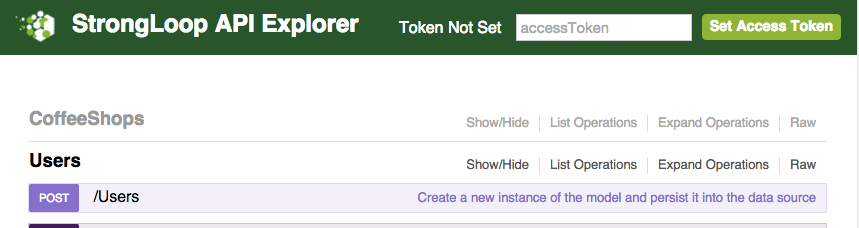

在`Parameters`下,单击`data`字段并输入具有电子邮件和密码属性的JSON对象,例如:

```json
{
   "email": "foo@bar.com",
   "password": "xxx"
}
```

基本用户模型验证电子邮件是否具有电子邮件地址的标准格式,并且密码不为空.

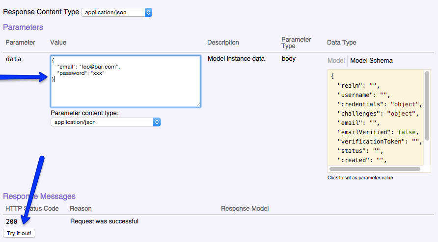

点击`Try it Out!`提交. 

你会收到值为200的响应代码,并且在Response Body中会显示新建用户的邮件地址和主键id.

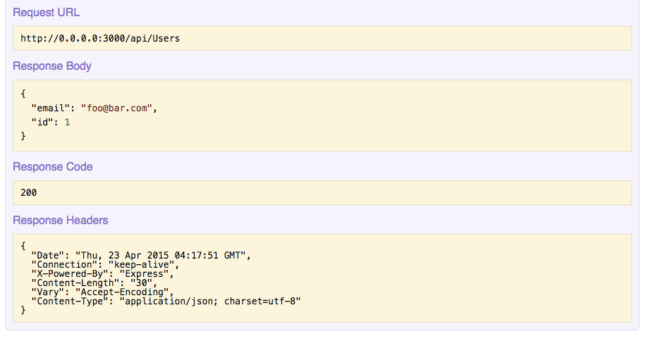

##### 使用新用户登录

现在点击`POST /Users/login`登录.将包含您之前输入的电子邮件和密码的相同JSON复制并传递到凭据字段,然后点击`Try it Out!`

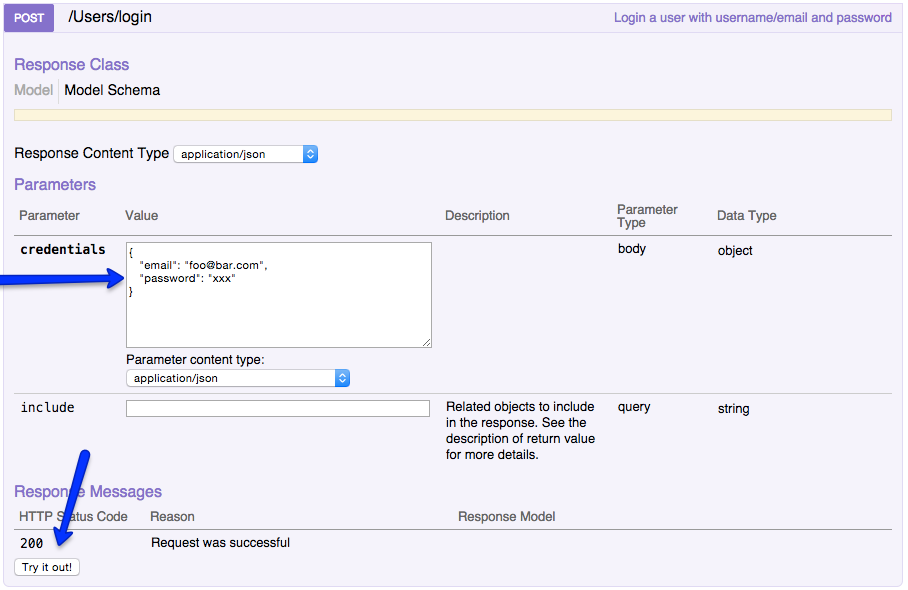

现在,响应将包含用户的授权令牌:

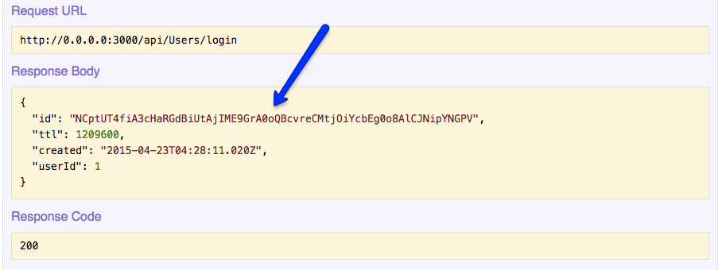

##### 设置access token

选择并复制响应正文中id属性的值,并将其粘贴到API Explorer窗口右上角的accessToken字段中:


执行此操作后,消息将更改为令牌集.此时,您创建的用户现在已登录并向应用程序进行身份验证.

现在可以执行某些REST操作,例如:单击GET /Users/{id},在id字段中输入1,然后单击Try It Out！ 以获取您自己的用户记录的用户模型实例数据:

>  注意:某些操作受到限制,即使您已通过身份验证.例如,您无法查看其他用户的记录.

---

<h4 id="7.2"> 7.2 控制数据访问 </h4>

>  概要: LoopBack使用访问控制列表(ACL)来控制谁可以访问什么数据.

##### 启用身份验证

当您使用LoopBack应用程序生成器创建应用程序时,将自动启用访问控制,除非您选择"empty-server"应用程序类型.要为"empty-server"应用程序启用访问控制,必须添加调用enableAuth()的引导脚本.例如,在server/boot/authentication.js中:

```javascript
module.exports = function enableAuthentication(server) {
  server.enableAuth();
};
```

##### 指定用户角色

指定用户角色的第一步是确定应用程序需要的角色.大多数应用程序将有未经身份验证或匿名的用户(未登录的用户)和经过身份验证的用户(已登录的用户).此外,许多应用程序将具有提供广泛访问权限的管理角色.并且应用可以具有任何数量的附加用户角色.

例如,startkicker应用程序由四种类型的用户组成:来宾,所有者,团队成员和管理员.每个用户类型都可以根据其角色和我们定义的访问控制列表(ACL)访问应用程序的各个部分.

**用户访问类型**

LoopBack提供了一个内置的User模型,具有相应的REST API,继承了PersistedModel对象的所有"CRUD"方法.LoopBack用户模型的每个CRUD方法映射到READ或WRITE访问类型,如下所示:

READ:

* exists - 确定用户是否存在的布尔方法.
* findById - 按ID查找用户.
* find - 查找符合指定条件的所有用户.
* findOne - 查找与指定条件匹配的单个用户实例.
* count - 返回与指定条件匹配的用户数.

WRITE:

* create - 创建新用户.
* updateAttributes(update) - 更新用户记录.
* upsert(更新或插入) - 更新或插入新的用户记录.
* destroyById(相当于removeById或deleteById) - 删除具有指定ID的用户.

对于其他方法,默认访问类型为EXECUTE.例如,自定义方法映射到EXECUTE访问类型.

##### 定义访问控制

使用ACL生成器为应用程序设置访问控制.在这之前,你必须清楚地知道如何为你的应用程序配置访问控制.

例如,以下是loopback-example-access-control如何设置用户及其权限:

- Guest - Guest
  - Role = $ everyone，$ unauthenticated
  - 有权访问"List projects"功能,但没有其他

- John - 项目所有者
  - Role = $ everyone，$ authenticated，teamMember，$ owner
  - 可以访问除"View all projects"之外的所有功能

- Jane - 项目团队成员
  - Role = $ everyone，$ authenticated，teamMember
  - 可以访问所有功能,除了“View all projects”和“Withdraw”

- Bob - 管理员
  - Role = $ everyone，$ authenticated，admin
  - 可以访问除"Withdraw"之外的所有功能

一旦你创建了这种规范,你可以很容易地构造命令来设置访问控制,如下所示.

##### 使用ACL生成器定义访问控制

为应用程序定义访问控制的最简单方法是使用ACL生成器.这使您能够在运行时之前创建静态定义.生成器会提示您输入所有必要的信息:

```bash
$ slc loopback:acl
```

**例子**

例如,以下是为loopback-example-access-control示例定义ACL条目的提示的答案.

Deny access to all project REST endpoints

- Select the model to apply the ACL entry to: All existing models
- Select the ACL scope: All methods and properties
- Select the access type: All (match all types)
- Select the role: All users
- Select the permission to apply: Explicitly deny access

Allow unrestricted access to GET `/api/projects/listProjects`

- Select the model to apply the ACL entry to: project
- Select the ACL scope: A single method
- Enter the method name: listProjects
- Select the access type: Execute
- Select the role: All users
- Select the permission to apply: Explicitly grant access

Only allow admin unrestricted access to GET `/api/projects`

- Select the model to apply the ACL entry to: project
- Select the ACL scope: A single method
- Enter the method name: find
- Select the access type: Read
- Select the role: other
- Enter the role name: admin
- Select the permission to apply: Explicitly grant access

Only allow team members access to GET `/api/projects/:id`

- Select the model to apply the ACL entry to: project
- Select the ACL scope: A single method
- Enter the method name: findById
- Select the access type: Read
- Select the role: other
- Enter the role name: teamMember
- Select the permission to apply: Explicitly grant access

Allow authenticated users to access POST `/api/projects/donate`

- Select the model to apply the ACL entry to: project
- Select the ACL scope: A single method
- Enter the method name: donate
- Select the access type: Execute
- Select the role: Any authenticated user
- Select the permission to apply: Explicitly grant access

Allow owners access to POST `/api/projects/withdraw`

- Select the model to apply the ACL entry to: project
- Select the ACL scope: A single method
- Enter the method name: withdraw
- Select the access type: Execute
- Select the role: The user owning the object
- Select the permission to apply: Explicitly grant access

##### 应用访问控制规则

每个传入请求都映射到具有三个属性的对象:

- model - 目标模型名称,例如'order'
- property - 目标方法名称,例如'find'.您还可以指定一个方法名称数组,以对所有方法应用相同的约束.
- accessType - 访问类型,'EXECUTE','READ'和'WRITE'

ACL规则被描述为一个对象数组,每个对象由在Model definition JSON file - ACLs中列出的属性组成.

1.  model
2.  property
3.  accessType
4.  principalType
    1.  USER
    2.  APP
    3.  ROLE
        1.  custom roles
        2.  $owner
        3.  $authenticated
        4.  $unauthenticated
        5.  $everyone
5.  permission
    1.  DENY
    2.  ALLOW

**ACL规则优先级**

单个模型可能应用了多个ACL:基本模型(或模型)的ACL和模型本身的ACL,在模型定义JSON文件中定义. LoopBack通过添加具有权限和访问类型的优先级规则的所有适用的ACL来解决任何冲突,从而确定最终ACL.

权限优先级按此顺序应用:

1.  DENY
2.  ALLOW
3.  DEFAULT

因此,例如,某个操作和用户组的DENY规则优先于同一操作和组的ALLOW规则.

按照以下顺序应用访问类型优先级(按特殊性顺序):

1.  Type (read, write, replicate, update)
2.  Method name
3.  Wildcard(通配符)

一般来说,更具体的规则将优先于更一般的规则.例如,拒绝访问经过身份验证的用户的操作的规则将优先于拒绝对所有用户的访问的规则.

LoopBack通过将请求与每个规则匹配的细节来对多个规则进行排序.它通过按照属性的分级顺序对每个ACL规则检查访问请求来计算细节.

在每个级别,匹配产生三点:

1.  完全匹配
2.  通配符匹配（'*'）
3.  无匹配

较高级别的匹配优先于较低级别的匹配.例如,在模型级别的完全匹配将超过通配符匹配.

例如,考虑以下访问请求:

```json
{
  model: 'order',
  property: 'find',
  accessType: 'EXECUTE'
}
```

假设定义了以下ACL规则:

```json
[
  // Rule #1
  {
    model: '*',
    property: 'find',
    accessType: 'EXECUTE',
    principalType: 'ROLE',
    principalId: '$authenticated',
    permission: 'ALLOW'
  },
  // Rule #2
  {
    model: 'order',
    property: '*',
    accessType: '*',
    principalType: 'ROLE',
    principalId: '$authenticated',
    permission: 'ALLOW'
  },
  // Rule #3
  {
    model: 'order',
    property: 'find',
    accessType: '*',
    principalType: 'ROLE',
    principalId: '$authenticated',
    permission: 'DENY'
  }
]
```

ACL规则的顺序将是＃3,＃2,＃1.因此,请求将被拒绝,因为规则＃3设置的权限是"DENY".

---

<h4 id="7.3"> 7.3 进行身份验证请求 </h4>

应用程序创建和验证用户的基本过程是:

1.  使用User.create()方法注册一个新用户,继承自PersistedModel对象.
2.  调用User.login()从客户端应用程序代表用户请求访问令牌.
3.  使用访问令牌调用API.在HTTP标头中提供访问令牌,或作为REST API调用的查询参数,如下所示.

##### 使用访问令牌进行身份验证请求

一旦用户登录,LoopBack创建一个新的AccessToken引用用户.在为访问控制系统进行后续REST请求以验证用户可以调用给定模型上的方法时,需要此令牌.

```bash
ACCESS_TOKEN=6Nb2ti5QEXIoDBS5FQGWIz4poRFiBCMMYJbYXSGHWuulOuy0GTEuGx2VCEVvbpBK

# Authorization Header
curl -X GET -H "Authorization: $ACCESS_TOKEN" \
http://localhost:3000/api/widgets

# Query Parameter
curl -X GET http://localhost:3000/api/widgets?access_token=$ACCESS_TOKEN
```

要使用cookie进行身份验证,请将以下内容添加到server.js(引导前):

**/server/server.js**

```javascript
app.use(loopback.token({
    model: app.models.accessToken
}));
```

##### 将当前用户标识用作REST的URL中的文字

要允许REST API当前登录的用户标识,请使用currentUserLiteral选项配置标记中间件.

**/server/server.js**

```javascript
app.use(loopback.token({
    model: app.models.accessToken,
    currentUserLiteral: 'me'
}));
```

currentUserLiteral定义了可以在REST API的URL中使用的特殊标记，例如:

```bash
curl -X GET http://localhost:3000/api/users/me/orders?access_token=$ACCESS_TOKEN
```

请注意,URL将被重写为如下:

`http://localhost:3000/api/users/<currentLoggedInUserId>/orders?access_token=$ACCESS_TOKEN`

##### 删除访问令牌

通过删除在登录时发出的访问令牌,用户将被有效地注销.这仅影响指定的访问令牌,附加到用户的其他令牌仍将有效.

**/server/boot/script.js**

```javascript
var USER_ID = 1;
var ACCESS_TOKEN = '6Nb2ti5QEXIoDBS5FQGWIz4poRFiBCMMYJbYXSGHWuulOuy0GTEuGx2VCEVvbpBK';
// remove just the token
var token = new AccessToken({
  id: ACCESS_TOKEN
});
token.destroy();
// remove all user tokens
AccessToken.destroyAll({
  where: {
    userId: USER_ID
  }
});
```

---

<h4 id="7.4"> 7.4 定义和使用角色 </h4>

LoopBack允许您定义静态和动态角色.静态角色存储在数据源中,并映射到用户.相反,动态角色不分配给用户,而是在访问期间确定.

##### 静态角色

**/server/boot/script.js**

```javascript
User.create([
    {username: 'John', email: 'john@doe.com', password: 'opensesame'},
    {username: 'Jane', email: 'jane@doe.com', password: 'opensesame'},
    {username: 'Bob', email: 'bob@projects.com', password: 'opensesame'}
  ], function(err, users) {
    if (err) return cb(err);

    //create the admin role
    Role.create({
      name: 'admin'
    }, function(err, role) {
      if (err) cb(err);

      //make bob an admin
      role.principals.create({
        principalType: RoleMapping.USER,
        principalId: users[2].id
      }, function(err, principal) {
        cb(err);
      });
    });
  });
```

现在你可以使用上面定义的角色在访问控制中.例如,将以下内容添加到common/models/project.json中,以使"admin"角色的用户能够调用所有REST API.

**/common/models/model.json**

```json
{
  "accessType": "EXECUTE",
  "principalType": "ROLE",
  "principalId": "admin",
  "permission": "ALLOW",
  "property": "find"
}
```

##### 动态角色

有时静态角色不够灵活.LoopBack还使您能够定义在运行时定义的动态角色.

LoopBack提供以下内置动态角色.

<table>
  <tbody>
    <tr>
      <th>Role object property</th>
      <th>String value</th>
      <th>Description</th>
    </tr>
    <tr>
      <td>Role.OWNER</td>
      <td>$owner</td>
      <td>Owner of the object</td>
    </tr>
    <tr>
      <td>Role.AUTHENTICATED</td>
      <td>$authenticated</td>
      <td>authenticated user</td>
    </tr>
    <tr>
      <td>Role.UNAUTHENTICATED</td>
      <td>$unauthenticated</td>
      <td>Unauthenticated user</td>
    </tr>
    <tr>
      <td>Role.EVERYONE</td>
      <td>$everyone</td>
      <td>Everyone</td>
    </tr>
  </tbody>
</table>

第一个示例使用`$owner`动态角色来允许访问所请求的项目模型的所有者.

>  注意: 为了限定`$owner`,目标模型需要具有与User模型(或者从User扩展的模型)和属性匹配目标模型实例的外键的belongsTo关系.对`$owner`的检查仅对路径上有':id'的远程方法执行,例如GET /api/users/:id.

使用Role.registerResolver()在引导脚本中设置自定义角色处理程序.此函数有两个参数:

1.  角色的字符串名称。
2.  确定主体是否处于指定角色的函数.函数签名必须是function(role, context, callback).

**/server/boot/script.js**

```javascript
module.exports = function(app) {
  var Role = app.models.Role;

  Role.registerResolver('teamMember', function(role, context, cb) {
    // Q: Is the current request accessing a Project?
    if (context.modelName !== 'project') {
      // A: No. This role is only for projects: callback with FALSE
      return process.nextTick(() => cb(null, false));
    }

    //Q: Is the user logged in? (there will be an accessToken with an ID if so)
    var userId = context.accessToken.userId;
    if (!userId) {
      //A: No, user is NOT logged in: callback with FALSE
      return process.nextTick(() => cb(null, false));
    }

    // Q: Is the current logged-in user associated with this Project?
    // Step 1: lookup the requested project
    context.model.findById(context.modelId, function(err, project) {
      // A: The datastore produced an error! Pass error to callback
      if(err) return cb(err);
      // A: There's no project by this ID! Pass error to callback
      if(!project) return cb(new Error("Project not found"));

      // Step 2: check if User is part of the Team associated with this Project
      // (using count() because we only want to know if such a record exists)
      var Team = app.models.Team;
      Team.count({
        ownerId: project.ownerId,
        memberId: userId
      }, function(err, count) {
        // A: The datastore produced an error! Pass error to callback
        if (err) return cb(err);

        if(count > 0){
          // A: YES. At least one Team associated with this User AND Project
          // callback with TRUE, user is role:`teamMember`
          return cb(null, true);
        }

		else{
          // A: NO, User is not in this Project's Team
          // callback with FALSE, user is NOT role:`teamMember`
          return cb(null, false);
        }
      });
    });
  });
};
```

>  注意:关于process.nextTick()的注释.在上面的代码中,我们将一些回调调用包装在process.nextTick( () => cb(...) ),但不是其他.为什么?在这样的异步函数中,它需要一个回调并在稍后的时间将结果传递给它,重要的是要确保我们总是调用稍后回调,而不是立即调用它(同步).我们从传递给process.nextTick的函数调用回调函数,否则会被同步调用.来自findById或count回调的调用已经保证在稍后访问数据库时发生,这是异步操作,因此我们不需要在process.nextTick中包装这些调用.

使用上面定义的动态角色,我们可以限制项目信息访问作为项目团队成员的用户.

**/common/models/model.json**

```json
{
  "accessType": "READ",
  "principalType": "ROLE",
  "principalId": "teamMember",
  "permission": "ALLOW",
  "property": "findById"
}
```

---

<h4 id="7.5"> 7.5 访问相关模型 </h4>

>  重要:在访问相关模型时,活动ACL仍然是您调用的模型的ACL.因此,即使您的模型设置了DENY ALL权限,如果与其相关的模型没有ACL,则所有关系端点都将打开.这可能是一个安全风险,因为例如GET /OpenModel/{id}/ ACLSecuredModel将允许通过OpenModel关系对ACLSecuredModel的完全访问.

##### 限制对相关模型的访问

当两个模型之间存在关系(参见创建模型关系)时,LoopBack会自动创建一组相关的模型方法,这些方法与为关系定义的API路由相对应.

在下面的列表中,modelName是相关模型的名称,而modelNamePlural是相关模型名称的复数形式.

>  注意:在下面的方法名称中,分隔符是双下划线__.

**belongsTo**:

* \_\_get\_\__relatedModelName_

**hasOne**:

* \_\_create\_\__relatedModelName_
* \_\_get\_\__relatedModelName_
* \_\_update\_\__relatedModelName_
* \_\_destroy\_\__relatedModelName_

**hasMany**:

* \_\_count\_\__relatedModelNamePlural_
* \_\_create\_\__relatedModelNamePlural_
* \_\_delete\_\__relatedModelNamePlural_
* \_\_destroyById\_\__relatedModelNamePlural_
* \_\_findById\_\__relatedModelNamePlural_
* \_\_get\_\__relatedModelNamePlural_
* \_\_updateById\_\__relatedModelNamePlural_

**hasManyThrough**:

* \_\_count\_\__relatedModelNamePlural_
* \_\_create\_\__relatedModelNamePlural_
* \_\_delete\_\__relatedModelNamePlural_
* \_\_destroyById\_\__relatedModelNamePlural_
* \_\_exists\_\__relatedModelNamePlural_ (through only)
* \_\_findById\_\__relatedModelNamePlural_
* \_\_get\_\__relatedModelNamePlural_
* \_\_link\_\__relatedModelNamePlural_ (through only)
* \_\_updateById\_\__relatedModelNamePlural_
* \_\_unlink\_\__relatedModelNamePlural_ (through only)

**hasAndBelongsToMany**:

* \_\_link\_\__relatedModelNamePlural_
* \_\_unlink\_\__relatedModelNamePlural_

您可以使用这些相关的模型方法来控制对相关路由的访问.

例如,如果用户有多个项目,LoopBack创建这些路由(以及其他)和相应的相关模型方法:

* `/api/users/count` - standard method is `count`
* ``/api/users/:id/projects`` - related model method is `__get__projects`
* `/api/users/:id/projects/count` - related model method is `__count__projects`

>  重要: 如果模型具有DENY ALL权限(例如,内置模型,如用户模型),但相关模型没有ACL,则仍然无法通过User模型访问相关模型.因此,例如,即使图书模型的默认ACL是GET /books的ALLOW $ authenticated,路由GET /user/{id}/books default仍将是DENY ALL.

要配置对这些路由的访问控制,请在模型定义JSON文件中设置相关模型方法的权限.例如,这些路由的用户模型定义JSON文件(user.json)的ACL可能如下所示,例如:

**/common/models/user.json**

```json
"acls": [{
  "principalType": "ROLE",
  "principalId": "$authenticated",
  "permission": "ALLOW",
  "property": "count"
}, {
  "principalType": "ROLE",
  "principalId": "$owner",
  "permission": "ALLOW",
  "property": "__get__projects"
}, {
  "principalType": "ROLE",
  "principalId": "$authenticated",
  "permission": "ALLOW",
  "property": "__count__projects"
}]
```

##### 查询相关模型

查询模型时,您可能还需要从其相关模型返回数据.

例如,假设您有三个模型: User,Report和LineItem,其中:

- 用户可以有多个报告.也就是说,在User和Report(User hasMany Report)之间有一个HasMany关系.
- 报表可以有多个订单项.也就是说,在Report和Lineitem之间有一个HasMany关系(Report hasMany LineItem).

此外,ReportModel还配置了以下ACL,以便经过身份验证的用户可以创建新记录,并且用户可以更新自己的记录:

```json
[{
    "principalType": "ROLE",
    "principalId": "$everyone",
    "permission": "DENY"
  }, {
    "principalType": "ROLE",
    "principalId": "$owner",
    "permission": "ALLOW",
    "property": "findById"
  },
  ...
]
```

假设LineItem模型具有定义的相同ACL.

现在,假设您要获取您的用户拥有的模型,并获取其相关模型.下面是如何使用findById()使用Node API:

```javascript
Report.findById({
  id: 1,
  filter: {
    include: 'lineitems'
  }
});
```

Using the REST API:

`GET /api/Reports/110?filter={"include":["lineItems"]}`

Example results:

```json
{
  "name": "january report - bob",
  "id": 110,
  "userId": 100,
  "lineItemModels": [{
    "name": "lunch",
    "id": 111,
    "reportModelId": 110
  }, {
    "name": "dinner",
    "id": 112,
    "reportModelId": 110
  }]
}
```

---

<h4 id="7.6"> 7.6 创建默认管理员账号 </h4>

LoopBack没有定义默认管理员用户,但是您可以在应用程序启动时定义一个,如loopback-example-access-control示例中所示.具体来说,该示例包括server/boot/sample-models.js中的代码:

- 创建多个用户,以及其他模型的实例.
- 定义模型之间的关系.
- 定义管理角色.
- 添加角色映射以将其中一个用户分配给管理角色.

因为此脚本在`server/boot`,它是在应用程序启动时执行的,所以管理员用户将始终存在一次应用程序初始化.

以下代码创建了名为"John","Jane"和"Bob"的三个用户,然后(跳过创建项目,项目所有者和项目团队成员的代码)定义了"管理"角色,并且制定Bob为管理员.

**/server/boot/script.js**

```javascript
User.create([
    {username: 'John', email: 'john@doe.com', password: 'opensesame'},
    {username: 'Jane', email: 'jane@doe.com', password: 'opensesame'},
    {username: 'Bob', email: 'bob@projects.com', password: 'opensesame'}
], function(err, users) {
    if (err) return debug('%j', err);
    //...
    // Create projects, assign project owners and project team members
    //...
    // Create the admin role
    Role.create({
      name: 'admin'
    }, function(err, role) {
      if (err) return debug(err);
      debug(role);

      // Make Bob an admin
      role.principals.create({
        principalType: RoleMapping.USER,
        principalId: users[2].id
      }, function(err, principal) {
        if (err) return debug(err);
        debug(principal);
      });
    });
  });
};
```

模型JSON(由ACL生成器创建)文件指定管理角色具有查看项目(GET /api/projects)的不受限制的访问权限:

**/common/models/model.json**

```json
...
{
  "accessType": "READ",
  "principalType": "ROLE",
  "principalId": "admin",
  "permission": "ALLOW",
  "property": "find"
},
...
```

---

<h4 id="7.7"> 7.7 安全注意事项 </h4>

##### Model REST APIs

默认情况下,您创建的LoopBack模型会为CRUD操作公开一组标准的HTTP端点.model-config.json中的public属性指定是否公开模型的REST API,例如:

**/server/model-config.json**

```json
...
  "MyModel": {
    "public": true,
    "dataSource": "db"
  },
...
```

要隐藏模型的REST API,只需将public更改为false即可.

##### CORS

LoopBack应用程序使用cors中间件软件包进行跨源资源共享(CORS),但对于使用应用程序生成器创建的应用程序,它默认禁用.

要启用CORS,请编辑server/config.json中的远程部分并将cors设置为true:

```json
{
  ...
  "remoting": {
    ...
    "cors": true,  // false by default
    "handleErrors": false
  }
}
```

要配置CORS设置,请编辑server/middleware.json文件中的`initial`部分:

```json
{
  // ...
  "initial": {
    // ...
    "cors": {
      "params": {
        "origin": true,
        "credentials": true,
        "maxAge": 86400
      }
    }
  },
  // ...
}
```

在客户端上启用CORS

如果您使用的是JavaScript客户端,则还必须在客户端启用CORS.例如,使用AngularJS启用它的一种方法是:

**/client/app.js**

```javascript
var myApp = angular.module('myApp', [
    'myAppApiService']);

myApp.config(['$httpProvider', function($httpProvider) {
        $httpProvider.defaults.useXDomain = true;
        delete $httpProvider.defaults.headers.common['X-Requested-With'];
    }
]);
```

---

剧终!